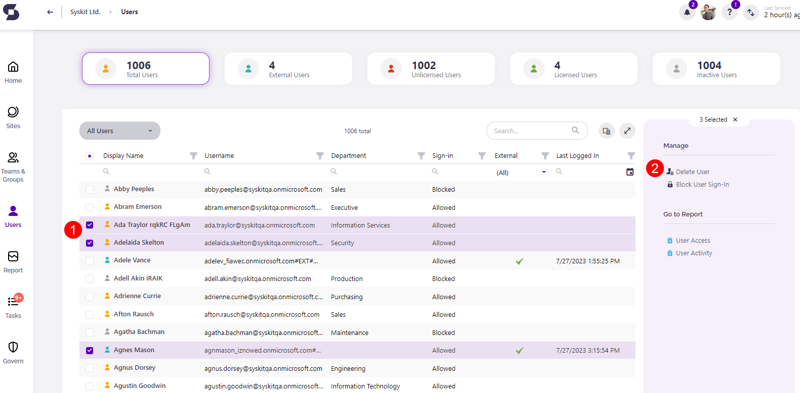
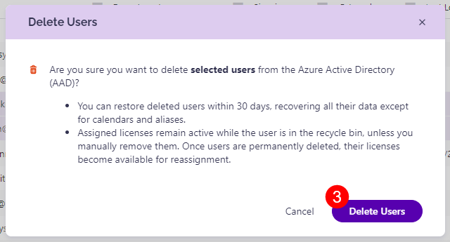
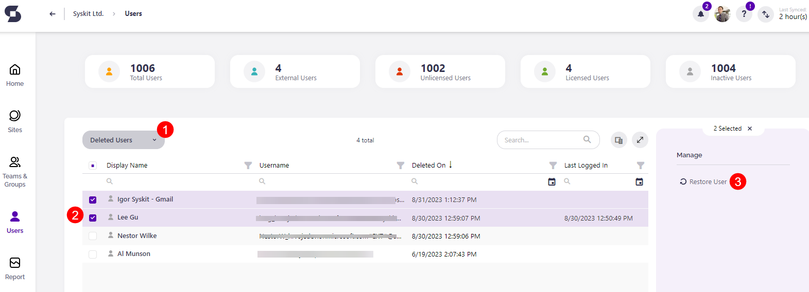
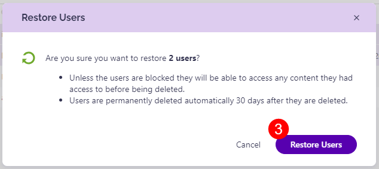

# Delete and Restore Users

When managing your **Microsoft 365** environment, there are certain situations when you need to **remove users** from your tenant, be it in a situation of offboarding a colleague from the company or ending the collaboration with an external user.

With **Syskit Point**, you get the ability to manage your users easily.

The Delete and Restore User actions can be used when:

* **offboarding a user** from the company; before deleting, you can copy permissions to a new user with the help of the [Copy User Permissions](copy-user-permissions.md) action
* **deleting external users** – if you have one or multiple external users who exist in your **Azure Active Directory**, and you have ended your collaboration with them
* **restoring a user** – in case someone deleted a wrong user


**Please note!**  
To successfully execute **Delete User** and **Restore User actions**, you need to have the [**Syskit Point Admin**](../configuration/enable-role-based-access.md#syskit-point-admins) role assigned. Additionally, you must meet one of the following conditions regarding **Microsoft 365 Azure Active Directory Roles** in your **Microsoft 365 environment**:

* have the **Global Admin** role assigned
* have the **SharePoint Admin** and the **User Admin** role assigned
* have the **User Admin** role assigned and specified as a manager to the targeted user in **Azure Active Directory**


## Running the Delete User Action

To use the **Delete User action**, follow these steps:

* Navigate to the **Users** overview screen;located on the left side of the home page
* **Select the users you wish to delete \(1\)**
* **Click the Delete User action \(2\)** - the **Delete Users** window opens
* **Click the Delete User button \(3\)** on the **Delete Users** window to confirm the deletion


**Please note!**  
You can only delete users that exist in the **Azure Active Directory**. Some external users in your tenant don’t appear in **Azure Active Directory** as they only have access to selected documents. To remove such users, use the **Remove Access** action on the [**User Access Report**](check-access-for-specific-user.md).


## Running the Restore User Action

To use the **Restore User action**, navigate to the **Users overview screen**, and follow these steps:

* **select the Deleted Users view\(1\)**
* **select the users you wish to restore \(2\)**
* **click the Restore User action \(3\)** - the **Restore Users** window opens
* **click the Restore User button \(4\)** to confirm the action


**Please note!**  
When you delete a user from Azure Active Directory, you have a period of 30 days to restore them. After 30 days, the user is permanently deleted and cannot be restored.


