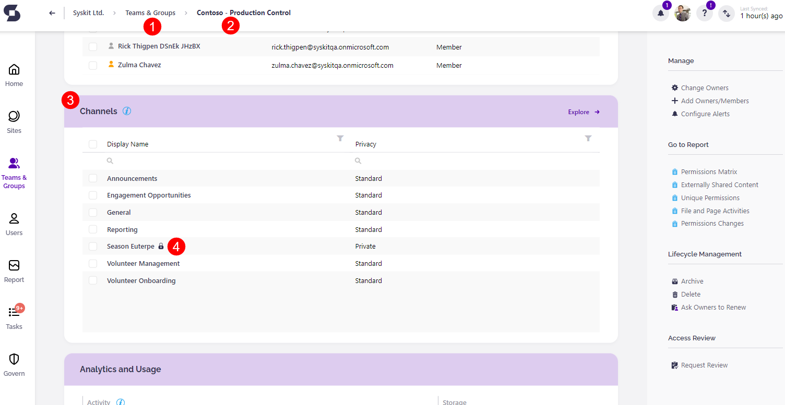
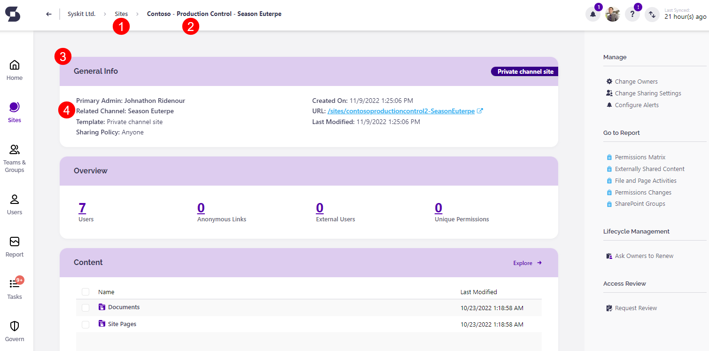

# Manage Private Channels Access

This article will help set up and manage who the owners and members are for private channels in Microsoft Teams and Groups. 

There are several ways to manage and change the access to private channels from within SysKit Point.

## Manage Access from Microsoft Teams & Groups

* **Click the Microsoft Teams & Groups tile (1)**; this is located on the home screen of SysKit Point. 
* **Select the team or group to manage (2)**; clicking the selected resource opens the details screen.
* On the details screen, **scroll to the Channels section (3)**; the private teams and groups will be marked by a locked symbol next to their name. 
* **Click the private channel (4)**; this opens the details screen of the channel.

On the left side of the screen, there are two options available under Manage:
 * **Add Owners/Members (1)**; the pop-up that opens allows adding new members to the private channel. Once added, these members can be promoted to Owner.
 * **Change Owners (2)**; the pop-up that opens provides the ability to remove current owners or promote current members to owners. 

 

## Manage Access from Sites

* **Click the Sites tile (1)**; located on the home screen of SysKit Point. 
* **Select the site to manage (2)**; the private channel site is marked with a locked symbol near its name. 
  * Clicking the selected site opens the details screen.
* **Under General Information (3)** click on the resource shown under **Related Channel (4)**.  
  * This opens the details screen of the private channel.

On the left side of the screen, there are two options available under Manage:
 * **Add Owners/Members**; the pop-up that opens allows adding new members to the private channel. Once added, these members can be promoted to Owner.
 * **Change Owners**; the pop-up that opens provides the ability to remove current owners or promote current members to owners.

 

## Changing Member and Owner Status

Members and Owners can be added and removed by **using the side panel** on the private channel resource or through the **Members tile** located lower on the private channel screen. 

The **Members tile (1)** shows a list of all members and owners available, and their status can be seen under the **Role column (2)**.
  * **Selecting an Owner (3)** provides two options on the left side of the screen: **Remove from Channel or Change to Member (4)**.
  * **Selecting a Member** provides two options on the left side of the screen: **Remove from Channel** or **Promote to Owner**.

 

  
**Please note!**  
After making these changes to private channels in SysKit Point, it could take up to a few hours for the changes to show in the SharePoint admin center.
