# Power Platform Actions


**Power Platform actions** are currently available as a free preview, allowing you to explore its benefits at no cost.


Many organizations use Power Platform to build apps, automate workflows, and analyze data. Through Syskit Point, you can generate detailed reports for your Power Platform resources. 

To help you manage these resources, Syskit Point is introducing new Power Platform actions:

* [Change Owners](#change-owners)
* [Add Co-Owners](#add-co-owners)
* [Delete Environment](#delete-environment)
* [Delete Flows](#delete-flow)
* [Delete App](#delete-app)

These actions help manage access, resolve the risks of orphaned resources by adding ownership, and eliminate sprawl by removing inactive environments.

* [Take a look at the Power Platform Reports article for more details on all the available Power Platform reports.](../reporting/power-platform-reports.md)


To generate the [Power Platform reports](../configuration/enable-role-based-access.md) and complete the Power Platform actions, please ensure [you have enabled Power Platform data collection](../configuration/power-platform.md).\
Power Platform actions can only be completed by Global Admin users.  


## Change Owners

The Change Owners action can be completed for Flows on the Power Automate Inventory and Power Automate Permissions reports, as well as for Power Apps on the Power Apps Inventory and Permissions reports. 


Please note that the Change Owner action cannot currently be performed to change the Primary Owner of Flows; only the co-owners can be modified. The Primary Owner selection for Flows is disabled as you cannot modify the Primary Owner on non-solution flows. 


You can access the Apps report by:
* **Clicking the number of apps** on the Power Platform Dashboard tile
* **Click the Reports button** located on the left side of the screen, **selecting the Power Platform category** in the filter in the upper left corner
  * **Click the Power Apps Inventory report tile** to generate the report, select one or more environments to create the report for, and click the **Run Report** button to generate

Once the Power Apps Inventory report is generated: 

* **Selecting one App** lets you complete **the Change Owners action**. 
* **Clicking the Change Owners action (1)** opens the confirmation modal that lets you manage:
  * **Primary Owner (2)** - you can select one primary owner by typing the name or email of the user you want to set as the primary owner
  * **Co-Owners (3)** - you can select one or more co-owners by typing the name or email of the users you want to set as co-owner(s) or remove current co-owners
  * **Click the Change button (4)** to complete the action and set the new App owners

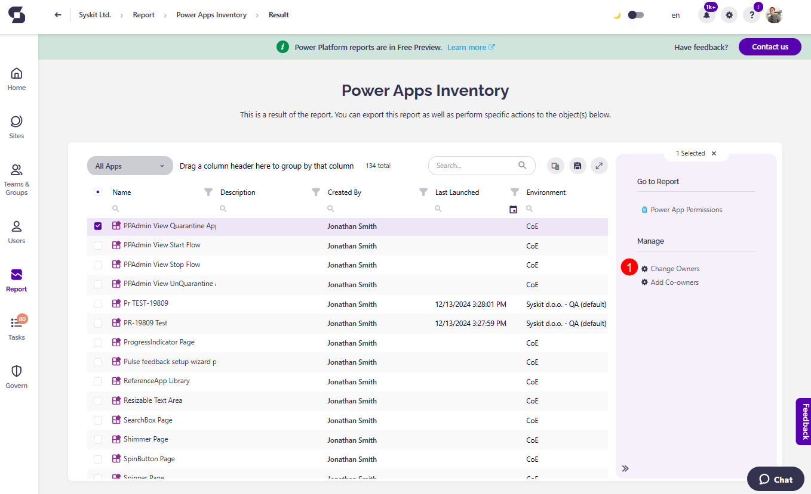

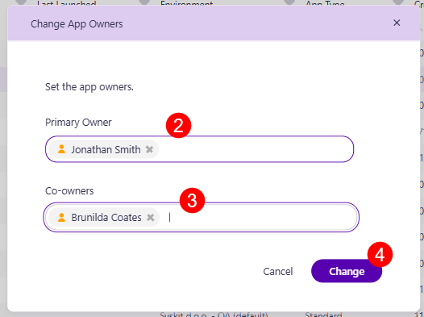

You can access the Power Automate Inventory report by:

* **Clicking the number of flows** on the Power Platform Dashboard tile
* **Click the Reports button** located on the left side of the screen, **selecting the Power Platform category** in the filter in the upper left corner
  * **Click the Power Automate Inventory report tile** to generate the report, select one or more environments to create the report for, and click the **Run Report** button to generate

Once the Power Automate Inventory report is generated: 

* **Selecting one Flow** lets you complete **the Change Owners action**. 
* **Clicking the Change Owners action (1)** opens the confirmation modal that lets you:
  * **View the Primary Owner (2)** - currently, managing the Primary Owner for Flows is not possible
  * **Manage Co-Owners (3)** - you can select one or more co-owners by typing the name or email of the users you want to set as co-owner(s) or remove the current co-owners
  * **Click the Change button (4)** to complete the action and set the new Flow owners

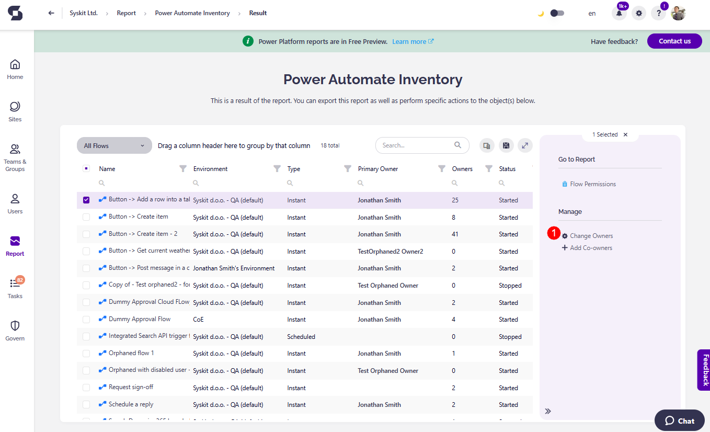

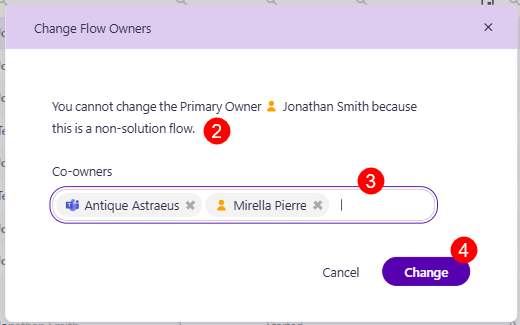

## Add Co-Owners

The Add Co-Owners action can be completed for Flows and Apps on the Power Automate Inventory and Power Apps Inventory report screens. 

You can access the Apps report by:
* **Clicking the number of apps** on the Power Platform Dashboard tile
* **Click the Reports button** located on the left side of the screen, **selecting the Power Platform category** in the filter in the upper left corner
  * **Click the Power Apps Inventory report tile** to generate the report, select one or more environments to create the report for, and click the **Run Report** button to generate

Once the Power Apps Inventory report is generated: 

**Selecting one or more Apps** lets you complete **the Add Co-owners action**. 
* **Clicking the Add Co-owners action (1)** opens the confirmation modal that lets you:
  * **Select one or more co-owners (2)** by typing the name or email of the users you want to set as the co-owner(s)
  * **Click the Change button (3)** to complete the action and set the new Apps co-owners

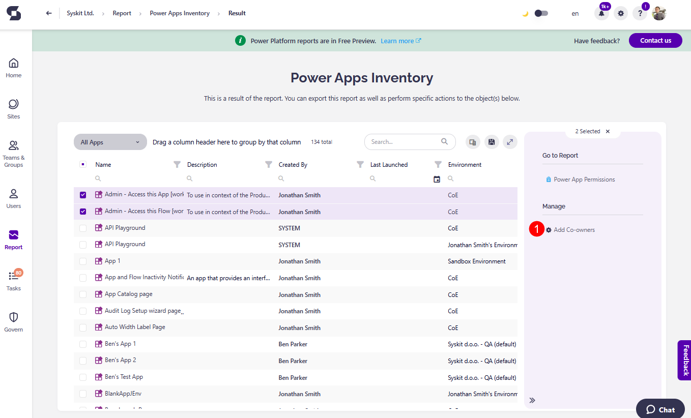

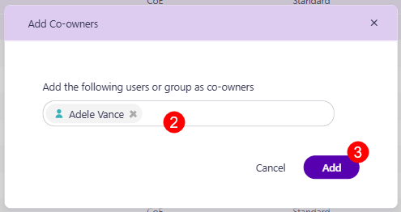

You can access the Flows report by:

* **Clicking the number of flows** on the Power Platform Dashboard tile
* **Click the Reports button** located on the left side of the screen, **selecting the Power Platform category** in the filter in the upper left corner
  * **Click the Power Automate Inventory report tile** to generate the report, select one or more environments to create the report for, and click the **Run Report** button to generate

Once the Power Automate Inventory report is generated:

**Selecting one or more Flows** lets you complete **the Add Co-owners action**. 
* **Clicking the Add Co-owners action (1)** opens the confirmation modal that lets you:
  * **Select one or more co-owners (2)** by typing the name or email of the users you want to set as the co-owner(s)
  * **Click the Change button (3)** to complete the action and set the new Flows co-owners

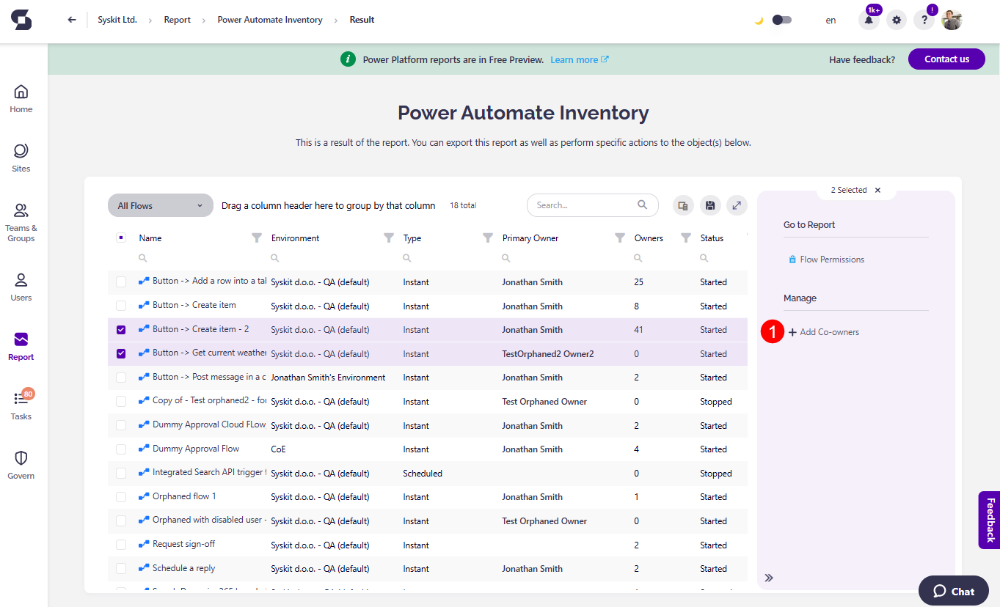

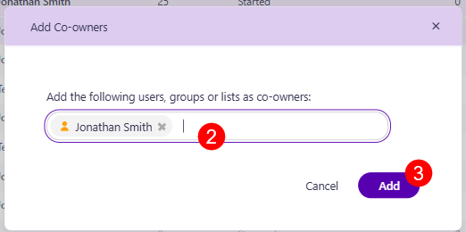

## Delete Environment

The Delete Environment action can be completed for Environments on the Power Platform Environments report.

You can access the report by:
* **Clicking the number of environments** on the Power Platform Dashboard tile
* **Click the Reports button** located on the left side of the screen, **select the Power Platform category** in the filter in the upper left corner, and **click the Power Platform Environments report tile** to generate the report.

Once you generate the Power Platform Environments report: 

* **Selecting one or more environments** lets you complete **the Delete Environment action**. 
* **Clicking the Delete Environment action (1)** opens the confirmation modal that states that performing this action means:
  * The environment resources and backups will be deleted, including dataverse, apps, and data
  * Administrators of environments will have 7 days to recover it by going to the main Microsoft environments page
* **Type Delete (2) in the confirmation bar and click the Delete button (3)** to complete the action

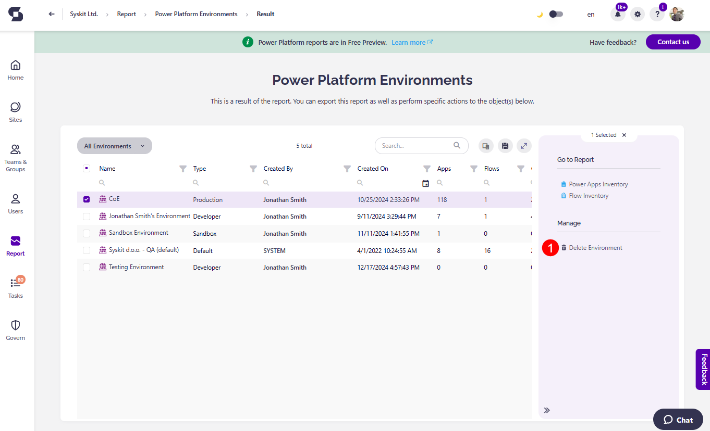

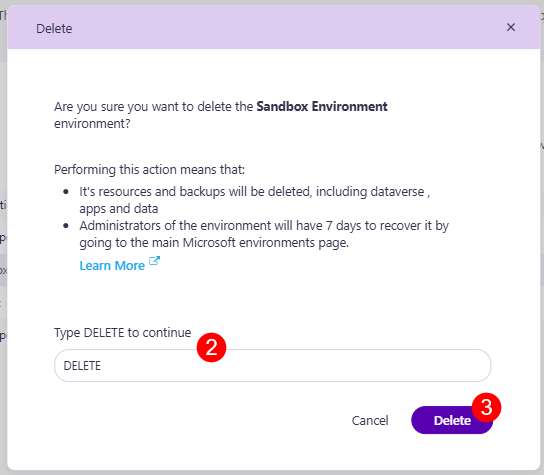

## Delete Flow

The Delete Flow action can be completed for Flows on the Power Automate Inventory report.

You can access the report by:
* **Clicking the number of Flows** on the Power Platform Dashboard tile
* **Click the Reports button** located on the left side of the screen, **select the Power Platform category** in the filter in the upper left corner, and **click the Power Automate Inventory report tile** to generate the report.

Once you generate the Power Automate Inventory report: 

* **Selecting one or more flows** lets you complete **the Delete Flow action**. 
* **Clicking the Delete Flow action (1)** opens the confirmation modal that states that performing this action means:
  * The flows will be removed for all co-owners and uninstalled for all users
  * The delete flow action cannot be undone
  * An information box that states you should ensure you have canceled any pending runs to prevent data loss before deleting any flows
* **Type Delete (2) in the confirmation bar and click the Delete button (3)** to complete the action

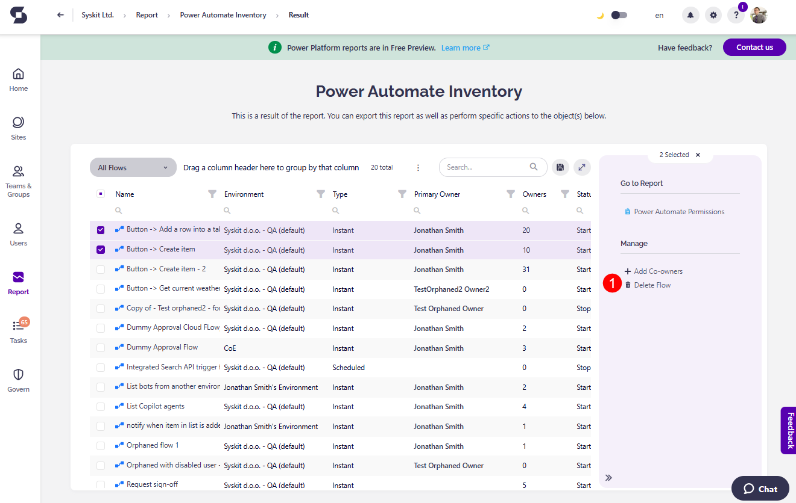

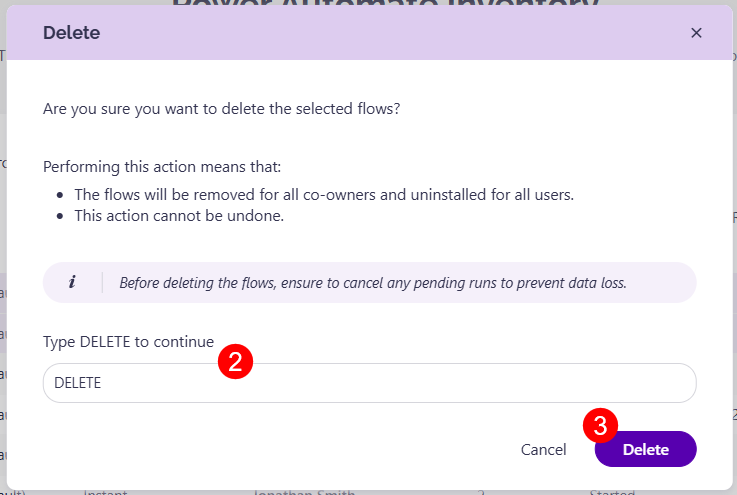

## Delete App

The Delete App action can be completed for Apps on the Power Apps Inventory report.

You can access the report by:
* **Clicking the number of Apps** on the Power Platform Dashboard tile
* **Click the Reports button** located on the left side of the screen, **select the Power Platform category** in the filter in the upper left corner, and **click the Power Apps Inventory report tile** to generate the report.

Once you generate the Power Apps Inventory report: 

* **Selecting one or more apps** lets you complete **the Delete App action**. 
* **Clicking the Delete App action (1)** opens the confirmation modal that states that performing this action means:
  * The apps will be uninstalled for all users
  * The apps will be deleted, but components and data contained within them will not be deleted
  * The delete app action cannot be undone
* **Type Delete (2) in the confirmation bar and click the Delete button (3)** to complete the action

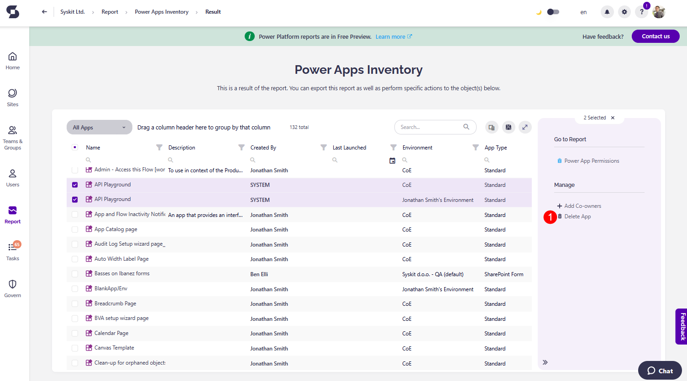

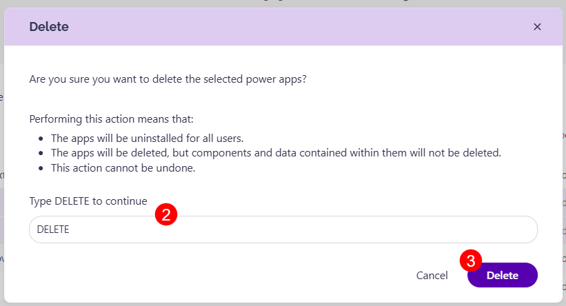