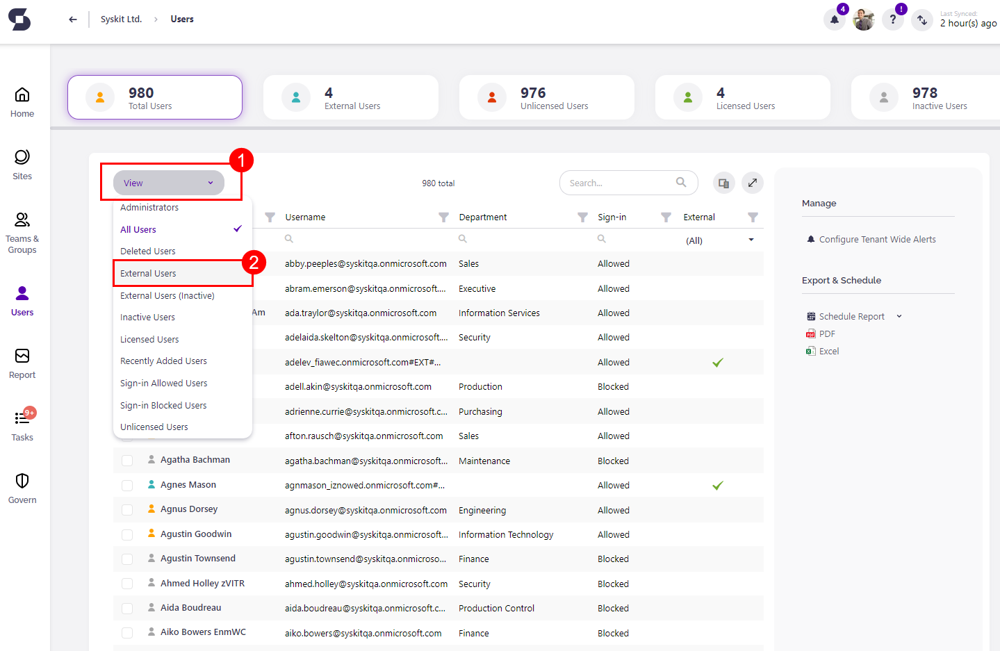
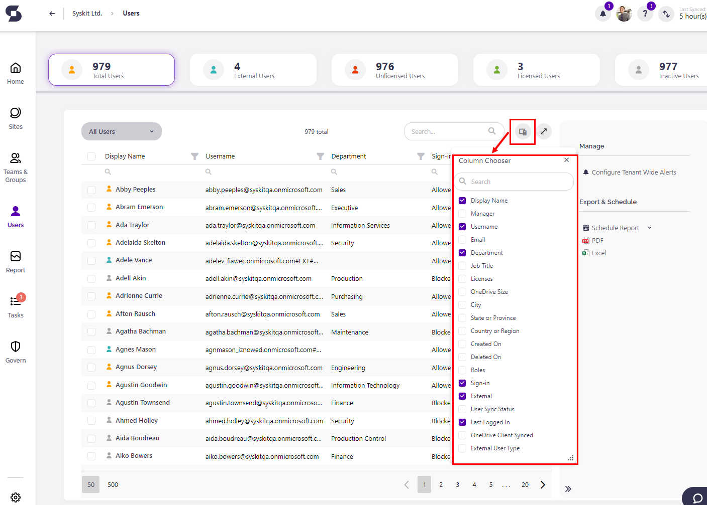
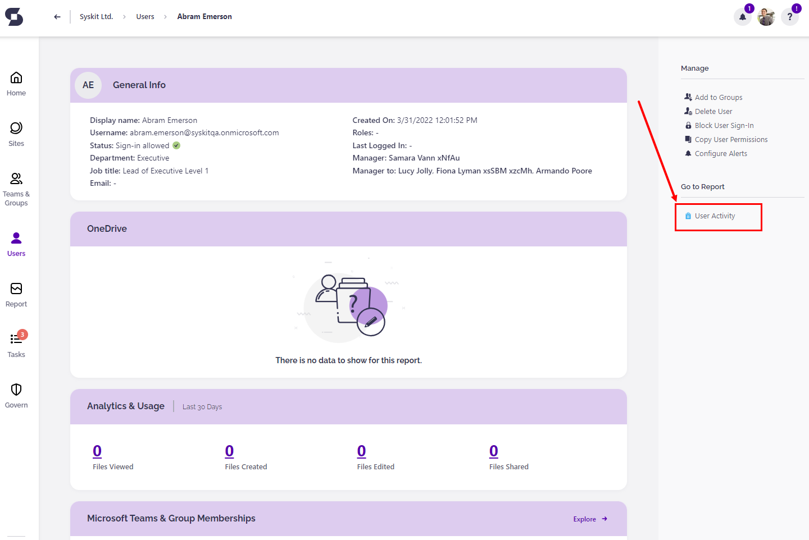
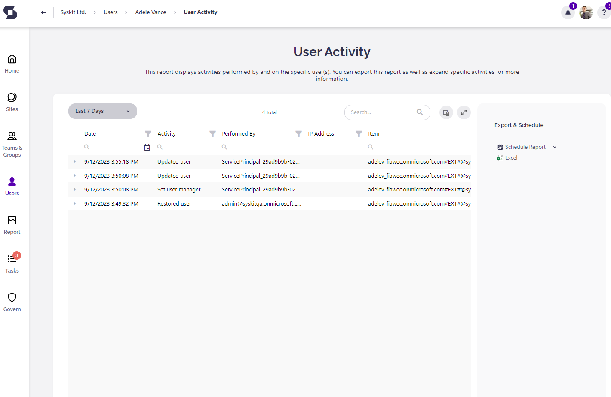
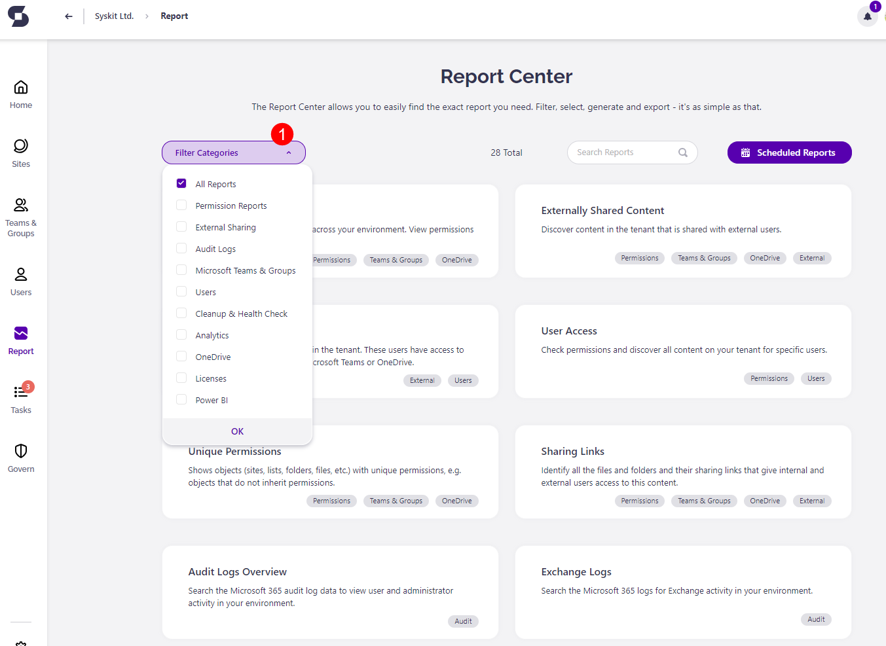
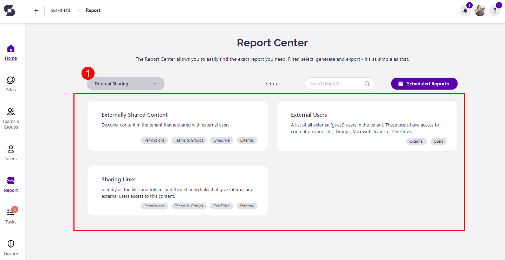

# Track Microsoft 365 External Users and Their Activities

If you want to find out everything about External users and their access to your environment, you can simply open the **SysKit Point** web application and within **Users Overview** screen choose **External Users** view.

The picture below shows you how to switch between different views at the **Users Overview** screen.

You will find useful data while checking the External Users view in the grid, such as the sign-in status of the user.

You can open **Column Chooser** with the list of all available columns to display by clicking on the button located on the left side of the **Search** field.

Detailed information about each External user \(or any other user\) is visible on their **User Details** screen. There you can find information divided into few tiles - General info, OneDrive, Analytics & Usage, Microsoft Teams & Groups Memberships, and Sites tile.

Notice the sidebar panel on the right end of the screen and section **Go to Report** &gt; **User Activity** report.

By clicking on that report button, it will redirect you to the **User Activity** report, where you can see all the actions performed by/on that external user.

By default, this report has the timeframe for the **Last 30 Days**. To switch this, choose a different timeframe from the dropdown menu.

Every report within the **SysKit Point** is exportable, all of them in the form of **Microsoft Excel Worksheet** file type and most of them in **PDF** file type. You will find this option in the sidebar panel under the section **Manage** &gt; **Export** button.

The icon will point out which export file type are you choosing. You can also access the **User Activity** report from the **Report Center** when you click the **Welcome Home** screen &gt; **Reports** tile. This screen will open:

While you are looking at the Report Center screen, try to use the **dropdown filter** above the tiles.

For example, if you open the dropdown filter and select **External Sharing** category - three reports will be selected \(**Externally Shared Content, External Users, Sharing Links**\), and all of them are regarding external users.

Every tile in the Report Center holds a description. This way, you won't have trouble choosing the right report.

