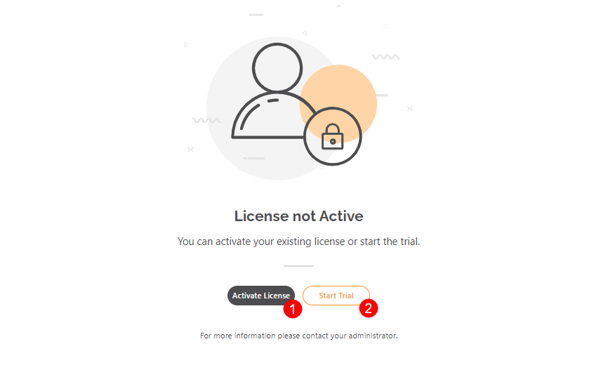
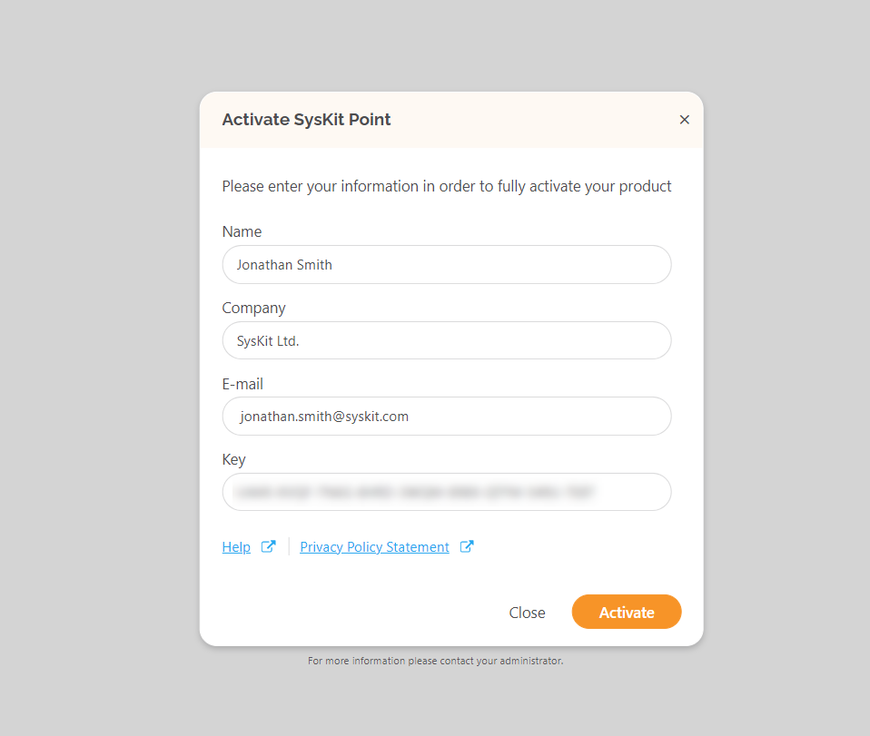

# Activate SysKit Point

## Activation

You will be provided with the license key for the product activation after the purchase of the selected edition of SysKit Point.

At any time, you can log in to SysKit [Customers Portal](https://my.syskit.com/) and navigate to the list of your licensed products. If you do not have the activation information, please [contact us](https://www.syskit.com/company/contact-us).

When opening the SysKit Point web-app URL for the first time, you will be prompted to **activate your copy of SysKit Point (1) or start the trial (2)**.

After you click the appropriate button, continue with the following steps:
* **Fill in all the required fields**: name, company, email, and the provided license key. 
* **Click the Activate button** to start the validation process. It only takes 2-5 seconds to perform the activation and it is a one-time-only procedure. If the validation of your email address is successful, an info dialog will appear thanking you for the activation. 

You can check license information and manage it later if you go to Settings &gt; License page.

## Changing the License Key

To change the existing license key with a new one, e.g., when you are upgrading to a different license edition, here are the instructions on how to do so:

1. **Navigate to Settings** &gt; **License**.
2. **Click the Deactivate button**.
3. **Enter the new license key and user details**.

## **Deactivate License**

To deactivate the SysKit Point license, please proceed with the following steps:

1. **Navigate to Settings** &gt; **License**. 
2. **Click the Deactivate button**. 

Once that product license has been deactivated, you won’t be able to sign in and access the application until it is activated.

