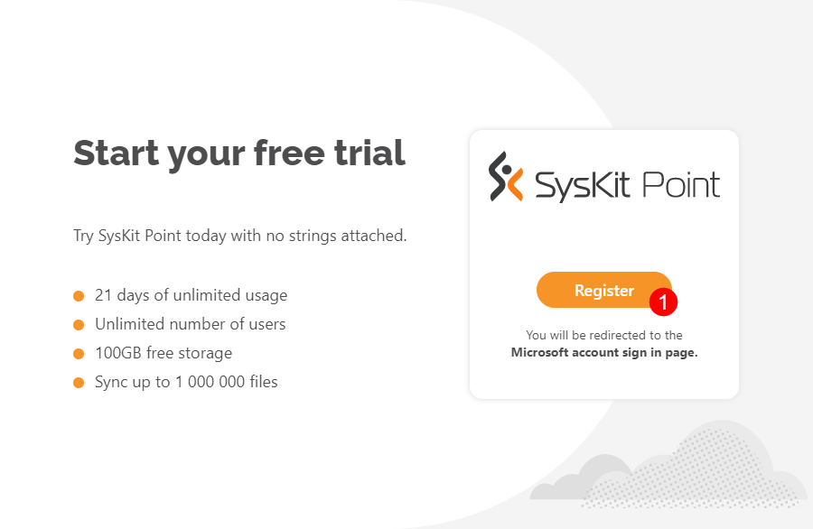
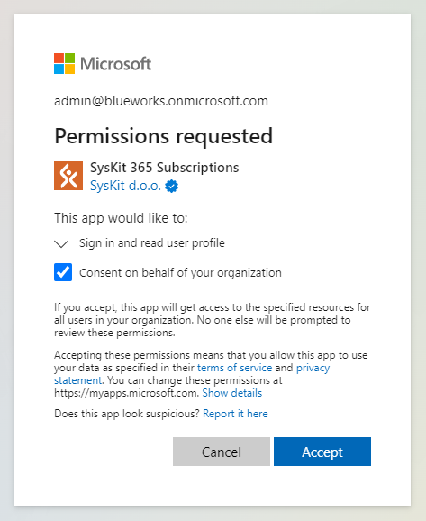
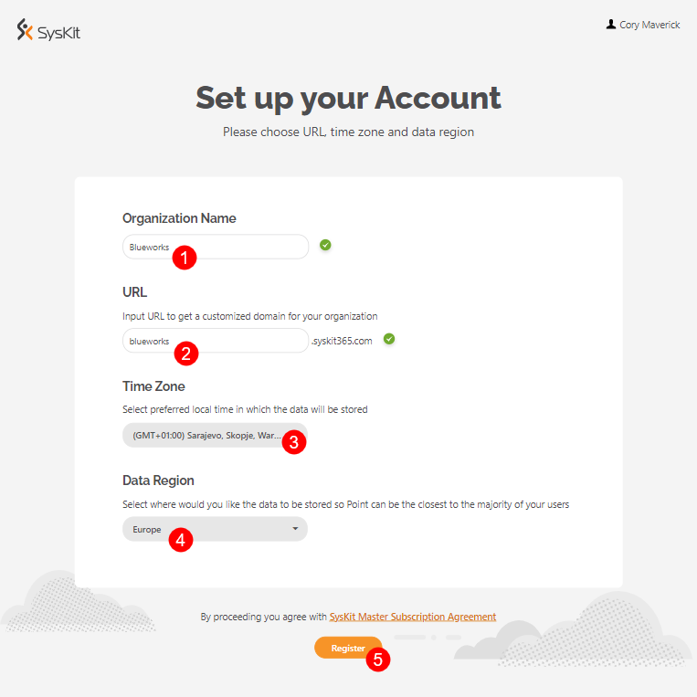
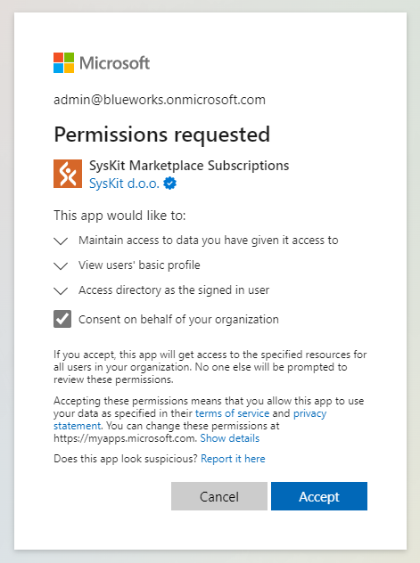
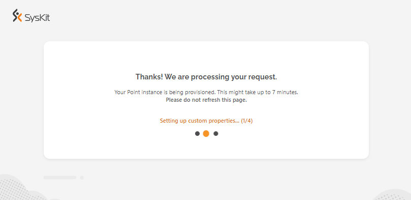
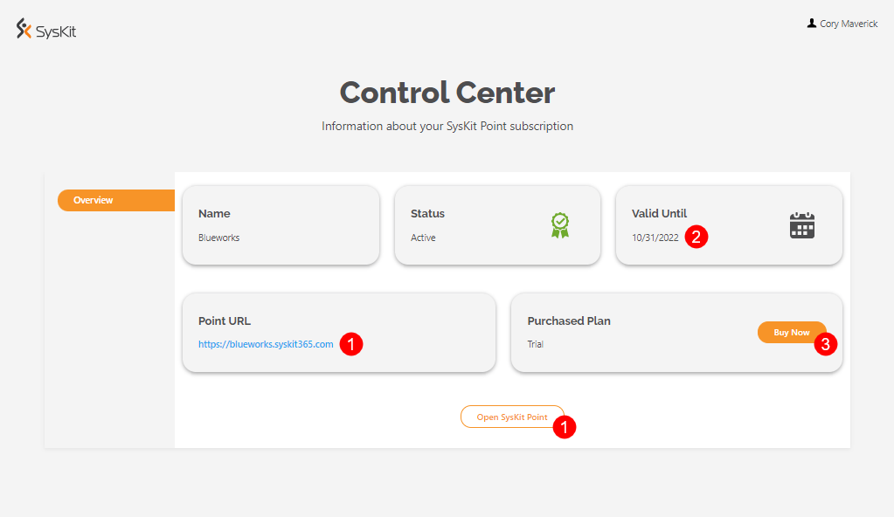

# SysKit Point Trial

**SysKit Point trial** enables you to **test drive SysKit Point for free for 21 days** and discover how to utilize it when managing your Microsoft 365 environment. 
In this article, you can find out the following:
* **how and where to get your 21 days of SysKit Point trial**
* **limitations when using SysKit Point in trial**


**Please note!**  
This article shows how to get a free trial of SysKit Point solution as a service.
If your company policies require using a self-hosted solution, please [contact us](https://www.syskit.com/company/contact-us) to acquire a trial key.


## Start SysKit Point Trial


**Please note!**  
We recommend Global Administrators perform the initial registration since consent is required multiple times during the initial setup process, giving SysKit Point permissions to collect your Microsoft 365 tenant data.


To start the trial registration process:
    * Navigate to [Subscriptions site](https://subscriptions.syskit.com/)
    * Click the **Register button (1)**

Next, sign in with your Microsoft credentials. 
Permitting to read your user profile requires consent, enabling SysKit to determine your Microsoft 365 tenant. Click Accept to continue.

A new page opens where you should:
* **Enter the Name of your organization (1)**
* **Enter the syskit365 subdomain you want to use (2)**
    * if the entered subdomain is already in use, an appropriate message is displayed 
* **Select the preferred time zone (3)**
* **Select the region where SysKit Point data will be stored (4)**; the following regions are currently supported:
    * **USA**
    * **Europe**
    * **Asia-Pacific & Australia**
* **Click Register (5) when finished**

Next, consent is required, giving SysKit Point permission to collect your Microsoft 365 tenant data.

After the consent, your SysKit Point instance starts to provision.

After the provisioning is completed, an overview screen opens, providing the most important subscription information:
* **Link/button to open your SysKit Point instance (1)**
* **Trial expiration date (2)**
* **Buy Now button (3)** enabling you to purchase a plan

## Trial Limits
#TODO

