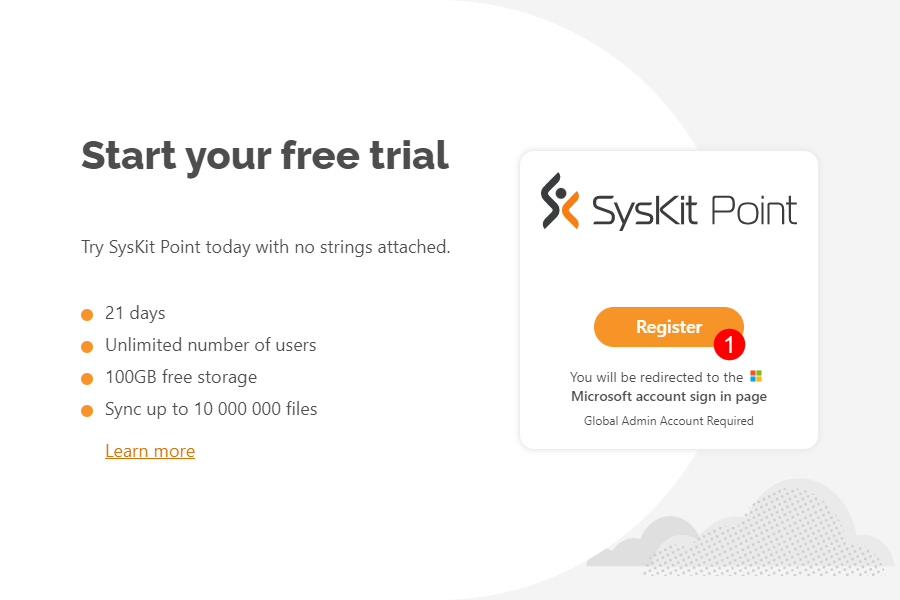

# SysKit Point Trial

**SysKit Point trial** enables you to **test drive SysKit Point for free for 21 days** and discover how to utilize it when managing your Microsoft 365 environment. In this article, you can find out the following:

* **how and where to get your 21 days of SysKit Point trial**
* **limitations when using SysKit Point in trial**


**Please note!**\
This article shows how to get a free trial of SysKit Point solution as a service. If your company policies require using a self-hosted solution, please [contact us](https://www.syskit.com/company/contact-us) to acquire a trial key.


## Get SysKit Point Trial


**Please note!**\
We recommend Global Administrators perform the initial registration since consent is required multiple times during the initial setup process, giving SysKit Point permissions to collect your Microsoft 365 tenant data.


To start the trial registration process:

* Navigate to the [Free Trial start page](https://www.syskit.com/products/point/free-trial/)
* Enter your information and click **Start a Free Trial(1)**
* Click the **Register button (2)** on the next screen

Next, sign in with your Microsoft credentials.

Permitting us to read your user profile **requires consent**, and enables SysKit to determine your Microsoft 365 tenant. **Click Accept** to continue. 

A new page opens where you should:

* **Enter the Name of your organization (1)**
* **Enter the syskit365 subdomain you want to use (2)**
  * If the entered subdomain is already in use, an appropriate message is displayed
* **Select the preferred time zone (3)**
* **Select the region where SysKit Point data will be stored (4)**; the following regions are currently supported:
  * **USA**
  * **Europe**
  * **Asia-Pacific & Australia**
* **Click Register (5) when finished**

Next, consent is required, giving SysKit Point permission to collect your Microsoft 365 tenant data. 

After the consent, your SysKit Point instance starts to provision.

After the provisioning is completed, an overview screen opens, providing the most important subscription information:

* **Link/button to open your SysKit Point instance (1)**
* **Trial expiration date (2)**
* **Buy Now button (3)** enabling you to purchase a plan

## Trial Limits

With the SysKit Point trial, you will receive **21 days of usage**. During that time, you'll be able to **explore everything SysKit Point offers and see what makes it the best governance and security software for Microsoft 365**. You'll be able to utilize most of the SysKit Point features while in the free trial; however, there will be some limitations:

* **When SysKit Point syncs above ten million items**, **the remaining workspaces will no longer be synced**
* **PDF exports will have a watermark** stating you exported the file during the SysKit Point Trial
* **OneDrive data will not be synced** and will not be available for access to gain more details
* **The Configuration Inventory Module** is not available during the trial

In the SysKit Point web app, you will notice the **trial banner** located at the top of the screen for the trial duration. Here you can find the following: \* **The amount of time that is left for your free trial (1)** out of the 21 available days \* **Buy Now button (2)** that redirects you to the SysKit contact page, where you'll be able to reach us and arrange the best possible SysKit Point package for your business needs


**Please note!**\
When the trial ends, the sync option will turn off, and you will no longer be able to click the sync button, download reports or complete other actions. 21 days after the last day of your trial, all of the data collected in SysKit Point will be erased as per the [DPA (Data Processing Addendum)](https://www.syskit.com/data-processing-addendum/). If during those 21 days you purchase a SysKit Point license, all of your data will remain intact.

