# Check Access for Specific Office 365 User

In **Office 365** and **SharePoint**, there are a variety of **permission levels** which allow users to **access** the resources they need. They tend to group actions and define what users can and can't see within your environment.

If you, as an administrator, try to check where does the user have access to in your environment, you would have to go through every site collection and check for a specific user.

However, if you use **SysKit Point** it allows you to reach this collected data for a specific user's access in a single report.

Here's how you can do it.

## Generate User Access from Report Center

From the **Welcome Home screen**, you can either click on Reports tile, or directly to **User Access** report.

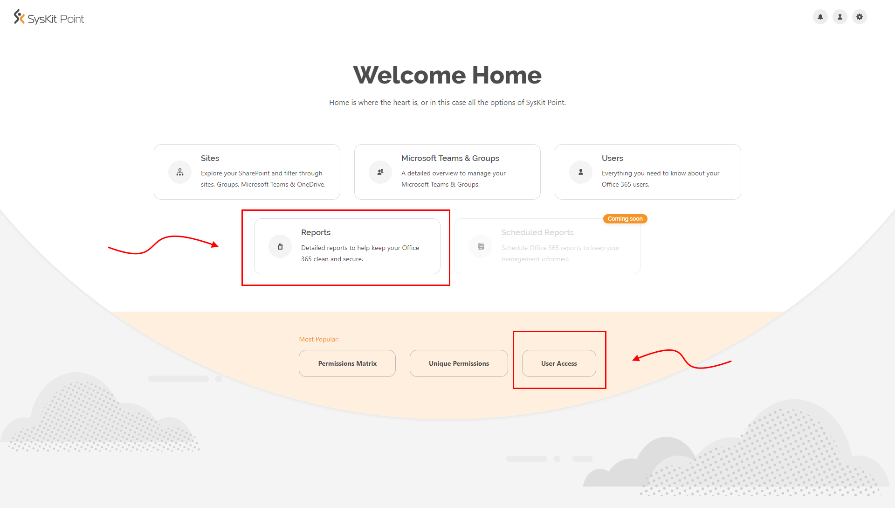

If you've clicked on **Reports** you will be redirected to **Report Center** where you can select **User Access** report.

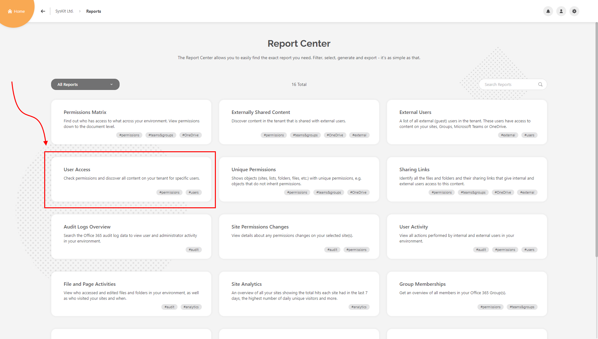

### Filtering through users on Selection page

After clicking on User Access, you are redirected to **Selection** page. There you can see all the **Users** on your **Tenant**.

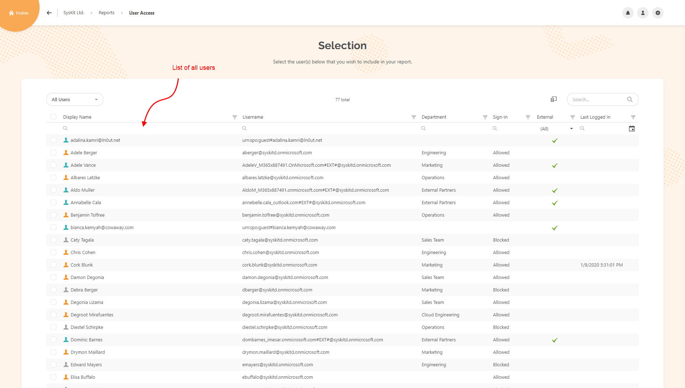

You can filter through **Users** by changing the type of **view** you're using. Change the type of view by clicking on **view selector** on the left side of the screen.

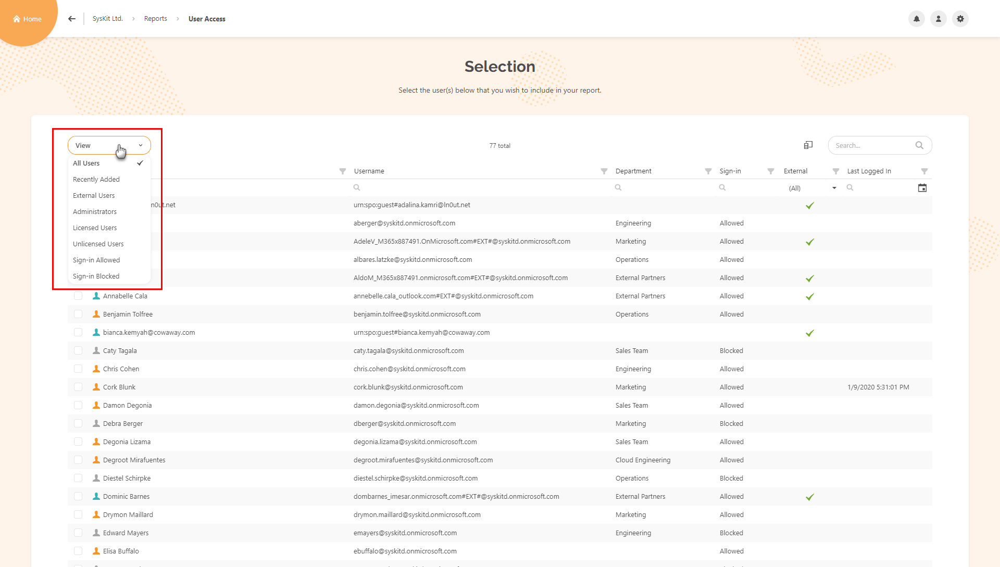

Clicking on **Column Chooser** also enables you at adding additional columns to the grid so you can filter further through those columns. To open a Column Chooser click on the icon next to the **Search bar** on the right.

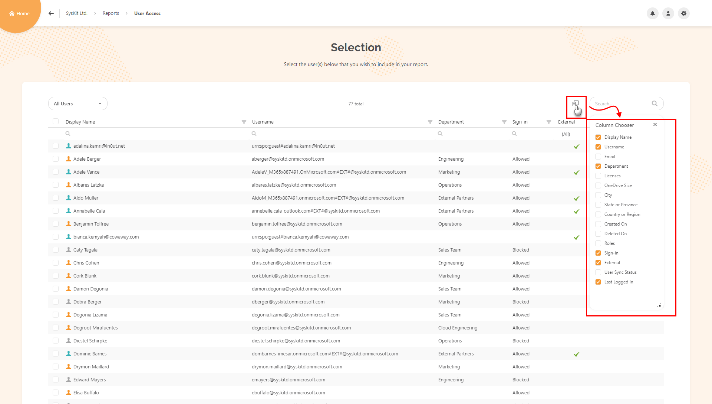

Last type of filtering is by using the **Search bar** which is located on the right side of the screen. Type into it to find a specific user you want.

### Making a Selection

While making a selection you have various possibilities. Clicking on a **checkbox** next to a **Display Name** column will select all the Users on the current view.

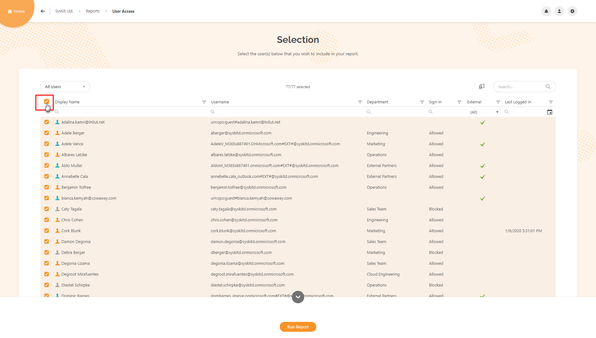

By clicking on checkboxes next to a User you can make a **single** or **multiple** User selection.

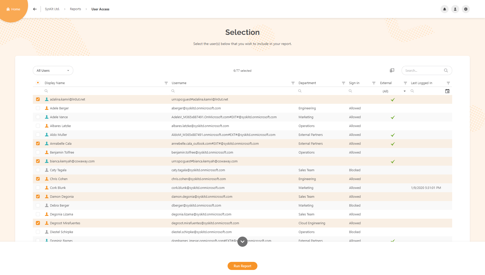

If you know names of Users you want to generate a report for and you don't want to scroll through the User list. You can use Search bar to enter each name and click on a checkbox next to User's name.

After you've made a selection, click on **Run Report**, it will generate User Access report for all the users you selected.

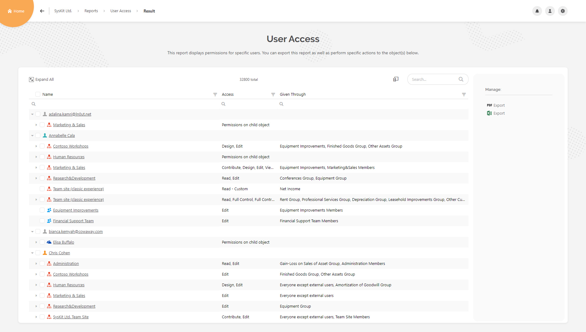

## Side Panel options when report is successfully generated

### Default options

When report is generated, if you focus on the right side of the screen you will see the **side panel**.

If you haven't selected anything on the report, there will be option to **Export** your report.

You can export the report into **PDF** and **Excel**.

### Options when making a selection

If you make a selection on a **Root level** of the report be it single selection or multi selection, side panel changes and action **Remove Access** becomes available.

Also you get the option to generate other **SysKit Point** reports for selected objects from there.

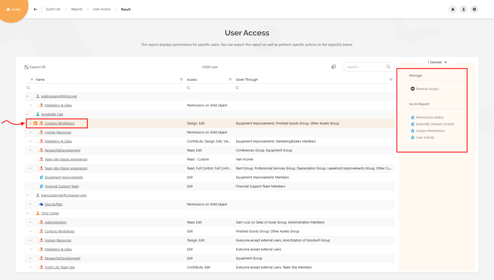

## Generate User Access from Site Details

You've visited **site details** page of one Site Collection on your tenant. There you can see the **Overview tile** which has **Users** and **External Users** metric.

If you click on Users metric, you will be redirected to the page which shows you all types of user that have access to that Site Collection.

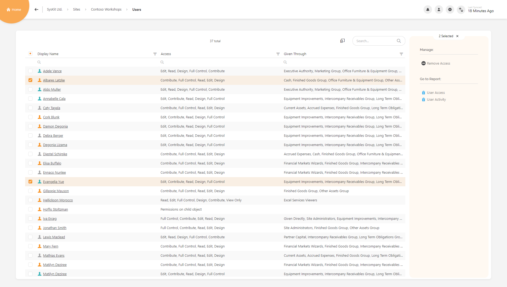

Clicking on External Users metric will show you only external users that have access to that Site Collection.

If you select some users on that page, you will get options in **Side panel** to generate a **User Access** report.

Generating report from there will show what kind of access do users have on that Site collection.

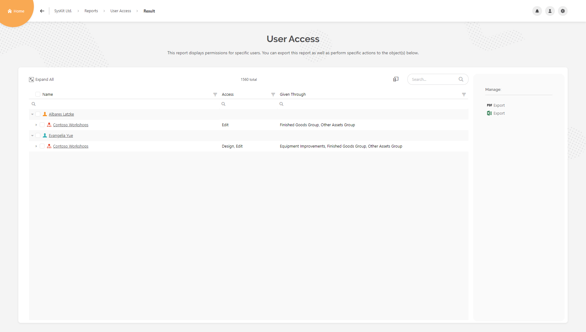

## Generate User Access from User Overview screen

From **Home Screen** click on **Users** tile which redirects you to Users Overview screen.

On **Users Overview** screen you see all the Users on your environment.

Select any user and on the **side panel** click on the **User Access**.

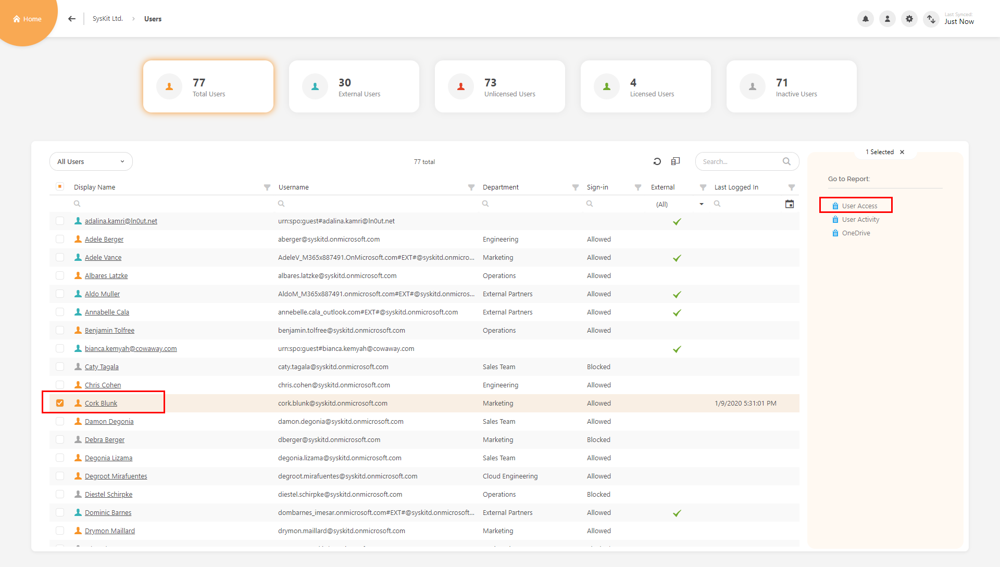

You will get a User Access report generated for the **selected user** on which you can see what kind of access does that user have on all objects of your environment.

