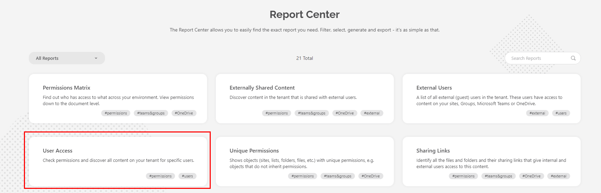
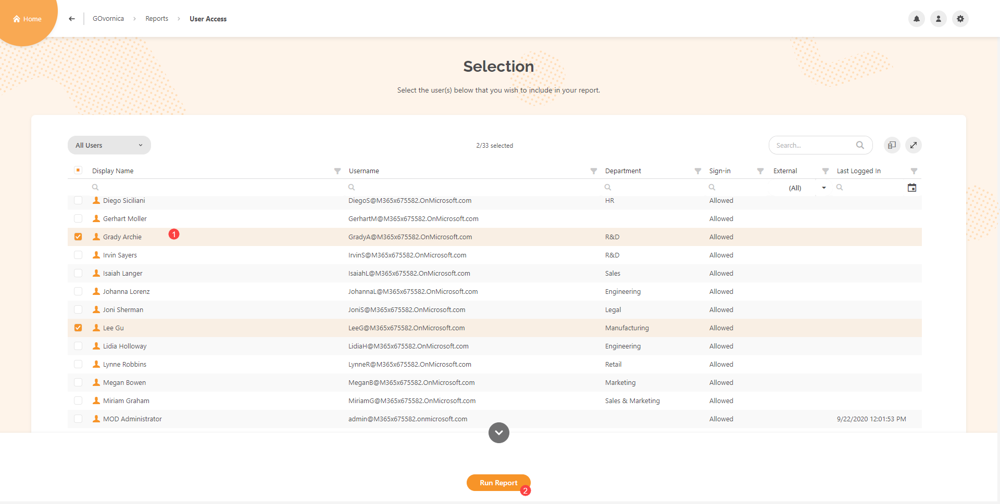
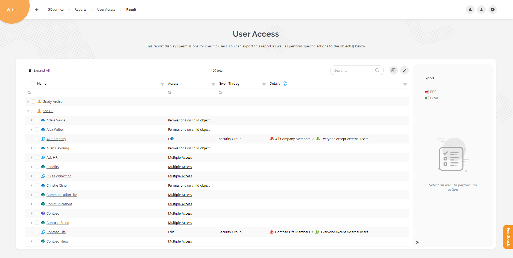
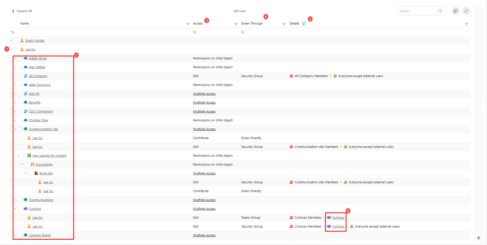
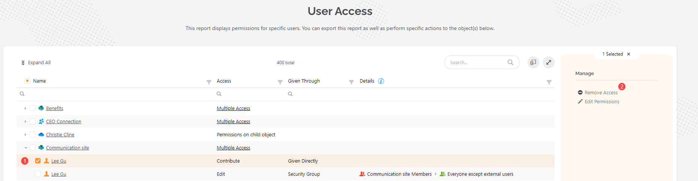

# Check Access for Specific Microsoft 365 User

## User Access in Microsoft 365 Environment

When using **Microsoft 365** for your daily **collaboration** there are numerous occasions where you will **grant** or **remove access** to specific items in your environment. **Microsoft 365** gives multiple ways of doing that, be it via **direct access** to the file or maybe through **security groups**, **SharePoint groups**, **sharing links** among other. After a while, you may lose traction of which user has access to a specific item and how you gave the access. This is where the **SysKit Point User Access report** comes in to save the day.

## SysKit Point User Access Report

### Capabilities

**SysKit Point User Access report** is a powerful tool that gives you the ability to **check** all **access** for **every specific user** in your **Microsoft 365 environment**. It enables you to:

* See what type of **access** does a user have \(**Full Control**, **Edit**, **Contribute**, or **any personal type of access** you may have **added** to your **environment**\).
* Understand **through which channel** is the **access given** to the user \(**Being a member in a SharePoint** **group**, **Group owner**, **Administrator**, through **security group** or **directly** to said **user**\).
* Show the **details** from which exact **source** were those rights given to it.
* **Perform** multiple **actions directly** on the report \(**Remove Access**, **Change Owners**, **Change to Member**, **Edit Permissions**, **Remove from Group**, **Remove Sharing Link**\).

### Use Cases

There are multiple occasions where using the **User Access report** will help you manage your **Microsoft 365 environment** successfully.

Some of them are:

* When a **new user** in your **Microsoft 365 environment** is being **onboarded**, to quickly check if they have all the correct permissions to succeed in their work.
* When a **user** is being **offboarded** to double-check if they still have access to some information, they shouldn’t have \(via **Anonymous sharing links**\).
* To check if some external collaborators have access to something they shouldn’t have.
* When reorganizing your environment \(**removing users** from certain **security groups** or **changing permissions** for specific users in your environment\).

## How to

### Generate User Access Report

First, you will need to **Sign in** to your **SysKit Point**. When located on the **home screen**, click on the **Reports** tile.

It will redirect you to the **SysKit Point Report Center**, where you can click on **User Access**.


**Hint! -** you can also access the **User Access report** through various other **SysKit Point** **reports**, **User overview screen**, and **User details screens**.


Now that you are located on the **User Access selection** **screen**, choose **one** or **multiple users** \(1\) you wish to generate the report for and click the **Run Report button** \(2\).

### Available Options and Actions

Now that you have **successfully** generated the **User Access report**, it should look something like this.

As the **User Access report** is a tree structure report, you can see:

* **User** for which you have generated the report \(1\).
* All **types** of **resources** \(**Sites**, **Microsoft Teams**, **Microsoft 365 Groups**, and **OneDrive** accounts\) that user has some kind of **access** to \(2\).
* What kind of **access** does the user have on a said **resource** \(3\).
* **How** the access was **Given Through** to said user \(4\).
* **Details** containing **exact resources** where the user got their **permissions** for \(5\), and if those are **Microsoft 365 Groups** or **Microsoft Teams** they are **drillable** to their respective **Detail Screens** in **SysKit Point** \(6\).

Let’s say that you have now found out that this user has **Multiple Access** over the same resource via **Direct Access** and **through** the **Security Group**. You want to **remove** the **direct access** that the user was given, so he only has access through the Security Group.

Here’s how to do it.

**Expand** the resource you have chosen, and **select** the **row** in which it says that the user has **Direct Access** \(1\). On the **side panel**, click the **action** called **Remove Access**\(2\).

**Remove Access** action **prompt** will appear where you just click the **Remove Access button**.

After the action is completed, you will receive a **notification bubble** where you can **click** and **see the result**. On selected resource, it is now visible that the user has rights only through the Security Group.

By the same principle, you can also **Edit** the given permissions, **Remove** said Users from groups with access to the resource, **Remove Sharing Links**, which might provide access to unwanted users.

**User Access report** helps all **Admins** and content **Owners** to keep their **Microsoft 365 environment** **clean**, **secure**, and **easy to manage** all at one place, the **SysKit Point**.

