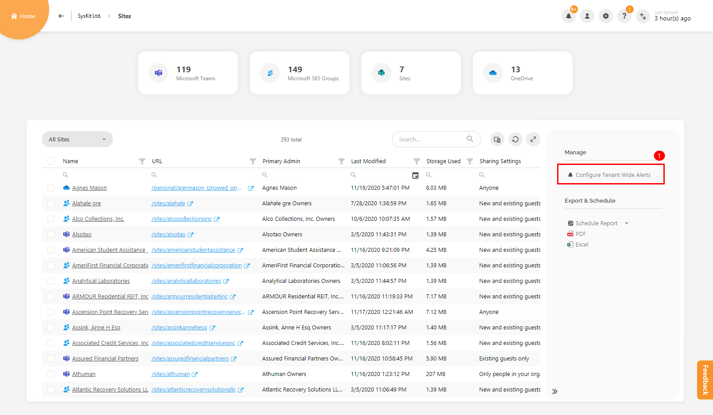
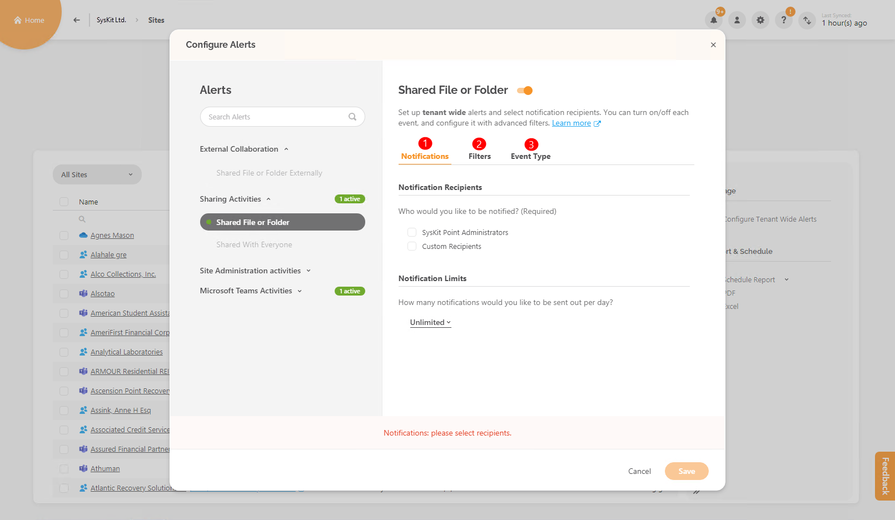
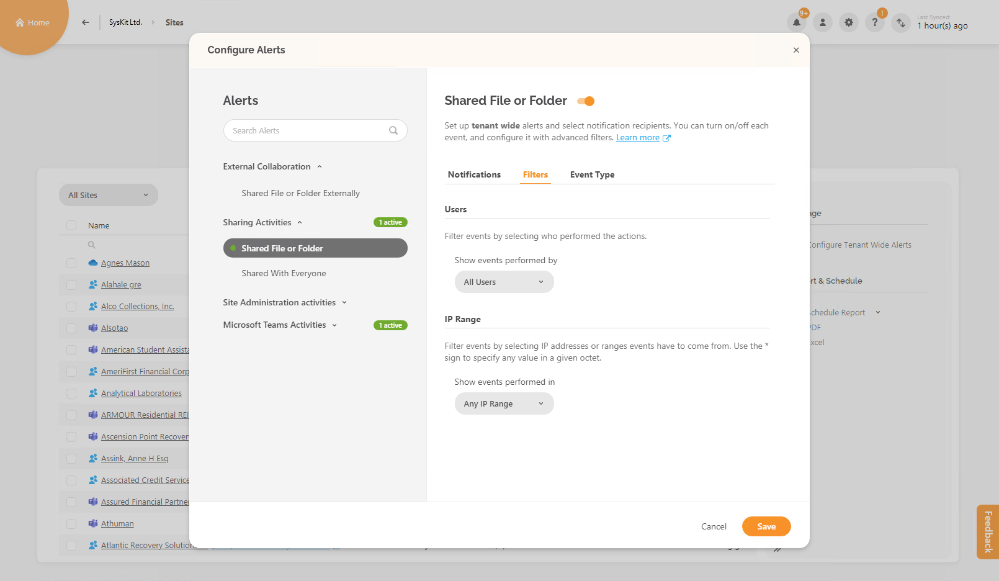
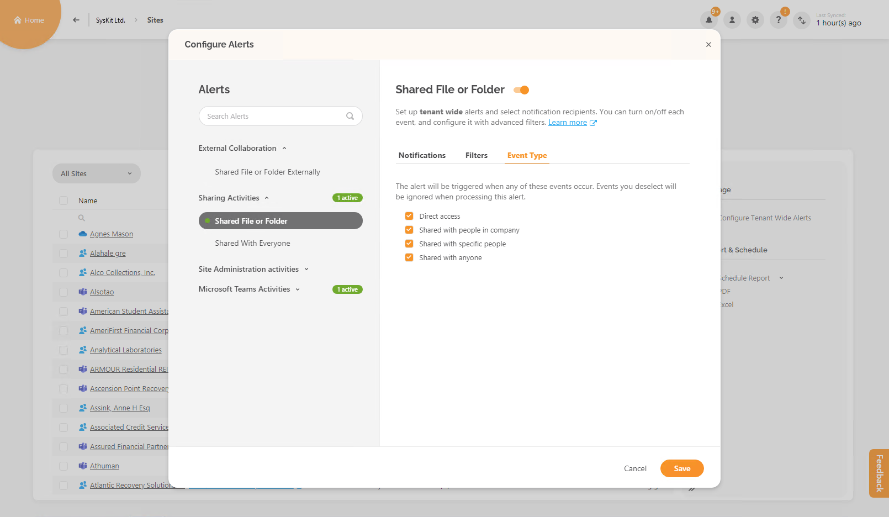

# Configure Alerts

**Alerts** feature in SysKit Point **allows you to track many events** that are collected within **Microsoft 365 audit logs**.  

**SysKit Point Admins** and **SysKit Point Collaborators** \(site owners and full control users\) can configure alerts. Point Admins can manage all created alerts regardless of who created them. 

You can enable alerts on the following screens:

* **Sites Overview** 
* **Microsoft Teams & Groups Overview** 
* **Users Overview** 

You can configure alerts on a **global level** of your tenant or individually for a **specific site or user**.

## Tenant wide alerts

These tenant wide alerts can be configured on Overview screens.


**Please note!** Tenant wide alerts on the **Sites Overview** screen and **Microsoft Teams & Groups Overview** screen are the same because they are focused on sites.


For **sites**, there are four alert categories:

* **External Collaboration** 
* **Sharing Activities** 
* **Site Administration Activities** 
* **Microsoft Teams Activities** 

For **users**, there are two alert categories:

* **User Activities** 
* **User & Role Administration Activities** 

## Specific alerts for site or user

Specific alerts for the site or user can also be created. On Overview screens, select one site/user and click on **Configure Alert** action in the side panel. 

For **sites**, there can be a maximum of seven alert categories to choose from, depending on the resource that you selected. These categories are:

* **External Collaboration** 
* **Sharing Activities** 
* **Site Administration Activities** 
* **File & Folder Activities** 
* **SharePoint List Activities** 
* **Microsoft Teams & Groups Membership Changes** 
* **Microsoft Teams Activities** 

For **users**, there is only one alert category **User Activities** with two alerts - **User Logged in**, **User Login Failed**.

## Enabling alerts

In the side panel of the Sites Overview screen, you will notice the link **Configure Tenant Wide Alerts \(1\)**.

A dialog screen will open when you click on it.  

You will see few alert categories on the left side.  

To start editing one alert, switch the state of **toggle button next to the title \(1\)**.  

When you have an active alert already, a **green notification \(2\)** will be present next to the appropriate alert category. 

In total, there can be three sections in defining an alert:

* **Notifications \(1\)** 
* **Filters \(2\)** 
* **Event Type \(3\)** 

First, you must **define recipients** - choose between SysKit Point Admins and/or custom recipients. 

Notification limits that are sending daily can be set from the dropdown menu. 

In the **Filters** section, you can define which **users** and **IP ranges** will trigger the alert. 

There are many combinations for you to set up. You can set the alert only for external users or some specific one. 

For some alerts, you can even choose the users on which the events were performed on. 

If there are more events related to the alert, the **Event Type** section will also be present. 

You can turn off certain events if you like. 

When the alert is created, and later event is performed and collected by audit logs, an e-mail will be sent to recipients that you defined while configuring the alert. 

In the picture below is the example of an e-mail. You can access the alert details screen by clicking on the **View Alerts Details** link. 

## Editing alerts

**Edit Alert** action is available on two screens - **Alerts Overview** and **Alert Details**.

You can always edit alerts on Overview screens where you created them - both tenant wide and specific site/user alert.

## Accessing alert reports

When you login into SysKit Point as Point admin, you will see tile **Alerts** in the lower part of the screen.

If you click on the tile, the **Alerts Overview** report will open. Here you can see all alerts that are created and currently active.


**Hint!** You can also access the **Alerts Overview** screen from the **persona icon** in the upper right corner of every screen in the application.


On the **Alerts Overview** screen you can:

* switch the view between **alert and scope \(1\)** 
* select additional columns in **column chooser \(2\)** 
* find two actions - **Disable Alert** and **Edit Alert \(3\)** when you select one row 


**Hint!** **Disable alert** action allows multiple row selections.


When you haven't selected anything on the screen, in the side panel, there is an action **Add Alert \(2\)**. With this, you can define tenant wide alerts for sites.  

Here is also a link to the **Alerts History \(1\)** screen which shows all triggered alerts in your environment.

On the **Alerts History** screen you can:

* select one or multiple rows and **mark alerts as resolved and write a comment \(1\)** 
* open **details screen for a single alert** **\(2\)** 

**Alert Details** screen allows you to see additional information about the alert and here you can:

* **mark alert as resolved \(1\)** 
* **edit settings for the alert \(2\)** 
* **expand the More Details \(3\)** section - here are all audit logs for this alert 
* **export** both sections - **triggered alerts and alert audit details \(4\)** 


**Hint!** When you open the **Notifications dropdown** from the upper right menu on every screen within the application, you can: 

* click on the **View Details link \(1\)** to open the **Alert Details** screen for a specific alert 
* click on **View All Alerts link \(2\)** to open the **Alerts History** screen 


