# Configure SSL Certificate

## Generate an SSL Certificate

Here are the step-by-step \_\*\*\_instructions on how to generate an SSL certificate using the Certificates Microsoft Management Console \(MMC\) when you have an internal Certification Authority \(CA\).

From the server on which you have **SysKit Point** installed, open the **MMC**. Click on **File &gt; Add/Remove Snap-in** and add the **Certificates** snap-in, managing the certificates for the Computer account on the local machine. Click **OK** to confirm.

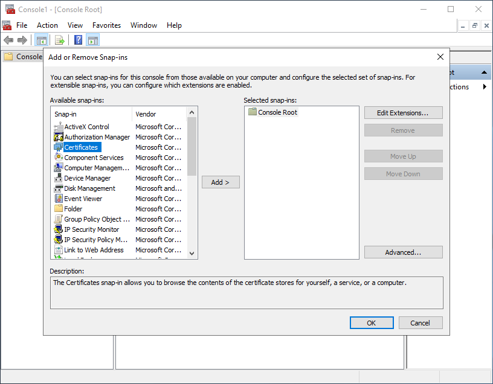

Then expand **Certificates \(Local Computer\)** &gt; **Personal**, right-click on **Certificates** and go to **All Tasks &gt; Request New Certificate.**

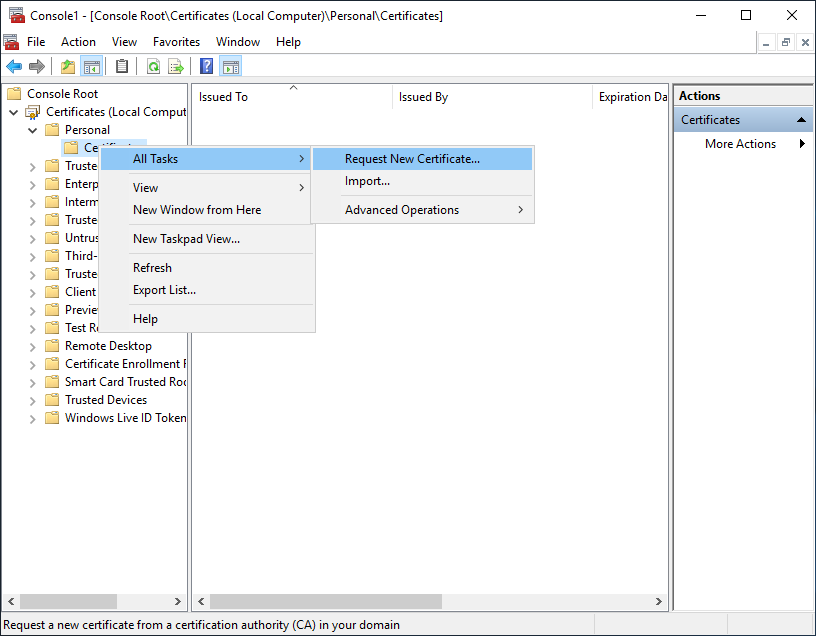

Choose **Active Directory Enrollment Policy** to use your existing internal CA. Click **Next** to continue.

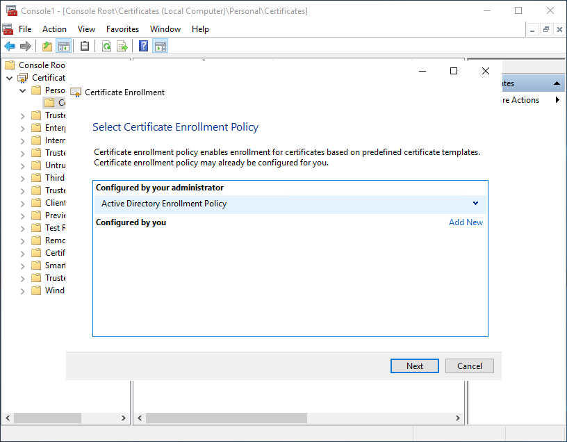

Select the appropriate **Web Server** certificate template and click the link below to enter more information.

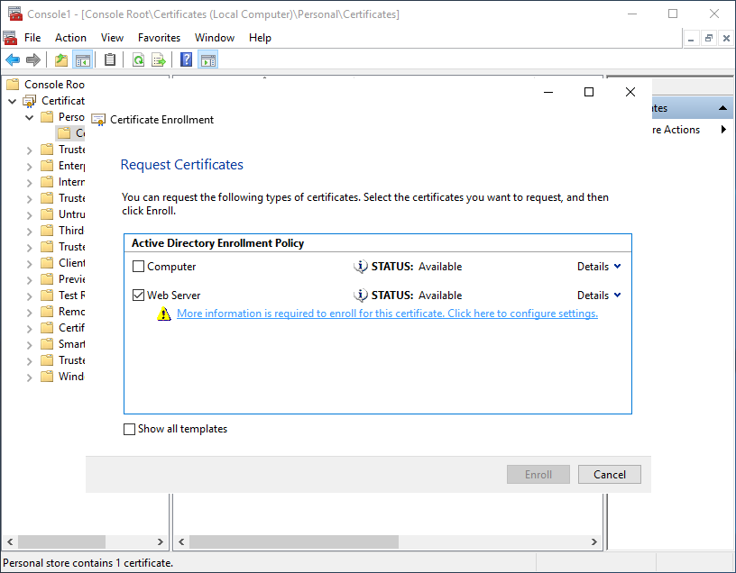

On the Subject tab, add the **Common name** for the **Subject name**, and the **DNS** name for the **Alternative name**. You can put the wildcard or name-specific values here, which can be the same. Chrome 58 and later uses the DNS alternative name only.

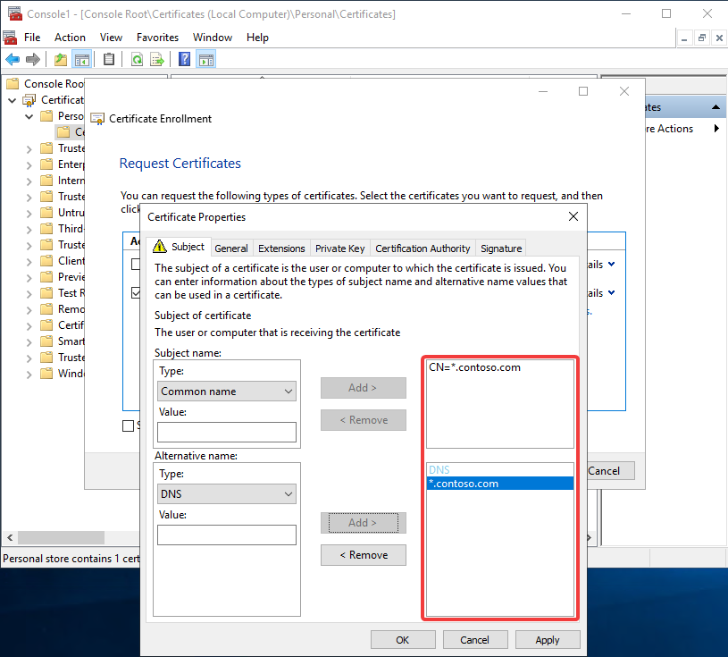

Enter a **Friendly name** on the General tab.

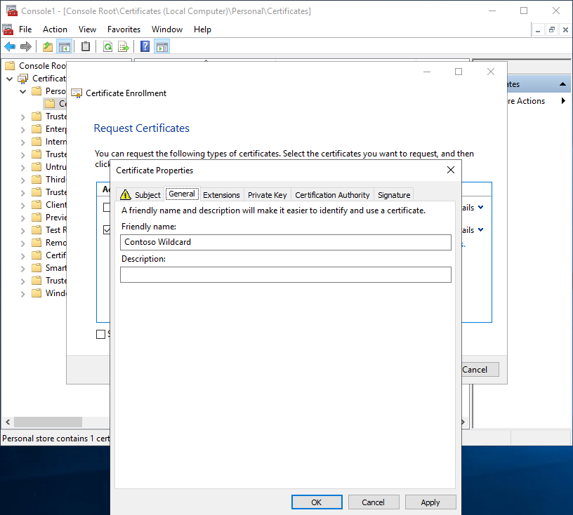

Check the **Make private key exportable** option under the Key options on the Private Key tab and click **OK.**

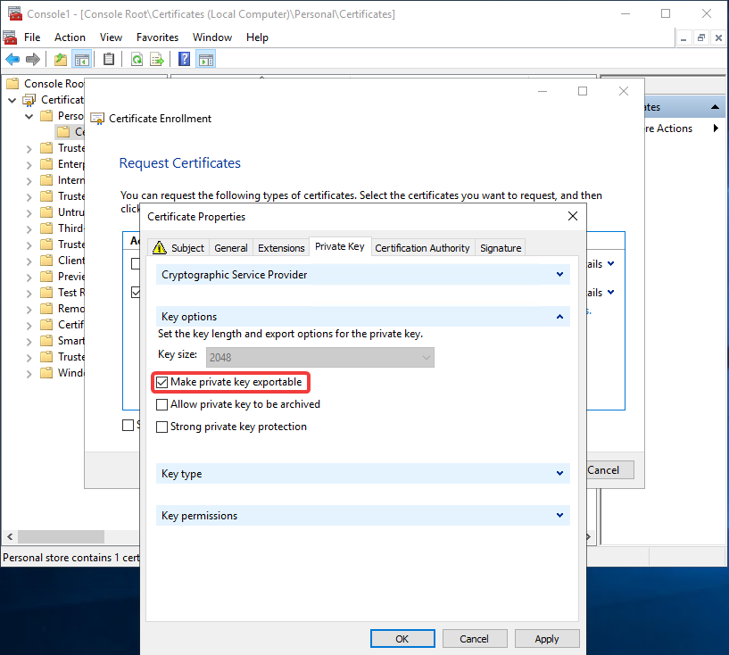

Click **Enroll** to generate the new cert from the CA and install it on the server.

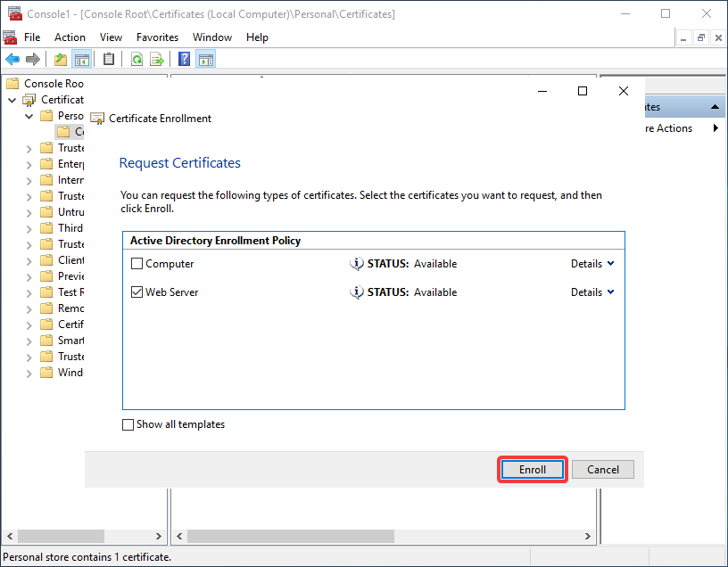

After the certificate is successfully installed, click **View Certificate** and go to Details tab to view the certificate information such as **Subject Alternative Name.** Once you are done reviewing certificate details, **click Finish.**

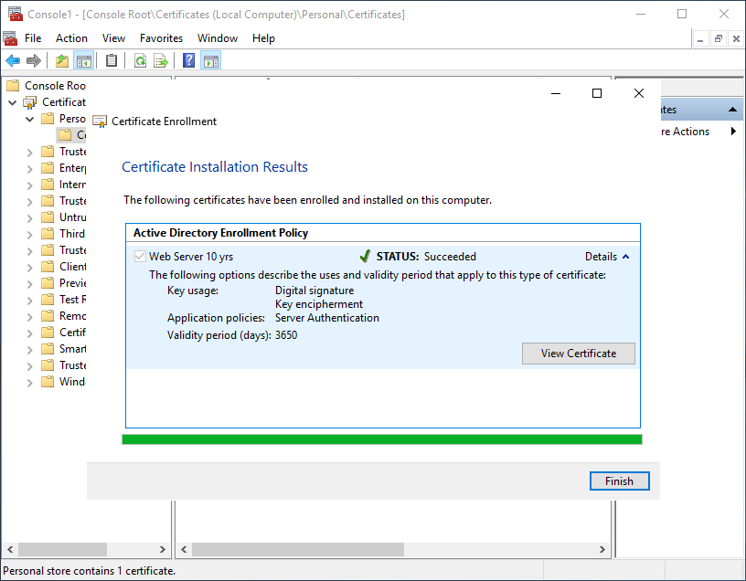

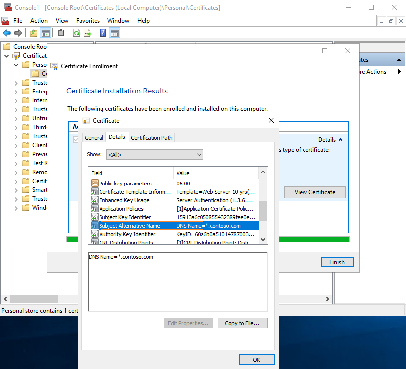

## Export the SSL Certificate

To import the certificate in SysKit Point Configuration wizard, you'll need to export it with its private key. From the MMC, right-click on the certificate you installed and choose **All Tasks &gt; Export.** Choose the **Yes, export the private key** option. Click **Next** to proceed.

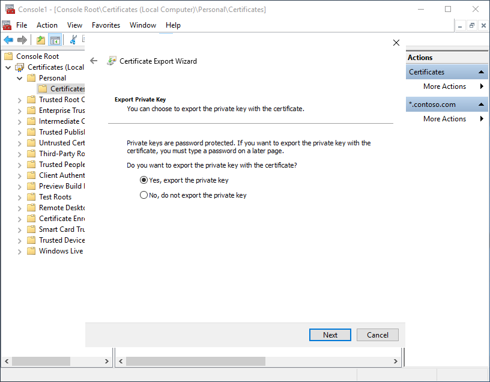

On the following screen, choose the **Include all certificates in certificate path if possible** option. Click **Next**.

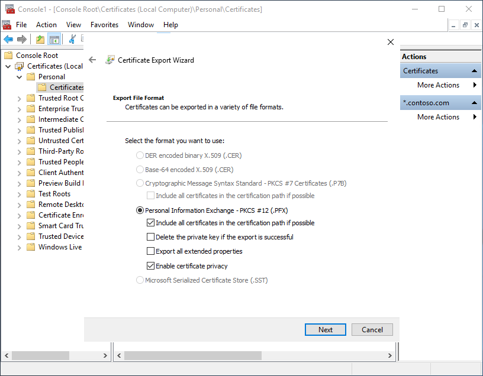

**Enter a strong password** you will remember and save the certificate to the desired location.

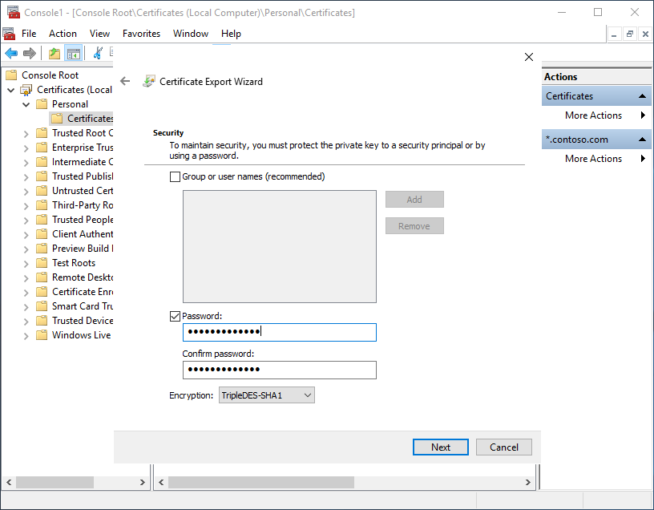

After you exported the certificate, use [SysKit Point Configuration Wizard](../installation-and-configuration/configure-syskit-point.md#web-application-settings) to import the same SSL certificate into the Web Application Settings, with the password you set previously. Also, **make sure you have an appropriate DNS record** in place for the URL you set in the wizard.

