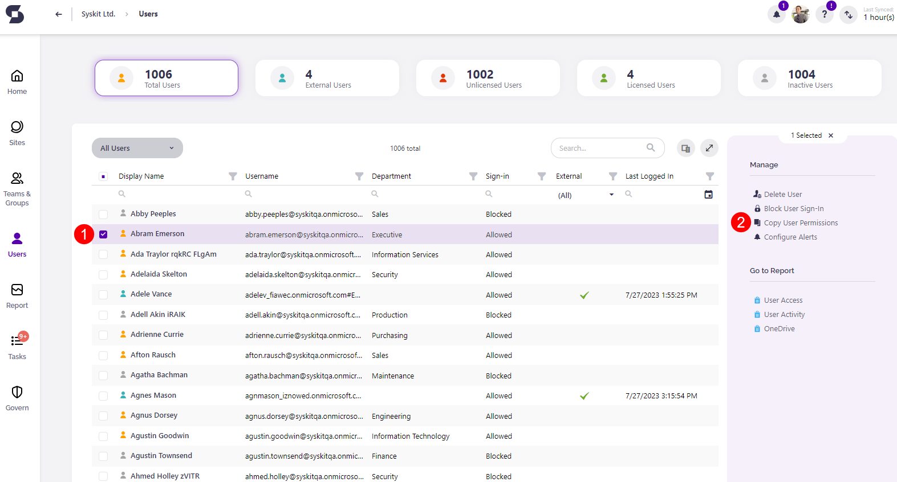
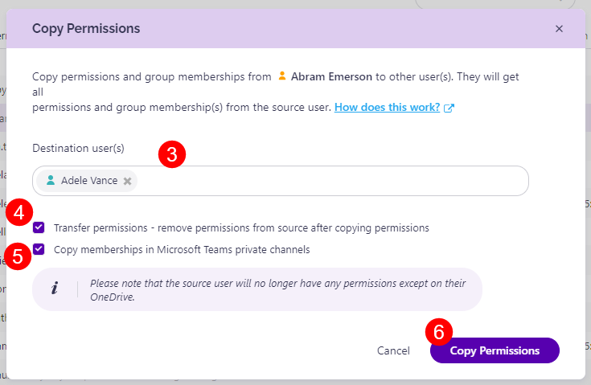
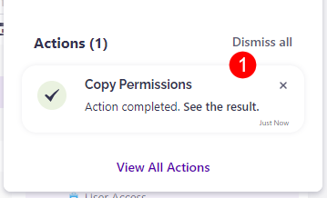
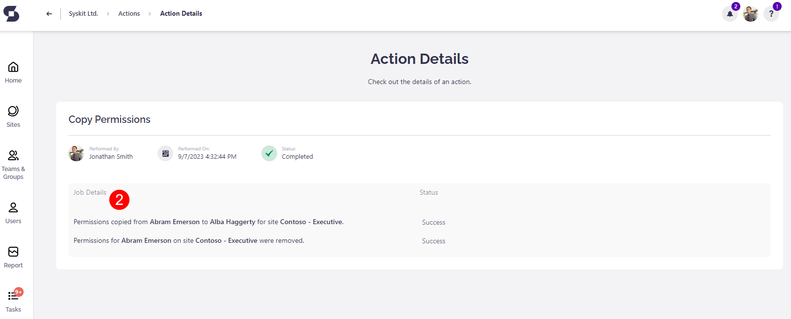

# Copy User Permissions

The **Copy User Permissions action** enables you to copy all directly given permissions and group memberships from one user to another user, or even multiple users, eliminating the daunting task of comparing permissions between users and manually applying them if needed.


**Please note!**  
The Copy User Permissions action is available only for SysKit Point users with the SysKit Point Admin role.


To learn more about roles in SysKit Point, see the [following article](../installation-and-configuration/enable-role-based-access.md).

You can take advantage of the Copy User Permissions action in the following cases:

* **Onboarding a user** – make the process faster by copying permissions from an existing team member to the new one, for example; you can even copy permissions to multiple users at once
* **Offboarding a user** – copy all permissions from a user that is leaving your company to a new colleague that is filling his position; after that, all permissions are removed from the old colleague if you decide to do so

## Running the Action

To copy permissions from one user to another, follow these steps:

* **Select a user on the Users overview screen \(1\)** – permissions will be copied from this user
* **Click the Copy User Permissions \(2\)** action in the side panel – the Copy Permissions dialog opens
* **Select one or more Destination users \(3\)** – permissions will be copied to this user
* **Check the Transfer Permissions option \(4\)** if you want to remove all permissions from the source user after the permissions are granted for the

  destination users

* **Click the Copy Permissions button \(5\)** to run the action

Once the Copy User Permissions action is started, a notification is displayed. **Click the action in the Notifications menu \(1\)** to access the **Action Details screen \(2\)** if you want to see all steps taken as a part of this action.

