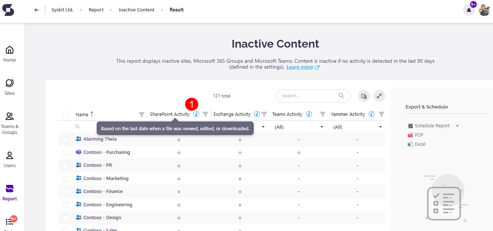

# Identify Inactive Content

Have you ever wondered how to discover all inactive content in your Office 365 environment?  
It is important to have this kind of information because you want a well-organized and clutter-free Office 365 environment.   
Now, you can find it all in one place with the help of **SysKit Point**.

## Monitored 
Workloads


To decide whether something is inactive in your Office 365 environment, we are collecting activity data for the following workloads: **SharePoint**, **Exchange**, and **Yammer**, with **Teams workload coming soon**.

**SharePoint activity** is collected via Office 365 audit logs. The last activity is based on the latest date when a file was viewed, edited, or downloaded.

For the collection of **Exchange activity**, SysKit Point uses Office 365 groups activity report available in Microsoft 365 admin center. The **last activity is based on the latest date when an email was delivered** to a group.

The collection of **Yammer activity** is also accomplished through Microsoft 365 admin center usage report but for Yammer groups activity. The **last activity is based on the latest date a message was read, posted, or liked** by the group.

Data for Exchange and Yammer activities is collected by SysKit Point's dedicated worker within non-working hours which are defined as between 7:00 p.m. and 7:00 a.m.



**Please note!**                                                                                                                                       Activity is being tracked from Syskit Point installation onward! This applies to SharePoint and Exchange workloads.


## 
Defining what is inactive content in SysKit Point


For setting up what is **inactive/unused content** for your environment you can choose the number of days between **30** and **180** in SysKit Point Settings.

Open the **Settings** from any screen within the application, go to the **General Settings** screen where you will find section **Unused Content**.


Enter the number of days in the field and click on the **Save** button to update value throughout the application.

## 
How to access unused content within SysKit Point


There are several ways to access unused content in **SysKit Point**.

You can open the **Sites Overview** screen and **Microsoft Teams & Groups Overview** screen.

### 
Sites Overview Screen


When you open the Overview screen from the **Welcome Home** screen, you have to open **Column** **Chooser** and mark column **Activity** so that it can be shown in the grid.


You can see the **blue information icon** in the Activity column header.


When you hover over it, you will see which workloads are included in the evaluation of the activity for Sites, Microsoft Teams, Office 365 Groups, and OneDrives. There is also information for which period \(number of days\) was the assessment made for the activity.

In the grid, you have a column filter so you can see all active or all inactive content.

Hovering over circle icons for each row you can get the information if the item has **no activity** since the application started collecting the data - that would be a **gray circle**.

If the **circle icon** is colored **green**, that means that the item **has** the **activity**. Hover will display the date when was the last activity.


**Hint!**                                                                                                                                                              If more than one workload was active, then the latest date among all workloads will be shown here.


There is also a separate view **Inactive Sites**, which can be accessed from the View dropdown menu. This way you have already displayed column Activity on the grid.

### 
Microsoft Teams & Groups Overview Screen


This Overview screen has a similar representation of workload activity for teams and groups as the Sites Overview screen.

The **Activity** column is shown as the last column in the grid.

The same rules of displaying the activity data are applied here as explained for the Sites Overview screen.

There is a separate **Inactive Groups** view.

**Inactive** **tile** above the grid shows a quantity representation of inactive content.

### 
Sites Details screen and Microsoft Teams & Groups Details screen

Accessing **Details** screens for sites, groups, and teams are possible by clicking the link in the **Name** column on **Overview** screens.

The activity information inside Details screens is shown in **Analytics and Usage** tile.


Here you can see separate section **Activity**. Hover over **blue information icon** to see for which workloads are activities tracked.

Workload activity data is shown only for the **root site level**. Document libraries, folders, or list items won't have displayed the **Activity** section in **Analytics and Usage** tile.

### 
Inactive Content report


If you open the **Report Center**, you will find the **Inactive Content** report.

By clicking on the dedicated tile, it will open the **Options** screen with a filter for you to choose whether you want to include **Sites**, **Microsoft Teams**, **Office 365 Groups** in the report.


The default value is set to include all of them in the report.

The report will be generated when you press the **Run Report** button.

On the report, there are four columns in the grid - **Name** column on which you can click to open **Details** screen, and three activity columns for **SharePoint**, **Exchange**, and **Yammer**.

Two columns, **Type** and **Primary** **Admin**, can be shown in the grid if you select them in **Column Chooser**.


Notice the **blue information icon** next to the Activity columns. Hovering above the icons displays **tooltip** with information about what is measured to determine the last activity date.


**Grey circle** icons represent that **workload exists**, and **hovering** **over** it will show information since when SysKit Point measures that there is **no activity**.

**Dash \(-\)** means that there is **no workload** for that item. Hover over it will tell you that **workload does not exist**.

