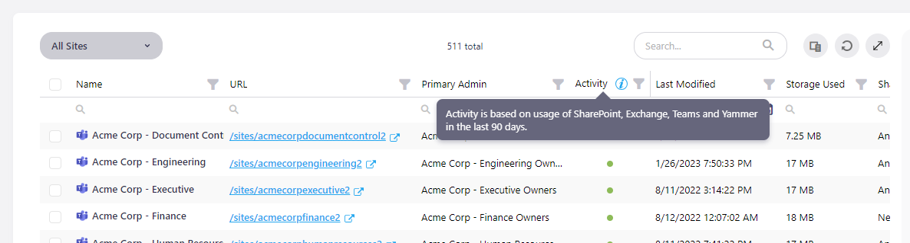
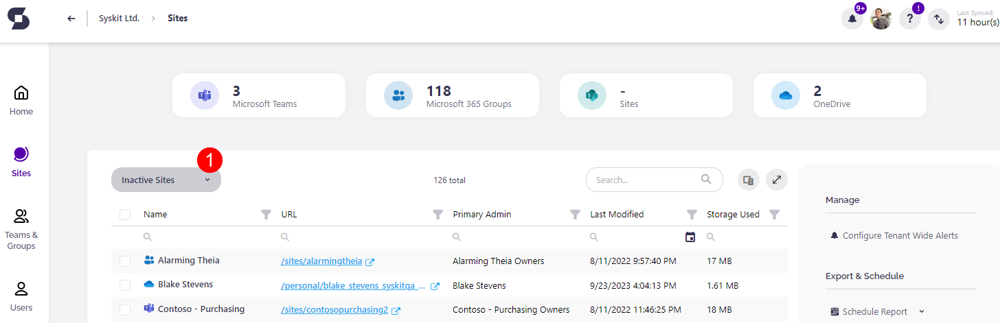
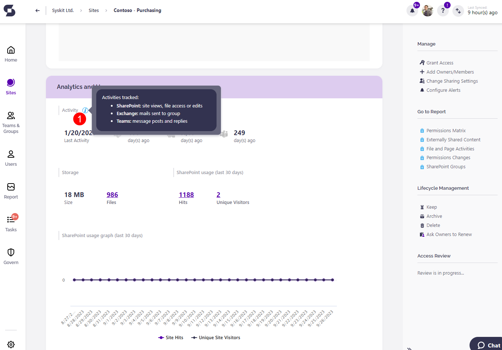

# Identify Inactive Content

Have you ever wondered how to discover all inactive content in your Office 365 environment?  
It is important to have this kind of information because you want a well-organized and clutter-free Office 365 environment.   
Now, you can find it all in one place with the help of **SysKit Point**.

## Monitored 
Workloads


To decide whether something is inactive in your Office 365 environment, we are collecting activity data for the following workloads: **SharePoint**, **Exchange**, and **Yammer**, with **Teams workload coming soon**.

**SharePoint activity** is collected via Office 365 audit logs. The last activity is based on the latest date when a file was viewed, edited, or downloaded.

For the collection of **Exchange activity**, SysKit Point uses Office 365 groups activity report available in Microsoft 365 admin center. The **last activity is based on the latest date when an email was delivered** to a group.

The collection of **Yammer activity** is also accomplished through Microsoft 365 admin center usage report but for Yammer groups activity. The **last activity is based on the latest date a message was read, posted, or liked** by the group.

**Data for Exchange and Yammer activities is collected by SysKit Point's dedicated service within non-working hours**, between 7:00 PM. and 7:00 AM.



**Please note!                                                                                                                                       Activity is being monitored from Syskit Point installation onward!** This applies to SharePoint and Exchange workloads since historical data for these workloads is not available in usage reports.


## 
Define What Is Inactive


You can **configure what is considered to be inactive** in SysKit Point by changing the number of inactive days, after which workloads will be marked as inactive. To do so, open the **Settings** page from any screen within the application, go to the **General Settings** screen where you will find the **Unused Content** section. **Enter the number of days** in the field and click the **Save** button to update the value. The number of days can be set to a value between 30 and 180.

## 
View Inactive Content in SysKit Point


There are several places where you can find activity information in **SysKit Point**. Let's get to know them.

### 
Sites Overview Screen


When you open the Sites Overview screen from the **Welcome Home** screen, click the **Column** **Chooser** and mark the **Activity** column to show it in the grid.


You can see the **blue info icon** in the Activity column header.


When you **hover over the info icon**, you will see which workloads are included in the evaluation of the activity for Sites, Microsoft Teams, Office 365 Groups, and OneDrive sites. There is also information for which period \(number of days\) was the activity assessment made. In the grid, you have a **column filter** to help you see just the active or the inactive content.

Hover over circle icons for each row to get more information about the **activity**. The **circle is colored gray** if there **was no activity since the application started collecting the activity data**. If the **circle is colored** **green**, the **content is** **active**. The date of the last activity is displayed on hover.


**Hint!**                                                                                                                                                              If more than one workload was active, then the latest date among all workloads will be shown here.


There is also a separate **Inactive Sites view** available, which can be accessed from the View drop-down menu. By selecting it, the Activity column becomes visible in the grid.

### 
Microsoft Teams & Groups Overview Screen


This Overview screen has a similar representation of workload activity for teams and groups as the Sites Overview screen.

The **Activity** column is shown as the last column in the grid.

The same rules of displaying the activity data are applied here as explained for the Sites Overview screen.

There is a separate **Inactive Groups** view.

**Inactive** **tile** above the grid shows a quantity representation of inactive content.

### 
Sites Details screen and Microsoft Teams & Groups Details screen

Accessing **Details** screens for sites, groups, and teams are possible by clicking the link in the **Name** column on **Overview** screens.

The activity information inside Details screens is shown in **Analytics and Usage** tile.


Here you can see separate section **Activity**. Hover over **blue information icon** to see for which workloads are activities tracked.

Workload activity data is shown only for the **root site level**. Document libraries, folders, or list items won't have displayed the **Activity** section in **Analytics and Usage** tile.

### 
Inactive Content report


If you open the **Report Center**, you will find the **Inactive Content** report.

By clicking on the dedicated tile, it will open the **Options** screen with a filter for you to choose whether you want to include **Sites**, **Microsoft Teams**, **Office 365 Groups** in the report.


The default value is set to include all of them in the report.

The report will be generated when you press the **Run Report** button.

On the report, there are four columns in the grid - **Name** column on which you can click to open **Details** screen, and three activity columns for **SharePoint**, **Exchange**, and **Yammer**.

Two columns, **Type** and **Primary** **Admin**, can be shown in the grid if you select them in **Column Chooser**.


Notice the **blue information icon** next to the Activity columns. Hovering above the icons displays **tooltip** with information about what is measured to determine the last activity date.


**Grey circle** icons represent that **workload exists**, and **hovering** **over** it will show information since when SysKit Point measures that there is **no activity**.

**Dash \(-\)** means that there is **no workload** for that item. Hover over it will tell you that **workload does not exist**.

