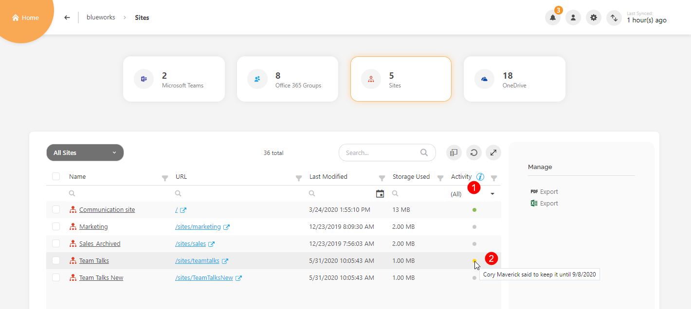
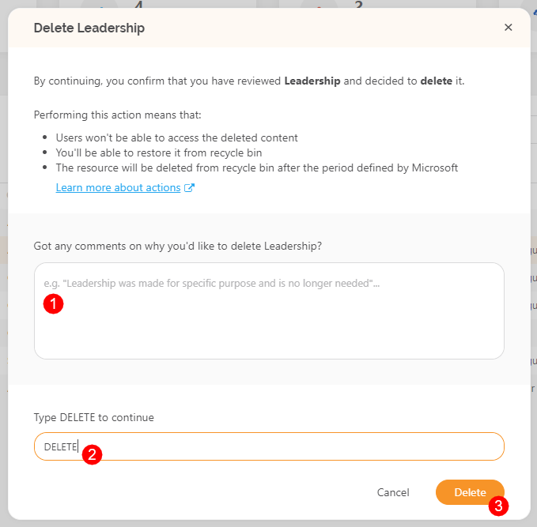
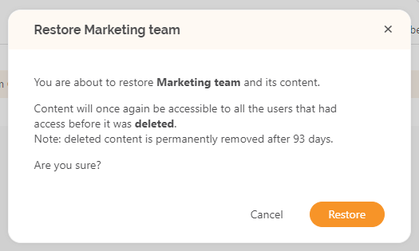

# Run Lifecycle Management Actions in SysKit Point

## Lifecycle Management Actions in SysKit Point

SysKit Point includes a set of **Lifecycle Management actions** that can be executed on Microsoft 365 resources - Microsoft Teams, Microsoft 365 Groups, and sites. The following actions are available:

* **Keep**
* **Archive**
* **Delete**
* **Restore**

Each action can be executed by **SysKit Point Admin** and **SysKit Point Collaborator** users.  
**Lifecycle Management actions** – **Keep, Archive, and Delete –** are available on the following screens in SysKit Point:

* **Sites overview**
* **Microsoft Teams & Groups overview**
* **Details of a selected resource**
* **Lifecycle Management task details**

You can find the actions in the side panel, under the **Manage category** **\(1\)**, except for the **Lifecycle Management task details** screen, where they are **displayed in a ribbon \(2\)**.

The **Restore** action is **available for deleted and archived resources only.** You can find these resources on the overview screens by selecting the **Deleted/Archived Sites/Groups view \(1\)**. On the view, additional columns are available:

* **Deleted By \(2\)**
* **Deleted On \(3\)**
* **Can be Restored \(4\)** – green checkmark is displayed for resources currently in the Recycle Bin and can be restored
* **Restore action \(5\)** is available in the side panel, as already described.


**Please note!**  
When the Lifecycle Management flow is enabled, **executing an action** \(except Restore\) from any of the mentioned screens **will resolve existing unresolved Lifecycle Management tasks** for the resource.



**Hint!**  
On the Sites overview screen and the Microsoft Teams & Groups overview screen, you **run actions on resources in bulk** by selecting multiple resources and clicking the wanted action from the side panel.


Lifecycle Management actions are also available in emails that SysKit Point sends to site owners and admins as a part of the Lifecycle Management Automation. Still, **actions can be executed in SysKit Point only**. Follow [this link](https://docs.syskit.com/point/common-tasks/lifecycle-management-actions) to learn more about Lifecycle Management emails and tasks.

Next, all actions are described in greater detail.

### Keep

The **Keep** action is run to **mark that the selected resource is being used**. As a result, the **kept resource** will be:

* **considered active** for a selected amount of time
* **exempt** when inactive resources are calculated by the Lifecycle Management Automation

When executing this action, you can:

* **select the period \(1\)** for which the resource should be kept
* **leave a comment \(2\)** on why you want to keep this resource
* **confirm the action** by clicking the **Keep button \(3\)**

By default, the selected period \(number of days\) is defined inside the settings, after which a resource will be considered inactive. Besides the default option, you can always choose one of the following:

* **6 months**
* **1 year**
* **2 years**
* **Custom**

The **Custom** option lets you choose a specific date in the future until which you want to keep a resource and consider it active.

As a result of this action, you can see the resource getting a new activity state – **Kept** – visible in the **Activity column \(1\)** on overview screens. Kept resources are depicted with a yellow circle. **On hover \(2\)**, the circle provides additional information on who and until when said to keep the resource.


**Please note!**  
The Keep action can be executed on inactive resources only!


### Archive

Archiving a resource within SysKit Point results in the following:

* **the resource gets into a read-only state**
* **access to the site is left only for administrators and owners**
* **the permissions inheritance is restored on all objects**
* **all memberships on the resource are removed in Microsoft 365**
* **all memberships are saved in SysKit Point database to support the Restore action**
* **the resource is renamed and gets the suffix \[Archived\]**

On the Archive action dialog, you can:

* **enter a comment \(1\)**
* **confirm the action by typing ARCHIVE \(2\)**
* **execute the action by clicking the Archive button \(3\)**


**Please note!**  
This action can be executed only on resources that are not archived or deleted.



**Hint!**  
As described in the introduction, you can find the archived resources by switching to the Archived view on the overview screens.


### Delete

With this action, you can easily delete a resource inside Microsoft 365.


**Please note!**  
This action **does not delete** a resource **permanently**.  
**The deleted resource is moved to the Recycle Bin**, and **you can restore inside the period defined by Microsoft**. Microsoft 365 keeps your sites for **93 days**, and after that, they are deleted permanently. Microsoft 365 Groups are kept in the Recycle Bin for **30 days**.



**Please note!**  
You can find more about Microsoft’s retention policies on the following links:

* [Microsoft 365 Groups](https://docs.microsoft.com/en-us/microsoft-365/admin/create-groups/restore-deleted-group?view=o365-worldwide)
* [SharePoint Online](https://support.office.com/en-us/article/restore-deleted-items-from-the-site-collection-recycle-bin-5fa924ee-16d7-487b-9a0a-021b9062d14b?ui=en-US&rs=en-001&ad=US#ID0EAAEAAA=Online)


When running the delete action, do the following:

* **enter a comment \(1\)**
* **confirm the action by typing DELETE \(2\)**
* **execute the action by clicking the Delete button \(3\)**


**Please note!**  
This action can be executed on resources that are not deleted or archived.


### Restore

The **Restore action** can be executed on archived and deleted resources.

* **When restoring a deleted resource**, the action results in the following:
* **The resource is removed from the Recycle Bin**
* **The resource is considered active**
* **When restoring an archived resource**, the action results in the following:
* **All memberships are be restored**
* **The suffix \[Archive\] is removed from the resource name**
* **The resource is considered active**

When running the Restore action, a confirmation dialog appears. To execute the action, click the **Restore button**.

