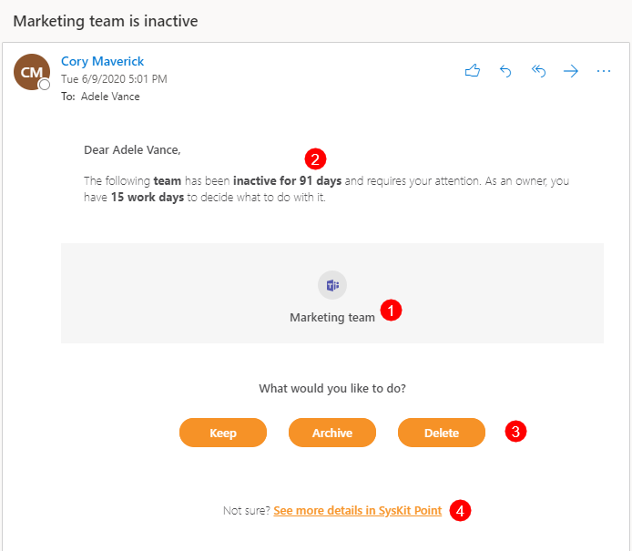
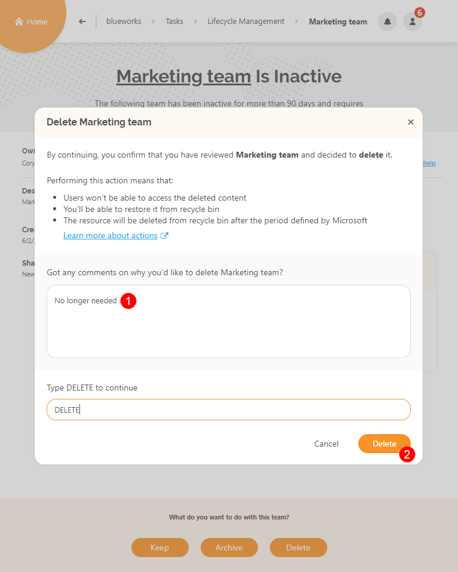
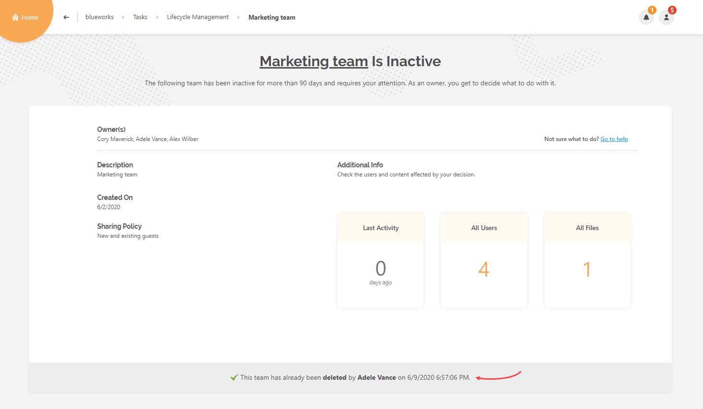
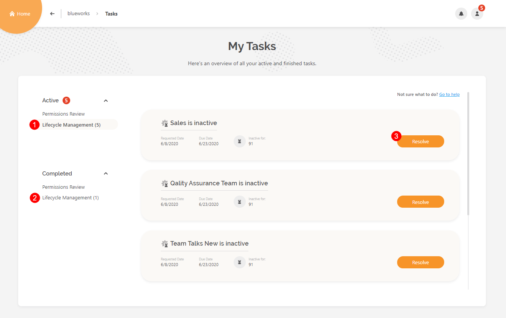
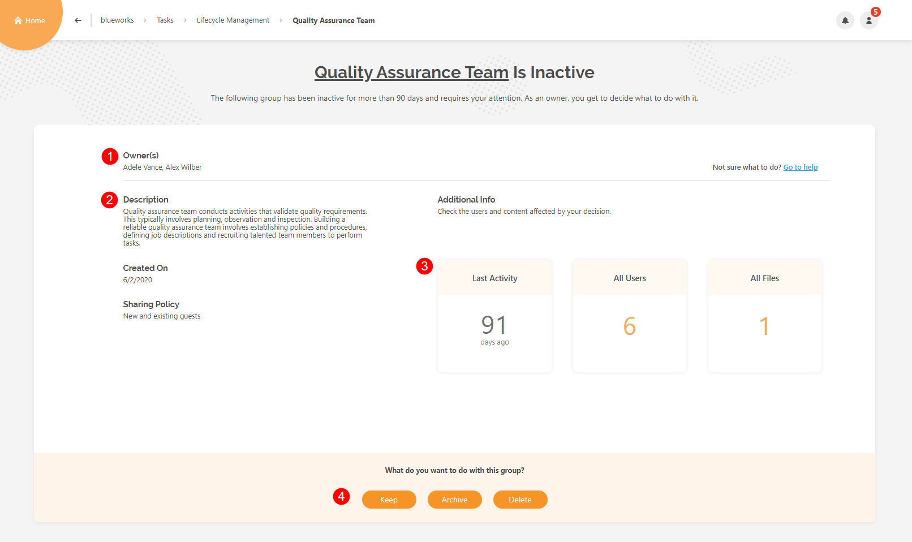
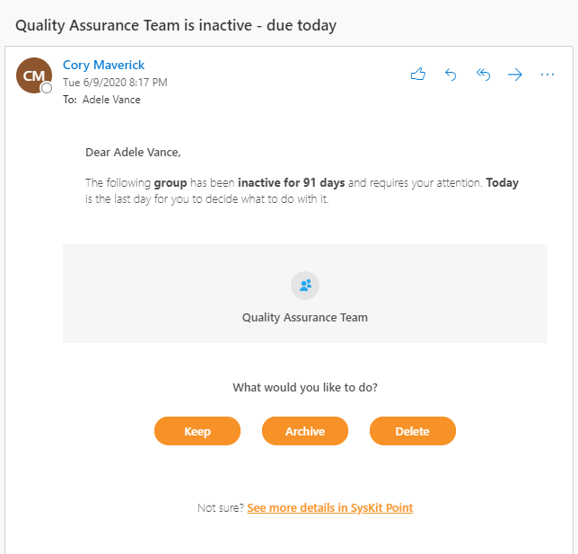
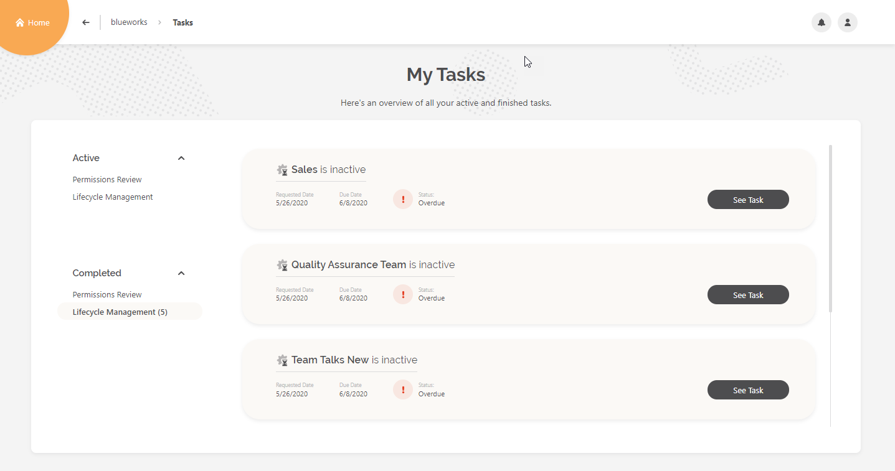
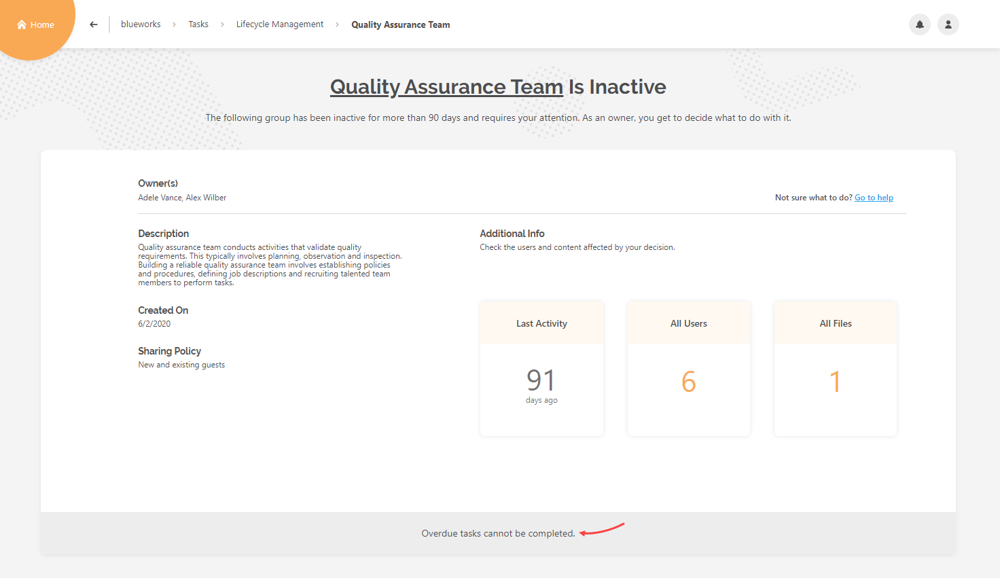

# Resolve Lifecycle Management Tasks in SysKit Point

All content and resources in Office 365 have a lifecycle which usually consists of the following three stages:

* **Beginning** – for example, an admin creates a new resource - Microsoft Team.
* **Middle** – users collaborate and use said resource, chat, create files, and take advantage of all means they have on disposal to collaborate and achieve their goals successfully.
* **End** – after a team is dismissed or a product retired, the previously used resource becomes stale and is no longer needed. 

**When a resource has reached the third stage**, a team owner from the example needs to decide:

* whether to **keep** the resource available, 
* **archive** the produced content, or
* **delete** the resource and all its content.

To help with this process, **SysKit Point provides the Lifecycle Management Automation feature** and reduces the management to the previously described decision making.

After a SysKit Point Admin [enables and configures Lifecycle Management Automation](../installation-and-configuration/enable-lifecycle-management.md), **site owners and admins will be notified via email** when some of their resources are inactive for longer period than [defined in SysKit Point settings](inactive-content.md#define-what-is-inactive).

## Inactive Resource Email

Once SysKit Point recognizes that a resource – Microsoft Team, Office 365 Group, or a site – is inactive, an email is sent to the owner or admin of said resource.

The email provides the following:

* **Resource name and type \(1\)**
* **Inactivity period \(2\)**
* **Keep, Archive and Delete actions \(3\)**
* **Link to the Lifecycle Management task in SysKit Point \(4\)**

Clicking an **action button \(3\)** takes you to the **Lifecycle Management task** of the resource in SysKit Point, where you can provide additional information and execute the selected action. Once clicked, the **task details screen opens with the appropriate action dialog visible**. For example, if the **Delete action button** is clicked, the screen shown below opens.

Here, you can:

* **Comment \(1\)** on why you’re performing the action
* **Run the action \(2\)** 

After the action is executed, the information is displayed in the bottom ribbon of the Lifecycle management task for the viewed resource.


**Please note!**  
You can find more detailed information on all Lifecycle Management actions available in SysKit Point [here](lifecycle-management-actions.md).


All Lifecycle Management tasks assigned to you can be found on the **My Tasks screen**.

## Lifecycle Management Tasks

To view the Lifecycle Management Tasks, click the **My Tasks tile** on the Home screen, or the **My Tasks section** in the user profile menu. Notice the red **notification bubble**; it shows the number of tasks assigned to you.

My Tasks screen shows:

* **active Lifecycle Management tasks**
* **completed Lifecycle Management tasks**
* **Resolve button** to open the task details screen

## Lifecycle Management Task Details

On the task details screen, the following is available:

* **Owner\(s\) list \(1\)**
* **General resource information \(2\)**; description, creation date, and resource sharing policy
* **Last Activity**, **All Users**, and **All Files tile \(3\)**; All Users and All Files tile drills to the appropriate reports where you can find more information about users and content in your resource
* **Actions \(4\)**; as previously described, here you can decide what to do with your inactive resource

**After you successfully run a Lifecycle Management action, SysKit Point automatically completes the Lifecycle Management task for the reviewed resource.**

## Reminder Emails

By default, site owners will receive two additional emails reminding them to complete their Lifecycle Management task. SysKit Point automatically sends these emails:

* **three days before the due**
* **on the due date**

The emails display an appropriate message depending on the time you have left to complete the task and provide you with all available Lifecycle Management actions needed for task completion.

## Overdue Tasks

In case you missed the opportunity to decide what to do with the inactive resource, SysKit Point automatically changes the status of all uncompleted Lifecycle Management tasks to **Overdue**. You can find them on the My Tasks screen under the Completed Lifecycle Management view. You can find them on the **My Tasks screen** under the Completed Lifecycle Management view.

**Such tasks are now assigned to SysKit Point Admins and can no longer be completed by site owners or admins.** When opened, the task details screen shows an appropriate message.

