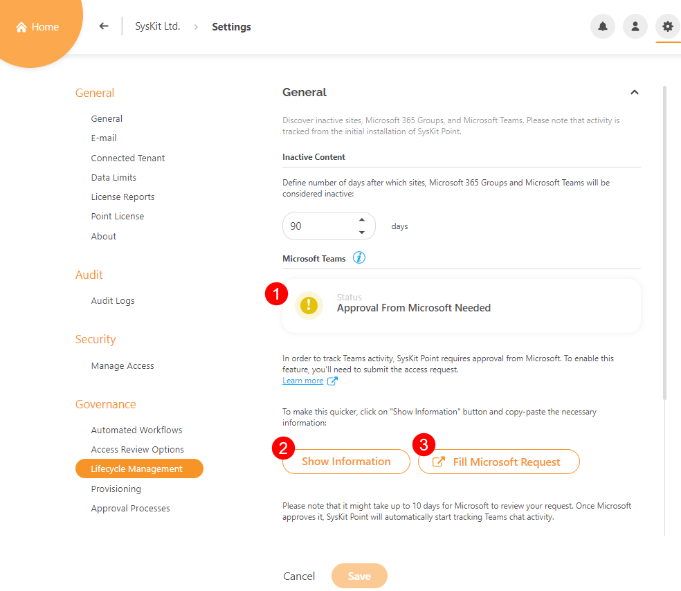

# Enable Microsoft Teams Activity Tracking

**SysKit Point** gives you the posibility to **discover which of your Microsoft Teams are not being actively used**. In order to collect necessary data, first, SysKit Point Admin has to **send an request to access Protected APIs in Microsoft Teams**.  Protected APIs make it posible for SysKit Point to **detect inactive Microsoft Teams based on the date of the last message.**  


**Please note!  
SysKit Point does not read or store Microsoft Teams' chat messages** while collecting activity data. **Only the date and time data is collected and stored** in the SysKit Point database.


To learn more about Protected APIs in Microsoft Teams, read the [following article](https://docs.microsoft.com/en-us/graph/teams-protected-apis).

### Sending the Access Request Form

**After you log in to SysKit Point** with a SysKit Point Admin account, you’ll **receive a message** on the bottom of the Home screen, notifying you about the **newly available feature**.   
Click the **Configure Now** link to proceed with the initial configuration.

The **Settings** &gt; **Governance** &gt; **Content Lifecycle** **settings page** opens. Here, you can find the current **Status** **\(1\)** information, the **Show Information button \(2\)** which will give you all data necessary to successfully fill the Microsoft Access Request form, and the **Fill Microsoft Request button \(3\)** that opens the before mentioned Microsoft Access Request form.

