# Permissions Review in SysKit Point


**Please note!**  
If you are a SysKit Point Admin, first check how to [enable and configure the Automated Permissions Review in SysKit Point](../installation-and-configuration/enable-permissions-review.md).


**Permissions review**, in the context of Office 365 environment, is an activity where a person responsible for an Office 365 resource - be it Communication site, Microsoft Team, Office 365 Group or OneDrive - checks whether permissions, given to users inside (internal) and outside (external) of company, comply with the organizational rules and guidelines. The **permissions review task is usually performed by a site owner** and includes:
* **checking if all users - internal and external - have access to right resources**
* **checking audit logs** to identify unwanted permissions changes
* **checking if only necessary content is externally shared**
* **performing correcting actions** to mitigate errors discovered in previous steps

**SysKit Point** provides the tools the site owners need to perform these tasks.

The permissions review in SysKit Point can be viewed from two different roles, as described in this article:
* [SysKit Point Admin user](#syskit-point-admin)
* [SysKit Point Collaborator user](#syskit-point-collaborator)

SysKit Point Admin users **define permissions review settings** and **decide what resources are reviewed**. Collaborators perform the permissions review on resources where they are an owner or admin. These two roles will have a **different set of reports and actions available** before and during the permissions review and will receive a different kind of emails. 

First, we will take a look at the **SysKit Point Admin** users.

## SysKit Point Admin

### Admin Reminder for the Upcoming Permissions Review

Three workdays before the start of automated permissions review, SysKit Point Admin users will receive a reminder email with the most important information about the upcoming permissions review: 
* **start date** of permissions review
* **number of site owners** that will be asked to perform a permissions review
* **the number of resources** - Microsoft Teams, Office 365 Groups, sites, and OneDrive - included in the upcoming permissions review
* **modify (1)** link
* **Resolve Now (2)** button

Click the **modify** link if you need to change the settings for the permissions review. When logged in to SysKit Point, this link opens the Permissions Review Settings screen.

If you are already signed in to SysKit Point, clicking the **Resolve Now** button opens the **Permissions Review – Preview** report with the preselected **Orphaned Sites view (2)**. Here, you can **select a site (3)** and add active users as site owners with the help of the **Change Owners action (4)**. 


**Please note!**  
To ensure that all sites have an owner responsible for the upcoming permissions review, set active users as site owners for all orphaned sites.


### Governance - Permissions Review

On the start date of the automated permissions review, **permissions review tasks are created in SysKit Point**, and **email requests sent to site owners**. **Each site included in the permissions review has one review task**, and that **task is assigned to all active site owners** of that particular site.

To **track the progress** of the currently active permissions review, SysKit Point Admins can **use the Governance screen**. To access it, **click the Governance tile** on the Home screen.

When clicked, the Governance screen opens, giving a summary for the Active Permissions Review. Here, the following is displayed:
* visual representation and the percentage of permissions review tasks completed (1)
* start and end date of the permissions review (2)
* number of completed review tasks (3)
* number of completed reviews by site type (4)
* **See Review Details** button (5) which opens the **Permissions Review** report

The Permissions Review report gives SysKit Point Admins the following information:
* **request date**, **due date**, **progress**, and **date when the automatic reminder will be sent to site owners (1)**
* **review status (2)** for each site included in the permissions review; can be **Pending** or **Completed**
* **comments (3)** provided by site owners when completing the review
* **all site owners**; blocked or deleted owners are displayed in **gray color (4)**
* **Remind Owners action (5)** to manually send the reminder email to site owners

Use the **Remind Owners action** to send a reminder email to site owners regarding the ongoing permissions review. You can use this action **once a day**, whenever you think appropriate, **as long as the permissions review is active**. **Only site owners with pending tasks will receive an email**.


**Please note!**
Permissions review has a predefined duration of **ten days**. In this time frame, site owners should be able to complete the permissions review on their sites. By default, **three days before the permissions review end date**, SysKit Point sends an automatic **email reminder to all site owners with pending tasks**.


### Permissions Review Completion

Ten days after the start, the permissions review is automatically marked as completed. SysKit Point also sends summary emails regarding the completed review to all SysKit Point Admin users. The email contains the following information:
* **number of sites where the permissions review was completed (1)**; grouped by site type
* **total number of sites where the permissions review was not completed (2)**
* **View Uncompleted Tasks (3)** button

To view sites where the permissions review was not completed, click the **View Uncompleted Tasks** button. If already signed in to SysKit Point, you will be redirected to the **Permissions Review** report. Here, you can see that all tasks where the permissions review was not completed have the status set to **Overdue**. SysKit Point changes the status automatically when the permissions review ends.

If you take a step back and look at the Governance screen, you can notice the following:
* **Active Review (1)** category is displaying the **No active Permissions Review (2)** message
* **Previous Reviews (3)** category has a single entry - **the completed permissions review (4)**
* **See Details (5)** button is visible on the completed permissions review tile

The **See Details** button opens the **Permissions Review** report, already described in this section.

With that, we finish the permissions review overview for SysKit Point Admin users and continue with SysKit Point Collaborators overview.

## SysKit Point Collaborator

### Permissions Review Email Request

When the Automated Permissions Review starts, all site owners receive an email request to review permissions on their site(s). The email contains the following important data:
* **number of sites an owner needs to review (1)**; grouped by site type
* **due date of the permissions review (2)**
* **Review Now button (3)**

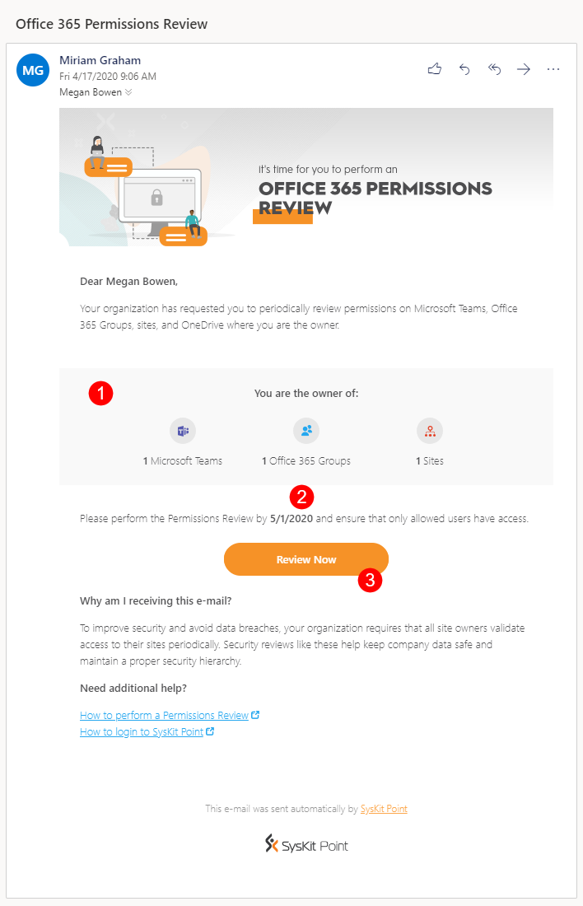

The **Review Now** button opens the **Permissions Review Task** screen once clicked.
On this screen, you can find:
* **sites they are the owner of and need to review**; displayed in the grid
* **information regarding the permissions review task (1)** 

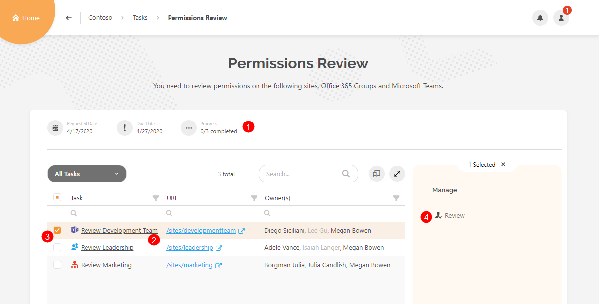

From here, you can continue and review a site by clicking the **link in the Task column (2)**, or **selecting a row (3)** and clicking the **Review action (4)**. We will stop here for now, and show how to access the same screen from within SysKit Point.

### My Tasks

On the Home screen, you can notice the **My Tasks** tile and a notification bubble displaying the number of tasks you need to address. It is set to one because a single permissions review task was created by SysKit Point and assigned to you. The **persona** button shows the same notification bubble. To view your tasks, click the **My Tasks tile** on the Home screen, or the **My Tasks section** in the persona drop-down menu.

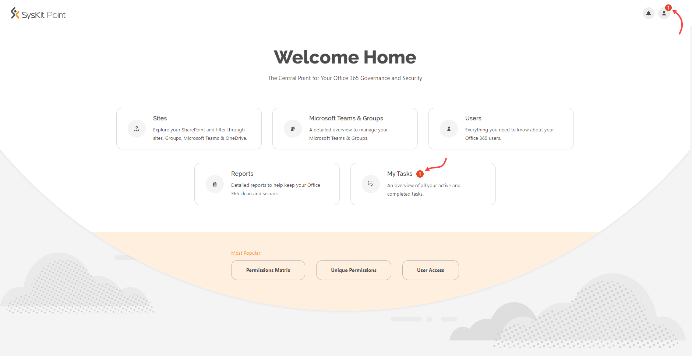

**My Tasks** screen displays the active permissions review task with the most important information:
* **requested date**
* **due date**
* **completion progress**
* **Review** button

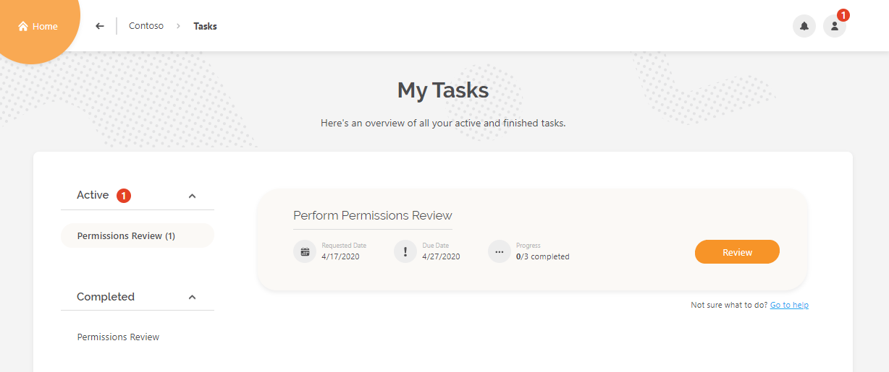

Click **Review** to continue. The **Permissions Review Task** screen opens - the same screen that you accessed from email in the previous section where we stopped. From here, you can continue and review a site by clicking the **link in the Task column**. The **Task Details** screen opens.

### Permissions Review Task Details

The Task Details screen you information, reports, and actions needed to perform a permissions review. The following is available on the screen:
* **Site owners list & Change Owners action (1)**
* **All Users and External Users tile (2)**
* **Permission Changes tile (3)**
* **Shared Files and Externally Shared Files tile (4)**
* **Permissions Matrix report link (5)**
* **Complete Review button (6)**

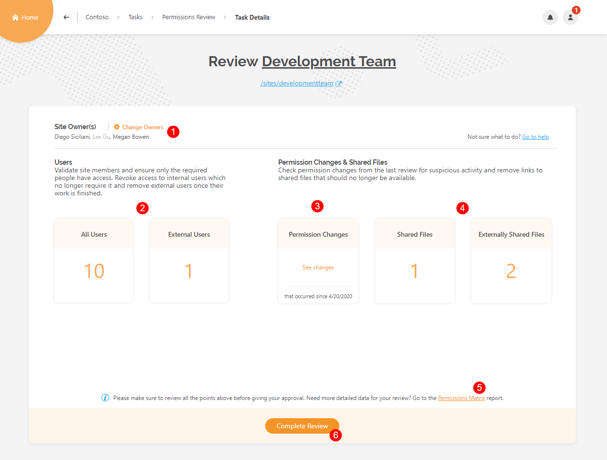

Use the **Change Owners** action to remove existing owners by clicking the x sign next to the user, or add new owners by typing their name. Click **Change** to confirm.

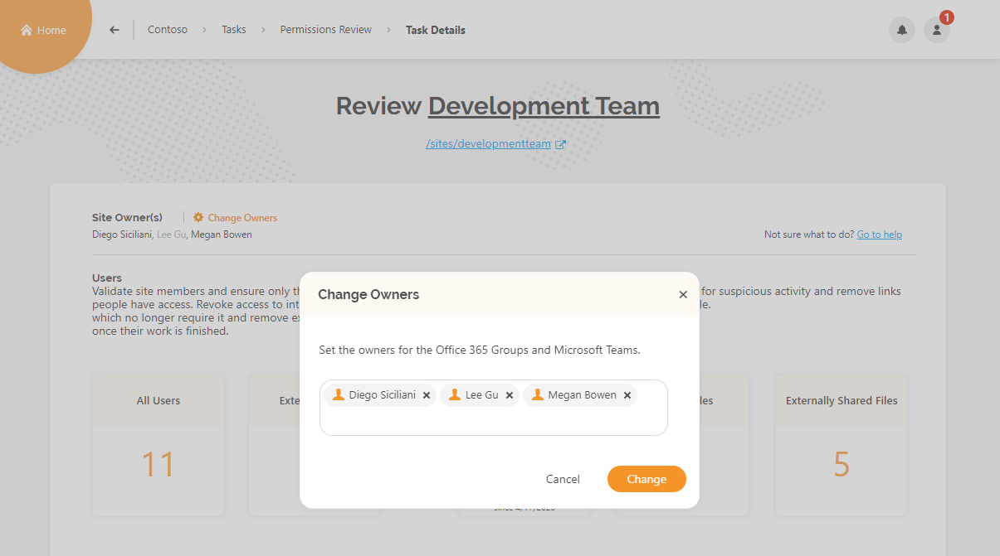

Click the **All Users** tile to access the **Users report**. Here, you can:
* **see all users** that have access to your site and **granted permissions**
* **grant access (1)** to additional users
* **add owners and members (2)** 
* **select users (3)** and **remove their access (4)** on the site.

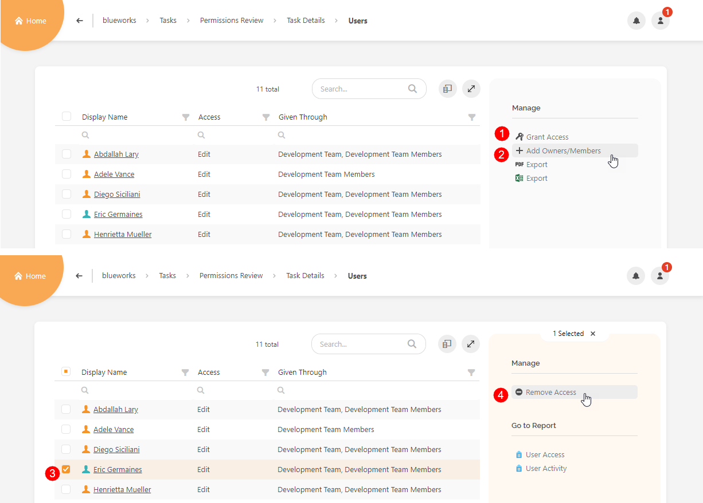

Click the **External Users** tile to access the **External Users report**. Here, you can:
* **view all external users**
* **select users (1)** and **remove their access (2)** 
* **find additional information**, such as when and by whom the external user was added

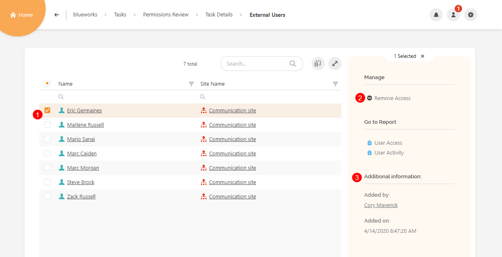

Click the **Permissions Changes** tile if you want to see audit logs for events that occurred since the last permissions review. **Site Permissions Changes** report opens, with custom date filter values preselected (1). You can click the date filter (2) and change the dates if needed. The report gives you the following information:
* **Activity date**
* **Activity**
* **User who performed the permission change**
* **object where the change was done**
* **target user of the permissions change**

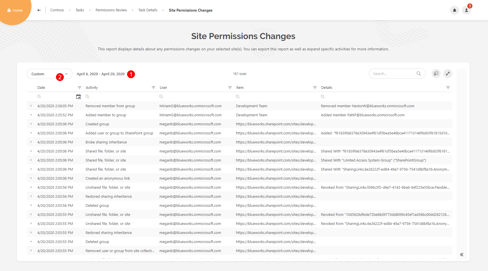

Click the **Shared Files** tile to open the **Sharing Links** report, where you can:
* **see information about all sharing links on your site**
* **select (1)** and **remove sharing links (2)**
* **find out who created the sharing link (3)**

Click the Externally Shared Files to open the **Externally Shared Content** report. Here, you can:
* **see sharing links** that give access to external users, for example, **anonymous links (1)**
* **remove sharing links** by **selecting a link (2)** and clicking the **Remove Sharing Link (3)** action 
* **view external users and their permissions (4)**; permissions given directly to external users are also visible here
* **Remove external users' access** by **selecting a user (5)** and clicking the **Remove from Group (6)** action

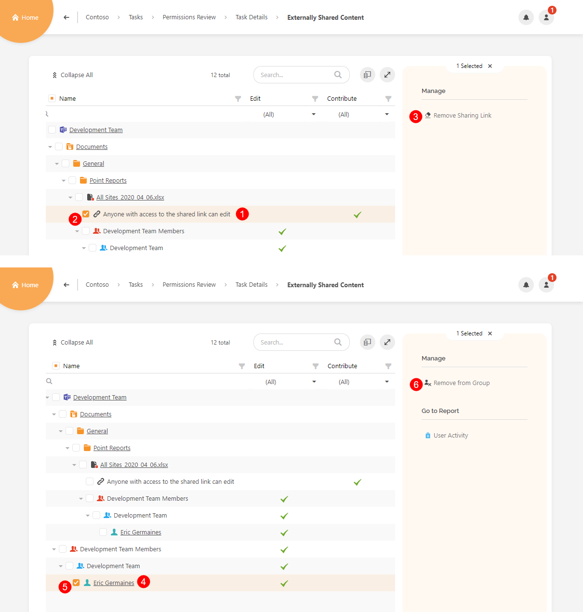

For more details, click the **Permissions Matrix link**, which gives you a complete overview of permissions on your site.

### Complete Permissions Review Task

When you are done with the review, and have made sure that your site is secure, **Complete the permissions review**. To do so:
* **click the Complete Review button (1)** on the bottom of the Task Details screen; the **Complete Review dialog opens**
* **leave a comment**; here, you can describe what kind of changes were made to ensure that the site is secured; the comment is visible to all site owners
* **type CONFIRM (3)** in the appropriate field
* **click the Confirm button (4)**


**Please note!**
You cannot undo or edit the **Complete Review** action.  


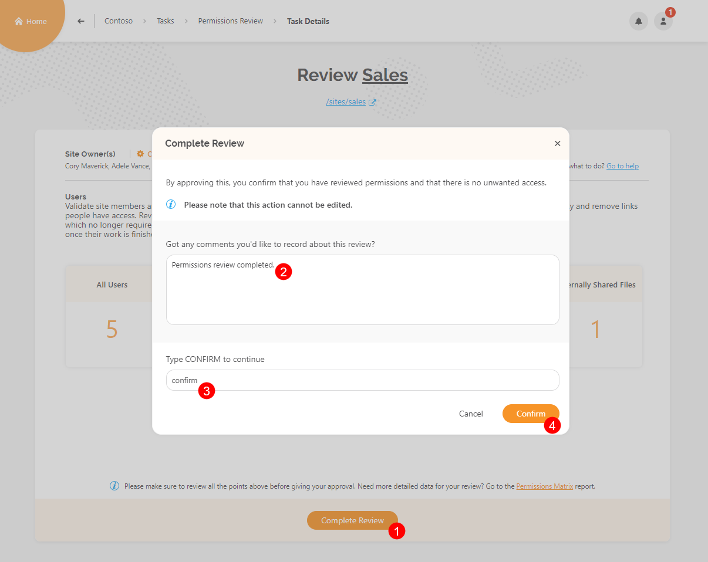

After you complete the permissions review for a site, the **Review Completed** dialog opens confirming the completion. Click the **Close Review** button to leave the screen and navigate to the Permissions Review screen, where you can find sites that you need to review. 

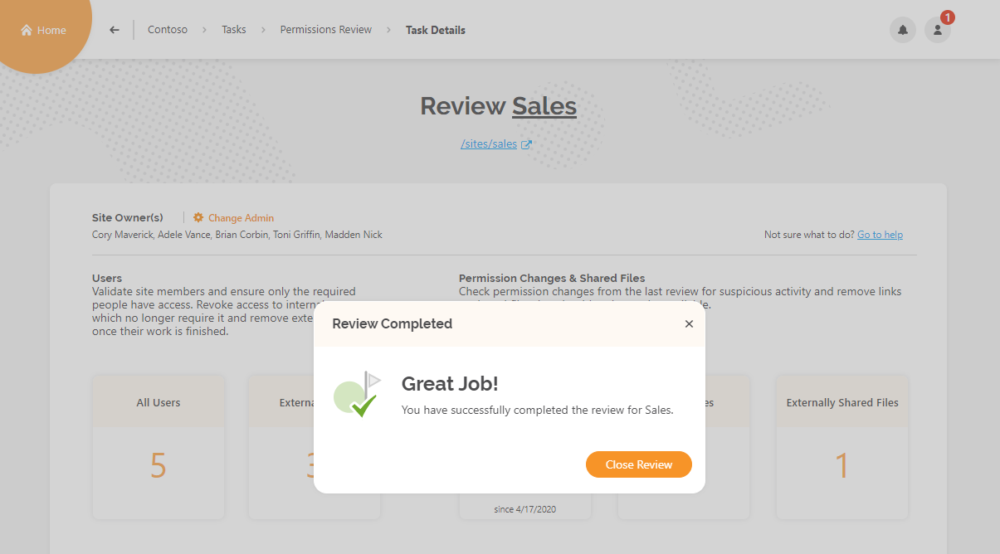

When you complete permissions reviews for all sites you are the owner of, your **Permissions Review task is completed.**
On **My Tasks** screen, under **Active Permissions Review (1)**, the **No Tasks (2)** message is displayed. You can find your **completed permissions review task (3)** in the **Completed section (4)**, and access task details by clicking the **See Task (5)** button.

### Overdue Reviews

After ten days, the permissions review cycle ends. SysKit Point automatically changes the status of all uncompleted site reviews to **Overdue**. 
You can find them on the **Permissions Review** task screen. 

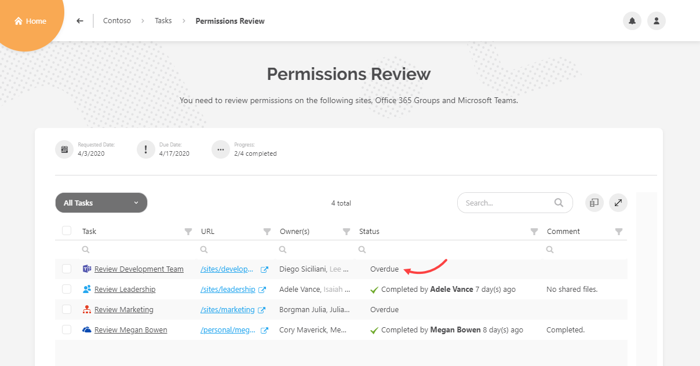

After the permissions review completion, you can still access the **Task Details screen**, however, you cannot complete the permissions review.
An **appropriate message is displayed** instead of the Complete Review button.

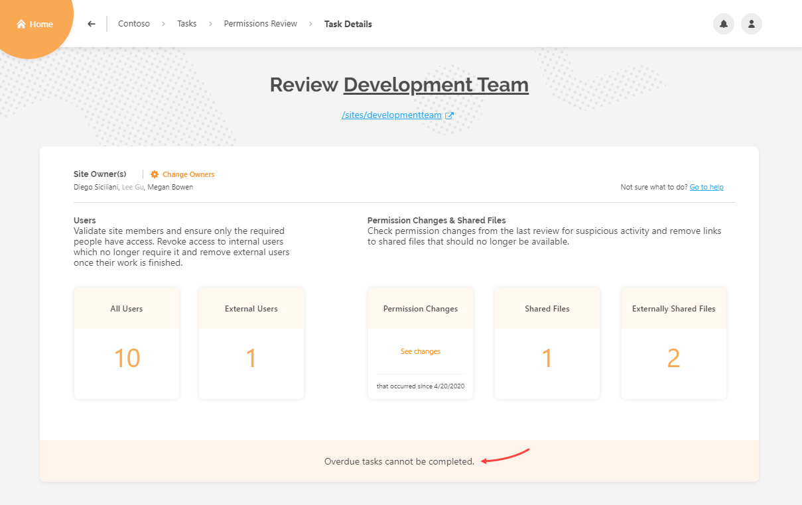

**With that, the first permissions review cycle is completed**. The cycle will repeat per schedule, as defined in [Permissions Review Settings](../installation-and-configuration/enable-permissions-review.md), giving you the same reports and actions to make this process as easy as possible.

