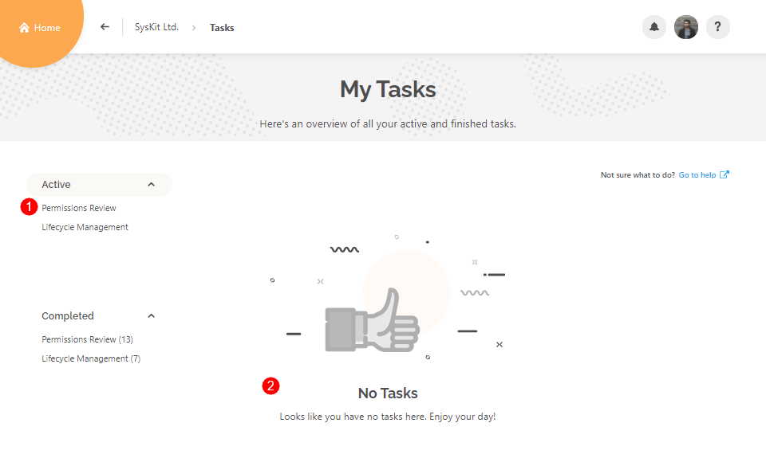

# Perform Permissions Review in SysKit Point

**Permissions review**, in the context of the Office 365 environment, is an activity where a person responsible for an Office 365 resource - be it Communication site, Microsoft Team, Office 365 Group, or OneDrive - checks whether permissions, given to users inside \(internal\) and outside \(external\) of company, comply with the organizational rules and guidelines. The **permissions review task is usually performed by a site owner** and includes:

* **checking if all users - internal and external - have access to the right resources, be it through directly given permissions, or group memberships**
* **identify unwanted permissions changes** by checking the audit logs 
* **checking if only necessary content is externally shared**
* **performing correcting actions** to mitigate errors discovered in previous steps

**SysKit Point** provides the tools the site owners need to perform these tasks.

The permissions review in SysKit Point can be viewed from two different roles:

* **SysKit Point Collaborator user**, as described in this article
* [SysKit Point Admin user](monitor-permissions-review.md)

When working with permissions review, SysKit Point Collaborators can **perform the permissions review on resources where they are an owner or admin**.

For a site owner or admin assigned to the SysKit Point Collaborators role, the permissions review process begins with an email.

## Permissions Review Email Request

When the Automated Permissions Review starts, site owners receive an email request to review permissions on their site\(s\). The email contains the following important data:

* **number of sites an owner needs to review \(1\)**; grouped by site type
* **due date of the permissions review \(2\)**
* **Review Now button \(3\)**

The **Review Now** button opens the **Permissions Review Task** screen once clicked. On this screen, you can find:

* **sites they are the owner of and need to review**; displayed in the grid
* **information regarding the permissions review task \(1\)** 

From here, you can continue and review a site by clicking the **link in the Task column \(2\)**, or **selecting a row \(3\)** and clicking the **Review action \(4\)**. You can access the same screen from within SysKit Point from the **My Tasks** screen.

## My Tasks

On the Home screen, you can notice the **My Tasks** tile and a notification bubble displaying the number of tasks you need to address. It is set to one because a single permissions review task was created by SysKit Point and assigned to you. The **user profile** button shows the same notification bubble. To view your tasks, click the **My Tasks tile** on the Home screen, or the **My Tasks section** in the user profile menu.

**My Tasks** screen displays the active permissions review task with the most important information:

* **requested date (1)**
* **due date (2)**
* **completion progress (3)**
* **Review button (4)**
* **Task categories (5)**
* **Completed tasks categories (6)**

Click **Review** to continue. The **Permissions Review Task** screen opens - the same screen that you accessed from email in the previous section where we stopped. From here, you can continue and review a site by clicking the **link in the Task column**. The **Permissions Review Wizard** opens that will guide you through the Permissions Review process.

## Permissions Review Wizard

The **Permissions Review Wizard** has three or four steps, depending on the resource type:
* **Overview**
* **Members** (for Office 365 Groups and Microsoft Teams), or **Users** (for sites); this step is not available for OneDrive 
* **Sharing**
* **Summary**

On all steps, the **Close & Continue Later** option is available that closes the Permissions Review wizard. 


**Hint!**  
No need to worry when you leave the Permissions Review wizard - all performed actions take effect emmediately, and will be visible in the Summary step at the end of the Permissions Review.
 

Let's take a closer look at every step in more detail.

### Overview Step
This step provides general information about the resource that you are about to review. The following is displayed:
* **List of owners, along with the Change Owners action (1)**
* **General resource information (2)** - **Description**, **Creation date and time**, **Privacy**, **Sharing Policy**, **resource URL**, and **Last Activity**
* **when the resource was last reviewed and by whom (3)**
* **Who else got this task? information (4)** - hover over it to see the full list of users that received the Permissions Review task
* **Permissions Changes tile (5)** - in case there were no changes since the last review, the **Skip wizard and complete review (6)** action is available
* **Close & Continue Later action (7)**, which closes the wizard 
* **Start Review button (8)**, which takes you to the next step of the Permissions Review wizard

### Members/Users

The **Members step** is available **when reviewing Office 365 Groups or Microsoft Teams**. The following options are available:
* **top filters (1)** - they help you view only a specific group of users on your resource:
  * **Added users**
  * **Removed users**
  * **Owners**
  * **Members**
  * **Guests**
* **when a user is selected (2)**, several options are available:
  * **actions (3)** - remove members or owners, promote members to owners, or change owners to members
  * **User Activity report (4)** - see all audit logs for the selected user
  * **Additional information (5)** - see user's latest activity and when it happened
* when no users are selected, the **Add Owners/Members** action is available
* **click Next (6)** to continue to the next step of the Permissions Review Wizard

The **Users step** is available **when reviewing sites**. The following options are available here:
* **top filters (1)** - choose to view only a certain type of users on site:
  * **Administrators**
  * **Users with permissions on the site level** 
  * **External Users**
* **when a user is selected (2)**, additional options are available:
  * **actions (3)** - based on the type of the selected user, various actions are available - Remove Access, Edit Permissions, Delete SharePoint Group, and Change Admins
  * **User Activity report (4)** - see all audit logs for the selected user
  * **Additional information (5)** - see user's latest activity and when it happened
* when no users are selected, the **Grant Access** action is available
* **click Next (6)** to continue to the next step of the Permissions Review Wizard


**Please note!**  
Described steps are not available when reviewing permissions for OneDrive.

### Sharing

The **Sharing step** gives you a simple, yet detailed overview of all shared content.
Multiple filters and views enable you to find shared content that you want to review.
* **top filters (1)** enable you to filter content by sharing type
  * **All Shared Content** - shows content that has been shared via sharing links or through direct access; use it when you want to see everyhing
  * **Shared Outside the Group** - selected by default; use it to find content shared with users that are not a part of the Office 365 Group or Microsoft Team
  * **Shared Externally** - shows content shared with specific people outside your organization
  * **Shared With Anyone** - show content shared with anyone via sharing links; this can be dangerous ground so make sure to examine such files carrefully
* **views (2)** enable you to see sharing from two different perspectives - you can group by:
  * **Content**
  * **Users**
* **Advanced Filters (3)** - by default, only content with unique permissions is visible down to the document level; with the help of the Advanced Filters, you can choose to:
  * **view content without unique permissions**
  * **view content down to a specific level**, for example, down to the document library or list level
* **when a row is selected (4)**, available actions are displayed in the **side panel (5)**
* **when no rows are selected**, the **Permissions Changes report link** is visible
* **click Next (6)** to continue to the final step of the Permissions Review Wizard

In case you switch to the **Users view**, the **top filters** are changed acordingly and enable you to filter out specific types of users.
You can find descriptions for all filters by **hovering your mouse over the filter tile (1)**. 

In the example above, Microsoft Team was reviewed. Filters will differ slightly when you review sites or OneDrive, since there is no Office 365 Group involved whose members would have access by default, so the Users Outside the Group filter is not applicable. Instead, the **Access on Child Objects filter is given**, showing only users that don't have access on a site level, but have access on a specific file or folder.

### Summary

The **Summary step** gives a recap of all actions performed during the Permissions Review.
Here, the following is displayed:
* **number of performed actions grouped by action (1)**
* **grid with all actions (2)** and information about who performed them, when, and other details
* **Export button (3)** which exportes the data in the grid into a XLSX file
* **Complete Review button (4)** that opens the **Complete Review dialog** 

* **Site owners list & Change Owners action \(1\)**
* **All Users and External Users tile \(2\)**
* **Permission Changes tile \(3\)**
* **Shared Files and Externally Shared Files tile \(4\)**
* **Permissions Matrix report link \(5\)**
* **Complete Review button \(6\)**

Use the **Change Owners** action to remove existing owners by clicking the x sign next to the user, or add new owners by typing their name. Click **Change** to confirm.

Click the **All Users** tile to access the **Users report**. Here, you can:

* **see all users** that have access to your site and **granted permissions**
* **grant access \(1\)** to additional users
* **add owners and members \(2\)** 
* **select users \(3\)** and **remove their access \(4\)** on the site.

Click the **External Users** tile to access the **External Users report**. Here, you can:

* **view all external users**
* **select users \(1\)** and **remove their access \(2\)** 
* **find additional information**, such as when and by whom the external user was added

Click the **Permissions Changes** tile if you want to see audit logs for events that occurred since the last permissions review. **Site Permissions Changes** report opens, with custom date filter values preselected \(1\). You can click the date filter \(2\) and change the dates if needed. The report gives you the following information:

* **Activity date**
* **Activity**
* **User who performed the permission change**
* **object where the change was done**
* **target user of the permissions change**

Click the **Shared Files** tile to open the **Sharing Links** report, where you can:

* **see information about all sharing links on your site**
* **select \(1\)** and **remove sharing links \(2\)**
* **find out who created the sharing link \(3\)**

Click the Externally Shared Files to open the **Externally Shared Content** report. Here, you can:

* **see sharing links** that give access to external users, for example, **anonymous links \(1\)**
* **remove sharing links** by **selecting a link \(2\)** and clicking the **Remove Sharing Link \(3\)** action 
* **view external users and their permissions \(4\)**; permissions given directly to external users are also visible here
* **Remove external users' access** by **selecting a user \(5\)** and clicking the **Remove from Group \(6\)** action

For more details, click the **Permissions Matrix link**, which gives you a complete overview of permissions on your site.

## Complete Permissions Review Task

When you are done with the review and have made sure that your site is secure, **Complete the permissions review**. To do so:

* **click the Complete Review button \(1\)** on the bottom of the Task Details screen; the **Complete Review dialog opens**
* **leave a comment**; here, you can describe what kind of changes were made to ensure that the site is secured; the comment is visible to all site owners
* **type CONFIRM \(3\)** in the appropriate field
* **click the Confirm button \(4\)**


**Please note!** You cannot undo or edit the **Complete Review** action.


After you complete the permissions review for a site, the **Review Completed** dialog opens confirming the completion. Click the **Close Review** button to leave the screen and navigate to the Permissions Review screen, where you can find sites that you need to review.

When you complete permissions reviews for all sites you are the owner of, your **Permissions Review task is completed.** On the **My Tasks** screen, under **Active Permissions Review \(1\)**, the **No Tasks \(2\)** message is displayed. You can find your **completed permissions review task \(3\)** in the **Completed section \(4\)**, and access task details by clicking the **See Task \(5\)** button.

## Overdue Reviews

After ten days, the permissions review cycle ends. SysKit Point automatically changes the status of all uncompleted site reviews to **Overdue**. You can find them on the **Permissions Review** task screen.

After the permissions review completion, you can still access the **Task Details screen**, however, you cannot complete the permissions review. An **appropriate message is displayed** instead of the Complete Review button.

**With that, the first permissions review cycle is completed**. The cycle will repeat per schedule, as defined by SysKit Point Admin, giving you the same reports and actions to make this process as easy as possible.

