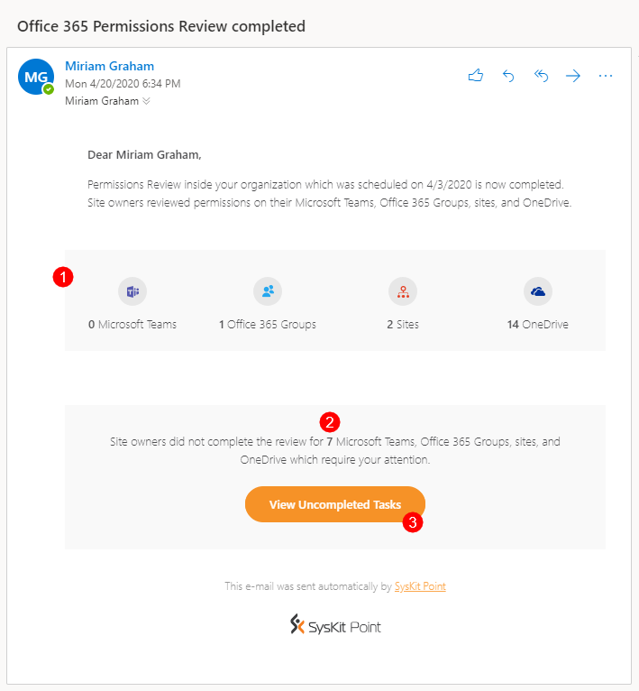

# Permissions Review in SysKit Point


**Please note!**  
If you are a SysKit Point Admin, first check how to [enable and configure the Automated Permissions Review in SysKit Point](../installation-and-configuration/enable-permissions-review.md).


Permissions review, in the context of Office 365 environment, is an activity where a person responsible for an Office 365 resource - be it Communication site, Microsoft Team, Office 365 Group or OneDrive – checks whether permissions, given to users inside (internal) and outside (external) of company, comply with the organizational rules and guidelines. Usually, the permissions review task is performed by a site owner and includes:
* checking if all users – internal and external - have access to right resources
* checking audit logs to identify unwanted permissions changes
* checking if only necessary content is publicly/externally shared
* performing correcting actions to mitigate errors discovered in previous steps

The permissions review in SysKit Point can be viewed from two different roles, as described in this article:
* [SysKit Point Admin user](#syskit-point-admin)
* [SysKit Point Collaborator user](#syskit-point-collaborator)

The first one defines permissions review settings and decides what resources are reviewed. The second performs the permissions review on resources where they are an owner or admin. These two roles will have a different set of reports and actions available before and during the permissions review and will receive a different kind of emails. 

First, we will take a look at the SysKit Point Admin users.

## SysKit Point Admin

### Admin Reminder for the Upcoming Permissions Review

Three workdays before the start of automated permissions review, SysKit Point Admin users will receive a reminder email with the most important information about the upcoming permissions review: 
* **start date** of permissions review
* **number of site owners** that will be asked to perform a permissions review
* **the number of resources** - Microsoft Teams, Office 365 Groups, sites, and OneDrive - included in the upcoming permissions review
* **modify (1)** link
* **Resolve Now (2)** button

Click the **modify** link if you need to change the settings for the permissions review. When logged in to SysKit Point, this link opens the Permissions Review Settings screen.

If you are already signed in to SysKit Point, clicking the **Resolve Now** button opens the **Permissions Review – Preview** report with the preselected **Orphaned Sites view (2)**. Here, you can **select a site (3)** and add active users as site owners with the help of the **Change Owners action (4)**. 


**Please note!**  
To ensure that all sites have an owner responsible for the upcoming permissions review, set active users as site owners for all orphaned sites.


### Governance - Permissions Review

On the start date of the automated permissions review, **permissions review tasks are created in SysKit Point**, and **email requests sent to site owners**. **Each site included in the permissions review has one review task**, and that **task is assigned to all active site owners** of that particular site.

To **track the progress** of the currently active permissions review, SysKit Point Admins can **use the Governance screen**. To access it, **click the Governance tile** on the Home screen.

When clicked, the Governance screen opens, giving a summary for the Active Permissions Review. Here, the following is displayed:
* visual representation and the percentage of permissions review tasks completed (1)
* start and end date of the permissions review (2)
* number of completed review tasks (3)
* number of completed reviews by site type (4)
* **See Review Details** button (5) which opens the **Permissions Review** report

The Permissions Review report gives SysKit Point Admins the following information:
* **request date**, **due date**, **progress**, and **date when the automatic reminder will be sent to site owners (1)**
* **review status (2)** for each site included in the permissions review; can be **Pending** or **Completed**
* **comments (3)** provided by site owners when completing the review
* **all site owners**; blocked or deleted owners are displayed in **gray color (4)**
* **Remind Owners action (5)** to manually send the reminder email to site owners

Use the **Remind Owners action** to send a reminder email to site owners regarding the ongoing permissions review. You can use this action **once a day**, whenever you think appropriate, **as long as the permissions review is active**. **Only site owners with pending tasks will receive an email**.


Please note!
Permissions review has a predefined duration of **ten days**. In this time frame, site owners should be able to complete the permissions review on their sites. By default, **three days before the permissions review end date**, SysKit Point sends an automatic email reminder to all site owners with pending tasks.


### Permissions Review Completion

Ten days after the start, the permissions review is automatically marked as completed. SysKit Point also sends summary emails regarding the completed review to all SysKit Point Admin users. The email contains the following information:
* **number of sites where the permissions review was completed (1)**; grouped by site type
* **total number of sites where the permissions review was not completed (2)**
* **View Uncompleted Tasks (3)** button

To view sites where the permissions review was not completed, click the **View Uncompleted Tasks** button. If already signed in to SysKit Point, you will be redirected to the **Permissions Review** report. Here, you can see that all tasks where the permissions review was not completed have the status set to **Overdue**. SysKit Point changes the status automatically when the permissions review ends.

If you take a step back and look at the Governance screen, you can notice the following:
* **Active Review (1)** category is displaying the **No active Permissions Review (2)** message
* **Previous Reviews (3)** category has a single entry - **the completed permissions review (4)**
* **See Details (5)** button is visible on the completed permissions review tile

The **See Details** button opens the **Permissions Review** report, already described in this section.

With that, we finish the permissions review overview for SysKit Point Admin users.

