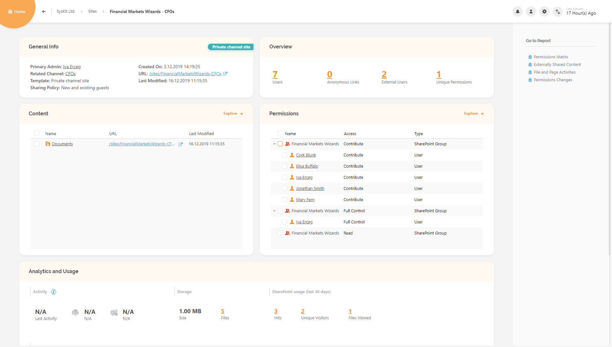

# Supervise Microsoft Teams Private Channels

## What are Microsoft Teams Private Channels

**Microsoft Teams Private Channels** are focused spaces for collaboration within your **Teams** so that only users on the team who are **owners** or **members** of the **private channel** can access it. 


**Please note!** Anyone, including **guest users** can be a member of a **Private Channel** as long as they are already a **member** of the Team within which the Private channel was created.


You might want to use a **Private Channel** in situation where you have a group of people who need a focused space to collaborate without having to create a separate team, or they need to discuss sensitive information, such as budgets, resourcing, strateging positioning and so on.

### Who can create a Private channel

By default options in your Microsoft Teams, any **Team Owner** or **Team Member** can **create** a **Private channel**. Only Guest users aren't allowed to create them in any condition. 

It is possible though to limit the creation of Private channels, on the Settings tab for a team, Team Owners can turn off the ability for team members to create Private channels.

### What can Team Owners and Members see in a Private channel

In **Microsoft Admin Center**, Team Owners can see the **names** of all **Private Channels** in their team and they can also **delete** any of them. They however **cannot see** any **conversations**, **files shared** or a **member list** of a Private Channel if they themselves are **not a member** of said Private Channel.

**Team Members** can only see the Private Channels they are members of. Unless they're added to them they are unable to see that said channels even exists.

### Background of Microsoft Teams Private Channels

When you create a **Microsoft Teams Private Channel**, you are actually creating that channel's **SharePoint Site collection** optimized for **file sharing** and **fast provisioning**. The separate site collection is to ensure that the access to private channel files is restricted to only members of the Private Channel compared to the team site where team owners have access to all the assets within the site collection.


**Please note!** By Microsofts design, Sharepoint Sites of Microsoft Teams Private Channels are **not visible** in the **SharePoint Admin Center**


## Why should You Use SysKit Point to oversee Private Channels

When you're using **SysKit Point** it enables you to oversee if there are any and which Teams do have Private Channels within themselves. It is easy to see, and you can **manage** your **Teams** more efficiently.

### Where can you find Private Channels in SysKit Point

Depending on your needs there are several places in **SysKit Point** where you can find and manage **Microsoft Teams Private Channels**.

#### Finding Private channel SharePoint sites through Site Overview screen

From **Home** screen of **SysKit Point** click on **Sites**.

It will redirect you to **SysKit Point Site Overview** screen. As we know when a **Private Channel** is created, it also creates a **SharePoint Site Collection**. Unlike **SharePoint Online**, SysKit Point gives you the ability to **see** that **Site Collection** within your **All Sites** and also it gives **Team owners** ability to see **all members** and **files shared** in a **Private Channel** even when Team owner is **not** a **member** of a said **Private Channel**. 

On **Site Overview screen**, any existing **Microsoft Teams Private Channel** site will be located right under it's parent **Microsoft Teams** site, but to easily **filter** said Sites, click on **Column Chooser**\(1\) and enable the column called **Template**\(2\).

Next thing you have to do is to click on the **Filter**\(1\) icon on **Template** column, select the '**Private Channel site**'\(2\) and click **OK**\(3\).

Now only the sites of Private Channels will be visible on Site Overview screen, You can recognize them by a little **lock** icon next to the **name** of the site.


**Please note!** Name of the Private Channel site consists the name of its **Team + name of said Channel**.


Selecting any of those will redirect you to Private Channel **site details page** from where you can see how many **Users** and **External Users** have **permissions** in it, **shared files** and **all analytics** we provide for all other types of **Sites**. You will also be able to **Generate** multiple **reports** for that site, and perform multiple **actions** on it \(**Remove Access**, **Edit Permissions**, **Delete SharePoint Group**, **Remove Users from Group**\).

#### Managing Private channels via Microsoft Teams & Groups screen

**SysKit Point** also gives you the **ability** to see **Microsoft Teams Private Channels** via **Group details page** of its **Parent Team**. Here's how you can do it. 

From **Home Screen** select the '**Microsoft Teams & Groups**' tile that will redirect you to the Group Overview screen. On Group Overview screen click on the **View chooser**\(1\) and select the '**Teams with Private Channels'**\(2\) option.

It will now show you only Microsoft Teams that **contain** Private Channels. 


**Hint!** You can also see which Microsoft Teams has Private Channels by enabling the column '**Private Channels**' in the **Column Chooser**.


When you have chosen to click on a Microsoft Teams you wish to inspect you will be redirected to the Group Details page of a said Team. Inside it contains a '**Channels**' tile which show all the channels that are inside that team be it a **Standard** or a **Private** channel. You will notice the **Private Channel** by a little '**lock**' icon next to the name of the channel or by checking under the column named '**Privacy**' where it says **Private**.

When you click on a Private Channel inside said tile, you will be redirected to **SysKit Point Channel Details** page where you will see all the **members** of that **Private Channel**, **when** was it **created**, **who** created it \(if SysKit Point was installed and collection of Audit logs was enabled before said channel was created\), All **files shared** within the **Channel** and also **externally shared files**.

#### Being in charge of Microsoft Teams Private Channels with a report

Let's say you need all information about **Private channels** on your **Office 365 environment** in one place, **SysKit Point** has a solution for you, with **Microsoft Teams with Private Channels report**. This is the way to generate it. From home screen click on **Reports**, you will be redirected to the **Report Center**. When on said screen, click on the **Filter** in the left corner \(1\), select the **Microsoft Teams & Groups** option\(2\) and then you will see the report called **Microsoft Teams with Private Channels**\(3\).

When you click on that report it will **automatically generate** a report containing **all** the **Microsoft Teams** that have a **Private Channel** in your **environment**, it will show you **all** the **members** and **owners** inside the said **channels** and you will also have information about **who** created a **Private Channel** and **when** was it created. You can also export that report into **PDF** or **XLSX** file.

If you wish to know even more about the Private Channels [here's](https://docs.microsoft.com/en-us/microsoftteams/private-channels) all the things that Microsoft told us about it. 

### 

