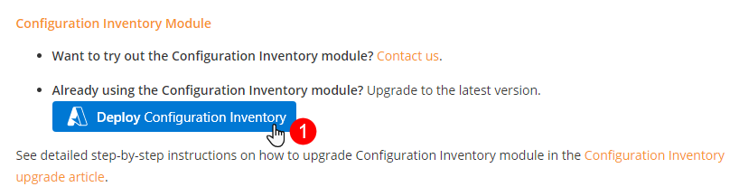
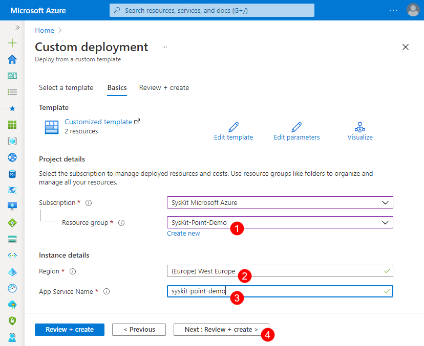
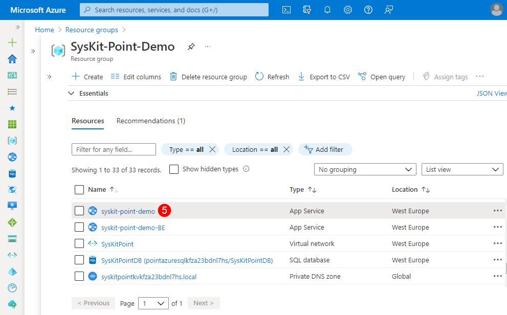

# Upgrade Configuration Inventory Module

Since **Syskit Point**, and all available features and modules, are frequently getting new features, we highly recommend deploying the latest available Syskit Point and Configuration Inventory module version to use their maximum potential.

## Upgrading to the Latest Version

After you **open the latest Release note**, **click** the **Deploy Configuration Inventory button (1)**.


**Please note!**
When entering the App service name, **make sure NOT to enter the app service name ending with '-BE'**. 
**Entering the backend app service name in the upgrade process may result in an invalid upgrade.**


The **Custom deployment** screen in Azure Portal opens. 
Here you need to:
* **Select the Resource group (1)** wherein the current Syskit Point version is deployed
* **Select Region (2)** - use the location of your currently deployed Syskit Point resources
* **Enter App service Name (3)** - enter the App Service resource Name; you can **find the App Service name (5)** by navigating to the Overview screen of the Syskit Point resource group
* **Click Next: Review + create > (4)** - Review + create screen opens showing entered data; check that the entered data is correct and click **Create**

## Next Steps

After the deployment is completed, you can:
* **Access the Syskit Point web app**
* [Check if a re-consent is needed after the upgrade](../requirements/permission-requirements-change-log.md)


**Hint!**  
Use the [What's new](https://www.syskit.com/products/point/whats-new/) page as an additional source of information on new features available in the latest version of the Syskit Point and Configuration Inventory module.


