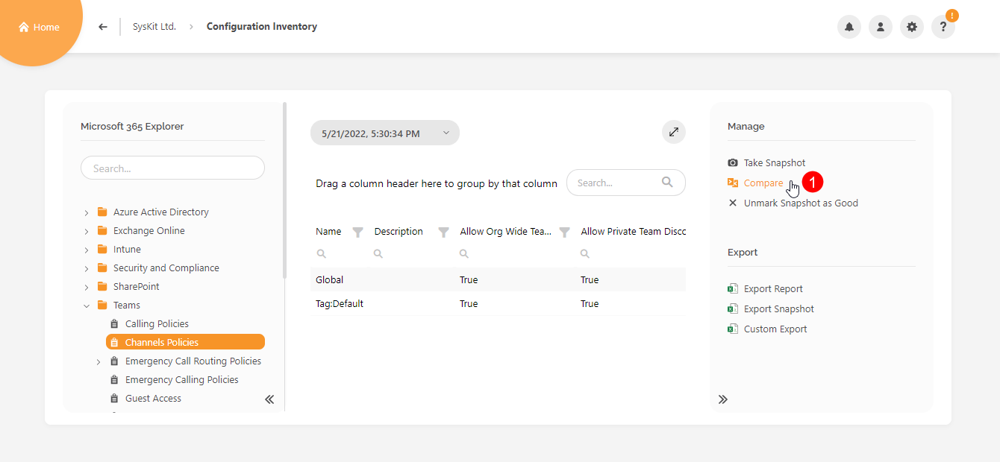
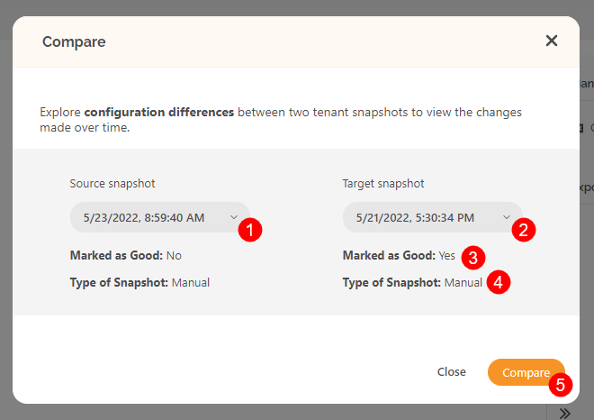
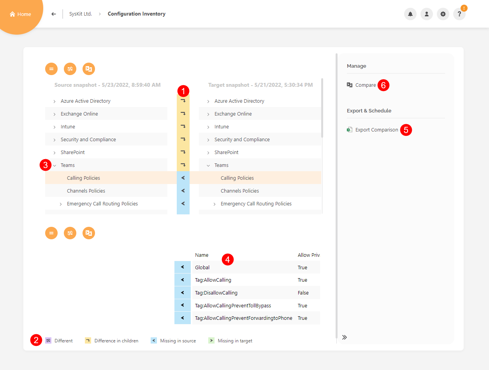

# Compare Snapshots

Syskit Point Configuration Inventory module allows you to compare snapshots.

You can track Microsoft 365 tenant changes and compare specific settings between snapshots with the comparison option. With a couple of easy steps, you can view the desired differences and export the result.  

Before comparing snapshots, make sure to have at least two snapshots [created](create-snapshot.md). 

## Compare Tenant Snapshots

First, navigate to the Configuration Inventory screen and click the Compare option (1) available in the Manage section.

The Compare dialog opens where you can:
* Select the Source snapshot (1)
* Select the Target snapshot (2)
* See if the selected snapshot is marked as good (3) 
* View if the selected snapshot was created automatically or manually (4)
* Click Compare (5) to generate the comparison report

The comparison report shows differences between the two selected snapshots, and different colors and icons mark object changes. The upper part of the window shows all the objects in a hierarchical structure, while the bottom half displays the differences between currently selected objects in the upper half.

Here, you can:
* detect all types of differences (1) marked with an icon - snapshot can have the same or different value of the same setting or settings missing in source or target snapshots; use the legend (2) to discover what each of the icons represents
* expand categories (3) to see exact settings that differ between snapshots (4)
* export the comparison report (5)
* select different snapshots to compare (6) - when clicked, the Compare dialog opens again

## Related Articles

* [Create Snapshot](create-snapshot.md)
* [Enable Automatic Snapshots](enable-automatic-snapshots.md)

