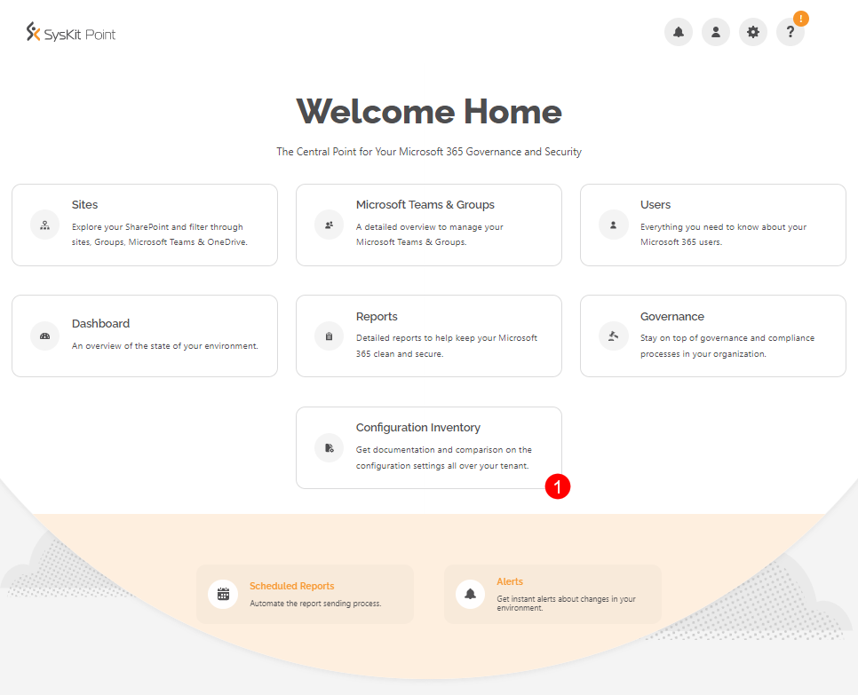
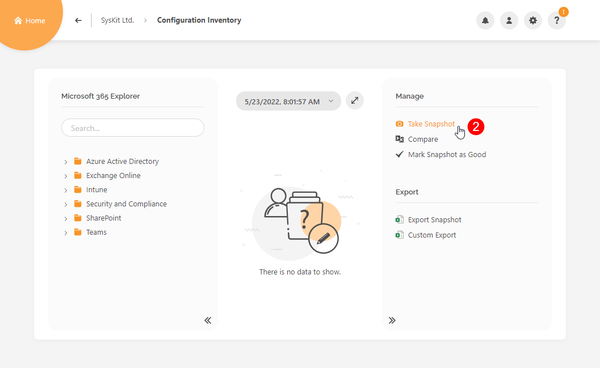
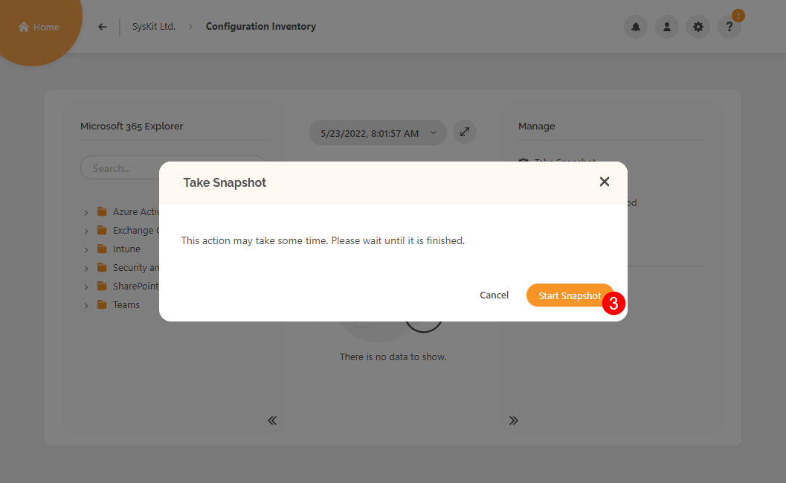
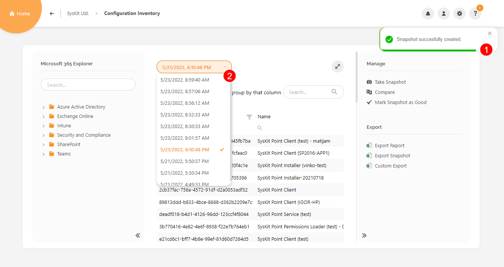

# Create Snapshot

A snapshot in the context of Syskit Point is a collection of all the Microsoft 365 configuration settings taken at a specific point in time. 

There are two ways to create a snapshot:
* **manual** - described in this article
* **automatic** - described in the [Enable Automatic Snapshots article](enable-automatic-snapshots.md)


**Please note!**  
Before creating a snapshot, make sure to read the [Configuration Inventory Requirements article](../configuration-inventory-requirements.md).


## Take Snapshot

To create a snapshot:
* Click the Configuration Inventory tile (1) on the Home screen - the Configuration Inventory screen opens 
* Click the Take Snapshot option (2) available in the side panel under the Manage section - the Take Snapshot dialog opens
* Click the Start Snapshot button (3) - Syskit Point starts to collect data in the background

Once the snapshot is finished, a notification (1) is displayed. 
You can find the newly created snapshot in the snapshot list (2).

## Related Articles

* [Configuration Inventory Requirements](../configuration-inventory-requirements.md)
* [Enable Automatic Snapshots](enable-automatic-snapshots.md)