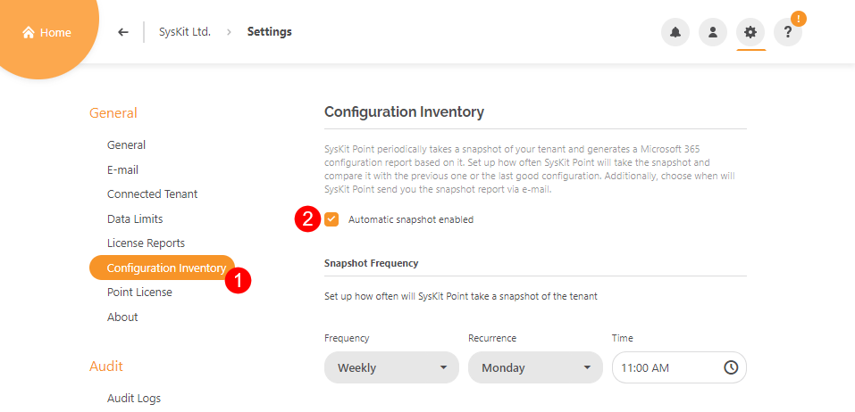
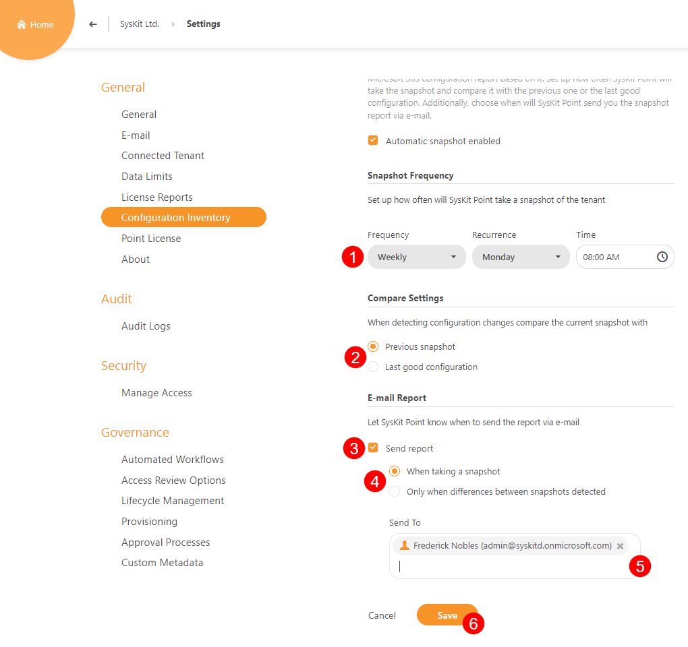
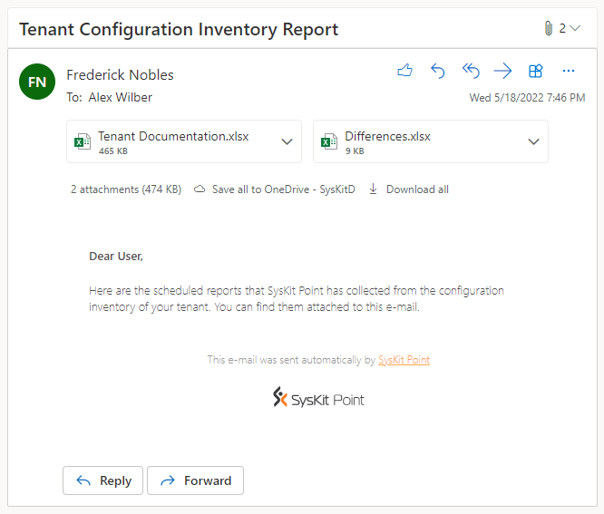

# Enable Automatic Snapshots

A snapshot in the context of Syskit Point is a collection of all the Microsoft 365 configuration settings taken at a specific point in time. 

There are two ways to create a snapshot:
* **automatic** - described in this article
* **manual** - described in the [Create Snapshot article](create-snapshot.md)


**Please note!**  
Before enabling automatic snapshots, make sure to read the [Configuration Inventory Requirements article](../configuration-inventory-requirements.md).


## Enable & Configure Automatic Snapshots

To enable automatic snapshots:
* Navigate to Settings > General > Configuration Inventory (1)
* Check the Automatic snapshot enabled option (2)

After you enable automatic snapshots, continue to configure automatic snapshot options. 
You can define the following:
* Snapshot Frequency (1) - choose between a daily, weekly, and monthly automatic snapshot and define the day and time when the snapshot is started
* Compare Settings (2) - when an automatic snapshot is created, Syskit Point can compare the new snapshot with the previous snapshot or a snapshot marked as a good configuration
* E-mail (3) - enable the checkbox (3) and choose if the report is sent after each snapshot or only if differences between the new and an old snapshot are discovered (4); enter the e-mail that receives the report (5)
* Save (6) when you are finished with the configuration

## Snapshot Report

After an automatic snapshot completes, Syskit Point sends an e-mail to defined users. 
The e-mail comes with reports attached:
* Tenant Documentation
* Differences - only if Syskit Point detected differences between the new and the previous snapshot

## Related Articles

* [Configuration Inventory Requirements](../configuration-inventory-requirements.md)
* [Create Snapshot](create-snapshot.md)