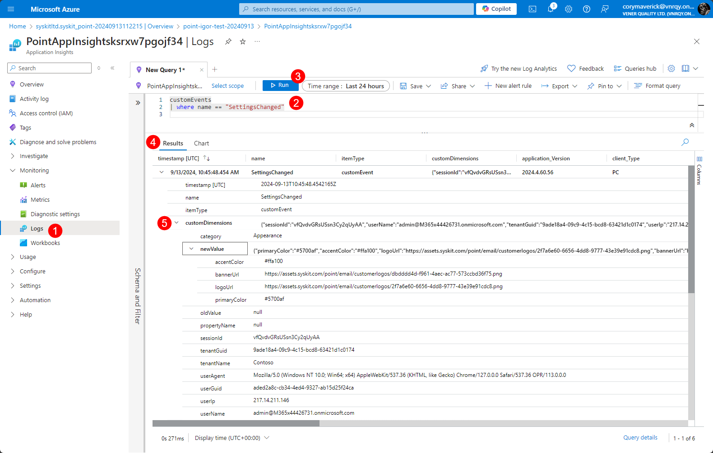

# Audit for Settings


**Please note!** Settings audit logs are readily available for Point Enterprise customers. SaaS customers are advised to [contact Syskit Support]() if they require audit logs for changes made in Syskit Point settings.


Syskit Point logs all changes in settings along with important additional information, such as the user who changed a setting, which setting was changed, as well as the values before and after the change, thus providing a complete picture of what was changed, when, and by whom. The Audit Log for your Point Settings can be accessed through the Application Insights resource.


No additional configuration in Syskit Point is needed to log the changes in Settings. This is done automatically. 


In this article you can find information on:

* Accessing Application Insights
* Query Logs 
* List of Common Properties in Logs

## Accessing Application Insights

To access Application Insights for Syskit Point:
* Open [Microsoft Azure portal](https://portal.azure.com/#home)
* Find and open the **Syskit Point Azure resource group**
* Navigate to the Application Insights resource within the resource group
* **Find and click Logs (1)** in the Monitoring section in the left-side menu
* In the New Query tab, **enter the following query (2)**:

```
customEvents
| where name == "SettingsChanged"
```

* When you've entered the above value, press the **Run (3)** button to execute your query. 
* In the **Results (4)** section you'll find information about the actions taken in Syskit Point settings.
* If no actions are shown in the results, try to adjust and increase the **time range (5)** and run the query again. 
* Expanding **customDimensions (5)** for each log gives you more details about what changed.



## Common Log Properties

In the table below, you can find common properties for all logs, along with more details about each property.

| Property | Description |
| --- | --- |
| category / propertyName | Give you information about which exact settings were changed. For example, changing the e-mail send method from Exchange Online to SMTP would have the category set to  `Base` (since this is considered as one of the baseline settings for Syskit Point), and propertyName set to `EmailSettings.SelectedEmailMode` | 
| userGuid | Object ID of the user who changed a setting |
| userName | User principal name of the user who changed a setting |
| userIp | IP address for the individual that made the changes |
| sessionId | ID of the user's session | 
| userAgent | Shows the browser and operating system used by the user |
| newValue | Shows the settings value after the change; when the property is null, an object was deleted in Settings; e.g., an unused Policy |
| oldValue | Shows the settings value before the change; when the property is null, an object was created in Settings; e.g., a new Policy | 

## Related Articles

* [Configure Your Environment for Storage Management](../configuration/configure-point-for-storage-management.md)
* [Free Up Storage](../storage-management/free-up-storage.md)
* [Configure Tenant Storage Limit Policy](../governance-and-automation/automated-workflows/tenant-storage-admin.md)
* [Tenant Storage Security & Compliance Check](../governance-and-automation/security-compliance-checks/tenant-storage.md)
* [Resolve Tenant Storage Limit Task](../point-collaborators/resolve-governance-tasks/tenant-storage-limit.md)
* [Storage Metrics Report](../storage-management/storage-reports.md)
* [Site Storage Metrics Report](../storage-management/storage-reports.md#site-storage-metrics)
* [File Storage Details Report](../storage-management/storage-reports.md#file-storage-details)
