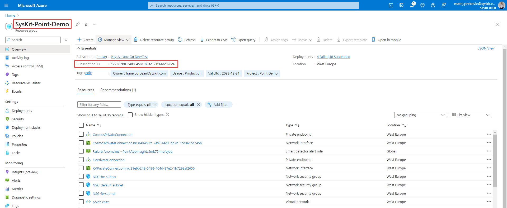
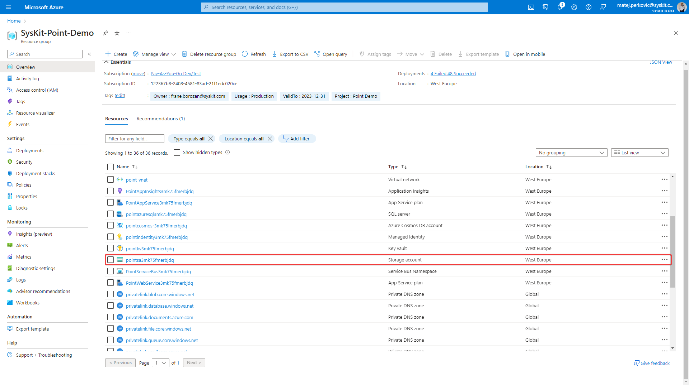

# Configure Syskit Point to use Storage Management 


**Please note!** 
The configuration described in this article is needed for the Storage Management feature to work for Point Data Center customers only.
Point Cloud instances require no additional configuration for Storage Management.  


## Why is additional configuration needed for the Azure storage account? 

Syskit Point introduced a new Storage Management feature; for it to work, additional configuration of your existing Point instance is needed. This functionality uses an API where the Microsoft backend software aggregates all the information into an XML file and saves it directly on your existing Storage account. For this to work, we generate a [SAS token](https://learn.microsoft.com/en-us/azure/storage/common/storage-sas-overview), which is passed to the Microsoft backend; Microsoft uses this token to write back the output manifest directly to your blobs. This token is generated with a limited lifetime and scope, and it is only shared with Microsoft backend.


**Please note:** No anonymous or unauthorized access is allowed to your Azure Blob Storage Container. Neither Syskit nor any other 3rd party can access your blobs. 



## Steps to enable Microsoft access to the Storage account  

The following process is going to: 

 * **Create a Private endpoint** so Syskit Point can securely read information from the storage account queue 
 * **Configure Firewall rules** with exceptions for Microsoft services that need to access your storage account directly 

 * Login to [https://portal.azure.com](https://portal.azure.com)

 * Find the Resource Group where Syskit Point is deployed, and write down the following values: 
    * Resource group name 
    * Subscription ID

* Find the Storage account and write down its name (name starts with pointsa*)

* Start Azure CLI 
   * Install the Azure CLI - [https://learn.microsoft.com/en-us/cli/azure/install-azure-cli](https://learn.microsoft.com/en-us/cli/azure/install-azure-cli)
   * Or run in Azure Cloud Shell [https://learn.microsoft.com/en-us/azure/cloud-shell/quickstart?tabs=azurecli](https://learn.microsoft.com/en-us/azure/cloud-shell/quickstart?tabs=azurecli)

* [Contact us](https://www.syskit.com/contact-us/) to request the script you need to run and feel free to ask for more details if you need further assistance. 

After completing the above, restart **both** App Services inside the Point resource group. 
