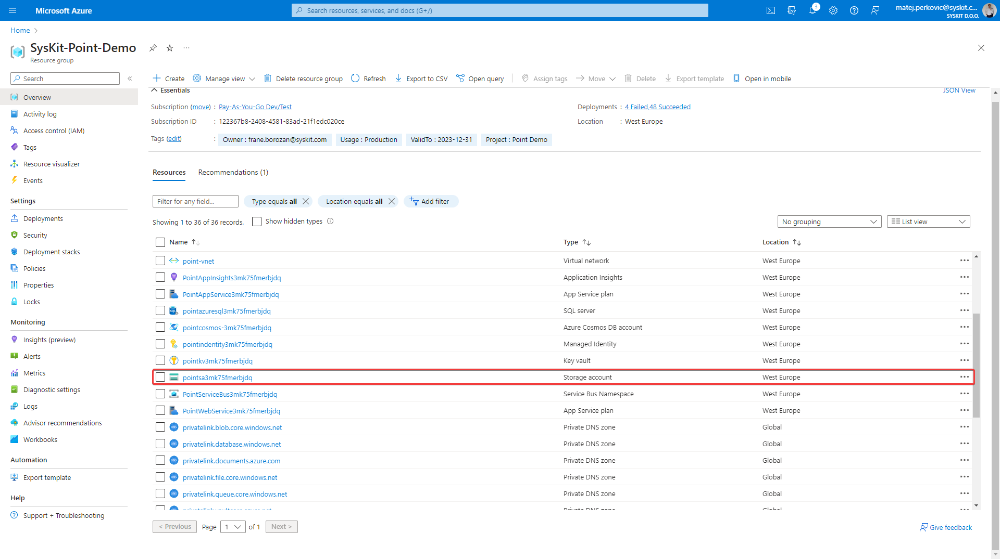

# Configure Your Environment for Storage Management 


**Please note!** 
The configuration described in this article is needed for the Storage Management feature to work for Point Enterprise customers only.
Point Cloud instances require no additional configuration for Storage Management.  


## Why is additional configuration needed for the Azure storage account? 

Syskit Point introduced the new Storage Management for SharePoint Online feature; for it to work, additional configuration of your existing Point instance is needed. This functionality uses an API where the Microsoft backend software aggregates all the information into an XML file and saves it directly on your existing Storage account. For this to work, we generate a [SAS token](https://learn.microsoft.com/en-us/azure/storage/common/storage-sas-overview), which is passed to the Microsoft backend; Microsoft uses this token to write back the output manifest directly to your blobs. This token is generated with a limited lifetime and scope, and it is shared with Microsoft backend only.


**Please note:** No anonymous or unauthorized access is allowed to your Azure Blob Storage Container. Neither Syskit nor any other 3rd party can access your blobs. 


## Enable Microsoft Access to the Storage Account  

### Requirements


**[Contact us](https://support.syskit.com/hc/en-us)** to provide you with a script you will run in your environment.


The script will:
* **Create a Private endpoint** so Syskit Point can securely read information from the storage account queue 
* **Configure Firewall rules** with exceptions for Microsoft services that need to access your storage account directly 

To run the script, you will need to:
* Install the Azure CLI - [https://learn.microsoft.com/en-us/cli/azure/install-azure-cli](https://learn.microsoft.com/en-us/cli/azure/install-azure-cli)
* Or run in Azure Cloud Shell [https://learn.microsoft.com/en-us/azure/cloud-shell/quickstart?tabs=azurecli](https://learn.microsoft.com/en-us/azure/cloud-shell/quickstart?tabs=azurecli)


**Please note!** When running the script outside the Azure CLI, you must log in using the az login command.


### Environment Data and Running the script

**The provided script contains placeholder values that you need to replace with data collected from your environment; this must be done before running the script**. 

To collect the data:
* Login to [https://portal.azure.com](https://portal.azure.com)
* Find the Resource Group where Syskit Point is deployed, and save the following values: 
    * **Resource group name** 
    * **Subscription ID**

* Find the Storage account and write down its name (name starts with pointsa*)

* Modify the provided script and enter the collected data instead of default values.
* To run the script, start Azure CLI 
   * Install the Azure CLI - [https://learn.microsoft.com/en-us/cli/azure/install-azure-cli](https://learn.microsoft.com/en-us/cli/azure/install-azure-cli)
   * Or run in Azure Cloud Shell [https://learn.microsoft.com/en-us/azure/cloud-shell/quickstart?tabs=azurecli](https://learn.microsoft.com/en-us/azure/cloud-shell/quickstart?tabs=azurecli)


**Please note!** When running the script outside the Azure CLI, you must log in using the az login command.


After completing the above, restart **both** App Services inside the Point resource group. After the restart, Syskit Point is configured to collect the storage data from Microsoft. 


**Please note!** If you modified the default ARM template when deploying Syskit Point and introduced custom networking changes, you must modify the provided script before its use.
**[Contact us](https://support.syskit.com/hc/en-us)** to provide you with more details or further assistance.


## Related Articles

* [Learn how to manage storage using Syskit Point](../storage-management/storage-management-overview.md)