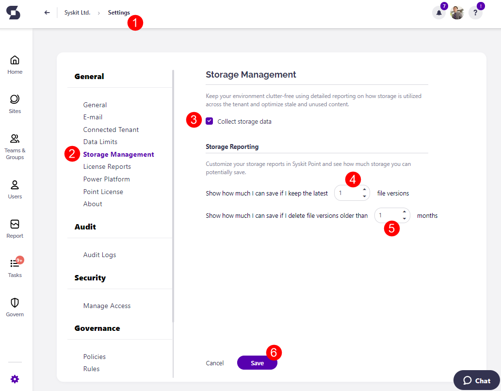

# Storage Storage Management in Syskit Point

The Syskit Point Storage Management feature helps you keep your environment clutter-free, optimize the usage of your storage, and gain insight into how your storage is distributed across your tenant.

For more information on this feature, [take a look at the Storage Management article](../reporting/storage-management/storage-management.md). 

To configure the Storage Management feature within Syskit Point, complete the following steps:

* **Go to the Settings (1)** of your Syskit Point
* Under the General section, **click the Storage Management button (2)**
*  The **Collect storage data checkbox (3)** is turned on by default
  * When the collecting storage data checkbox is selected, Syskit Point collects file sizes, file extensions, and file versions. 
  * If you deselect the check box and turn off collecting storage data, Syskit Point does not collect file sizes, file extensions, or file versions, and no new storage data is reflected in Syskit Point.
  * Site size history is collected even when the checkbox is deselected. 


**Please note!** When the checkbox is deselected and collecting storage data is turned off, you will not be able to access any of the Storage Management reports.


Once storage management has been turned on, you can also customize your storage reports in Syskit Point by setting the following:
* **Show how much I can save if I keep the latest X file versions (4)** - here, you can set a number in place of X depending on how many of the latest file versions you want to keep when trying to declutter your workspaces
* **Show how much I can save if I delete file versions older than X months (5)** - here, you can select the number of months that the file version should be older than when considering cleaning up your site and deleting previous versions
* These values can be found in tiles on: 
  * The [Site Storage Metrics](../reporting/storage-management/storage-reports.md#site-storage-metrics) report, where you can use them to also instantly clean up your site, along with being shown the amount of storage that will be freed up.
  * The [File Storage Details](../reporting/storage-management/storage-reports.md#file-storage-details) report, where you can use the tiles to filter between the versions of the files before deciding which to delete. 

Once finished, **click Save (6)** to save your storage management preferences. 

## Related Articles

* [Storage Management](../reporting/storage-management/storage-management.md)
* [Configure Tenant Storage Limit Policy](../governance-and-automation/automated-workflows/tenant-storage-admin.md)
* [Tenant Storage Security & Compliance Check](../../governance-and-automation/security-compliance-checks/tenant-storage.md)
* [Resolve Tenant Storage Limit Task](../../point-collaborators/resolve-governance-tasks/tenant-storage-limit.md)
* [Storage Metrics Report](../reporting/storage-management/storage-reports.md#storage-metrics)
* [Site Storage Metrics Report](../reporting/storage-management/storage-reports.md#site-storage-metrics)
* [File Storage Details Report](../reporting/storage-management/storage-reports.md#file-storage-details)