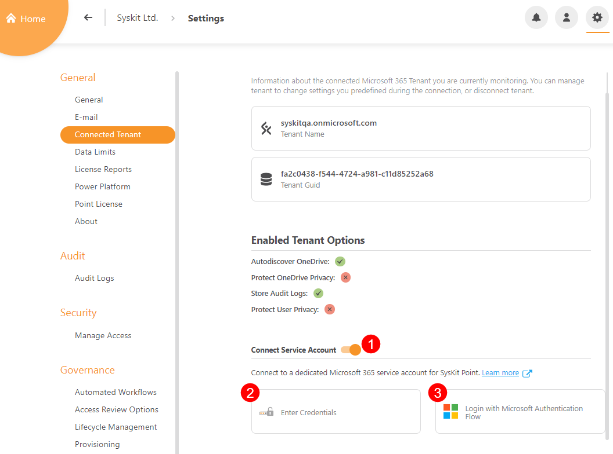
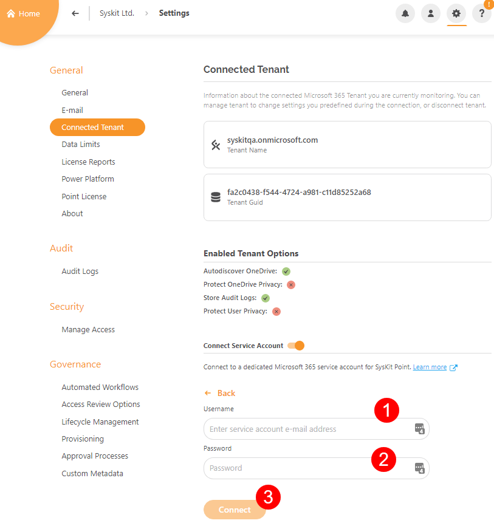
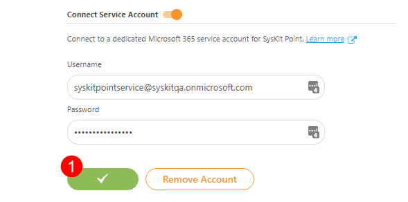

## Connect Service Account

**Service accounts** in SysKit Point are utilized for the Configuration Inventory module, using sensitivity labels for templates and other available features. 

To connect the service account in SysKit Point:
* **Navigate to Settings** > **General** > **Connected Tenant**
* **Switch the Connect Service Account (1) toggle on**

Once the Connect Service Account option is turned on, you can choose how to connect and authenticate your service account.

The two options are the following:

* **Enter credentials (2)** for the service account
* **Multi-factor authentication (3)** with Microsoft Authentication Flow

If multi-factor authentication is selected, you will need to log in with Microsoft Authentication Flow. 
  * To enable multi-factor authentication, follow the instructions in [this article](https://support.microsoft.com/en-us/office/set-up-your-microsoft-365-sign-in-for-multi-factor-authentication-ace1d096-61e5-449b-a875-58eb3d74de14).

If credentials are selected, additional fields are displayed where you can:
* **Enter service account email address (1)**
* **Enter service account password (2)**
* **Click the Connect button (3)** to finish

**After a successful connection, the connect button turns green and shows a checkmark (1).**

