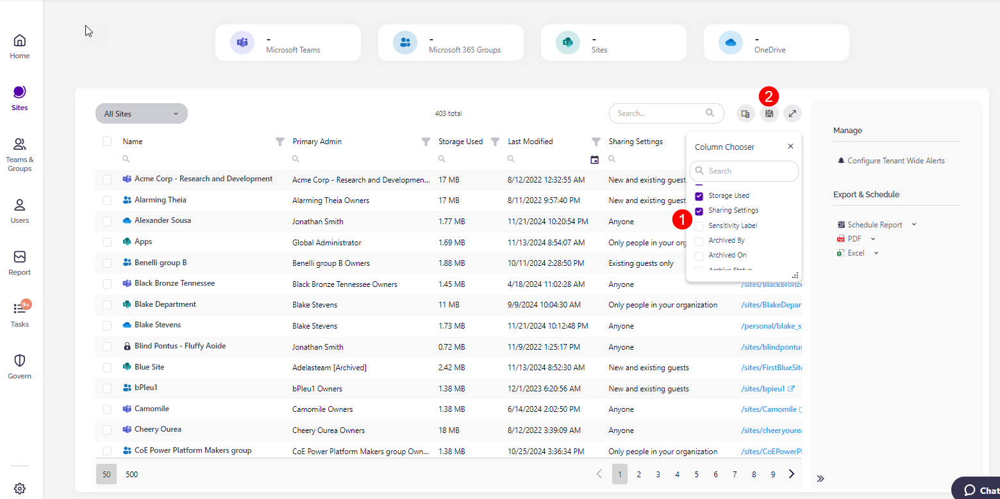
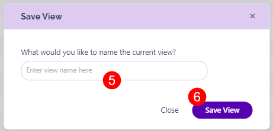
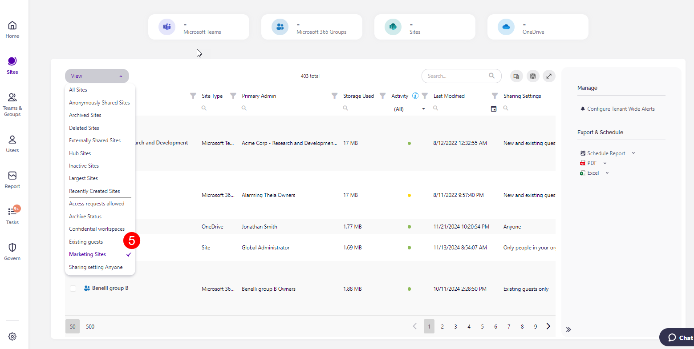
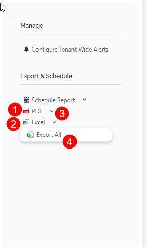

# Custom Views

The Custom Views feature allows you to **create and save customized views for your reports** in Syskit Point. 

Tailored reports are often needed to track inventory, access, activity, or other important information accurately. However, these needs usually differ from business to business - what one company finds important, another might see as non-essential. 

The ability to save custom views **lets you filter, sort, add, or remove columns in your report based on your specific needs and then retain those customizations for future use**. This includes exporting or scheduling reports with your customized view.

Custom Views can be saved on all overview screens, grid reports, and tree reports which are the following:

* **Overview Reports**
  * Sites
  * Microsoft Teams
  * Microsoft Groups
  * Users
* **Report center**
  * External Sharing reports
  * Access reports
  * Audit reports
  * Cleanup & Health reports
  * Licenses reports
  * Sensitivity Labels reports
  * Storage reports
  * Analytics reports (except for the Site Analytics report)
  * Power Platform reports
  * Power BI reports

## Save Custom Views

This example uses the Sites Overview report to explain how to save custom views. However, the same actions can be performed on the above-listed reports.

First, you need to customize your report based on your preferences. 

This means that you should:

* **Select the columns (1)** you want visible from the column chooser
* **Modify visible columns**, their order, sorting, and other filters based on your preference
  * [Click here to see the table of report customization saved in custom views](#custom-views-options)
* **Click the Save Custom Views (2)** button on the top right side of the report
  * **The confirmation dialog** appears where you can **name the custom view (3)** you created and **click Save View (4)** to finalize
  * Now, you can schedule or export the report with the custom view you created
  * the next time you generate the report, you can select the custom view you created
* Once your custom views are created, you can **select them from the View filter (5)** in the top left of the report
  * You can find your views there every time you access the report they were created for
  * The top views you see in the filter are the predefined views for the report, and below the separator line, you can find your saved custom views 

When you are ready, you can choose to schedule your report or export it as:
* A **PDF (1)** file
* An **Excel (2)** file

**This exports the rows you see in your filtered report**. 
  * For example, when you select a custom view and then additionally filter the report, use Excel or PDF export actions to generate a file containing the final result of your filtering. 

Clicking the **arrow symbol (3)** next to either of the two export options enables you to run the **Export All (4)** action. 
* **The Export All action generates a file containing all the information that is included in the selected report view.**
  * For example, when you select a custom view and then additionally filter the report but you still want to export rows as filtered in the selected view without additional filters applied, use the Export All action. 

## Custom Views Options

The table below shows report customizations saved when creating custom views and how this impacts report export.

| View Feature | Point UI | Direct Export - XLSX | Scheduled Export - XLSX |  Direct Export - PDF |  Scheduled Export - PDF |
| --- | --- | --- | --- | --- | --- |
| Column visibility | Yes | No | No | No | No |
| Column order | Yes | No | No | No | No | 
| Column sort | Yes | Yes | Yes | Yes | Yes | 
| Column filters | Yes | Yes | Yes | Yes | Yes | 
| Column search cell (searchbox in column) | Yes | Yes | Yes | Yes | Yes |
| Global Search (searchbox top right in grid) | Yes | Yes | Yes | Yes | Yes |
| Column group | Yes | No | No | No | No | 
| Filter tiles | Yes | Yes | Yes | Yes | Yes | 
| Date period, any other filter operations | Yes | Yes | Yes | Yes | Yes | 

