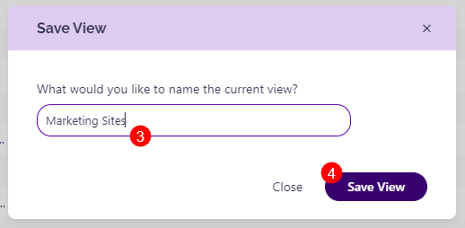

# Custom Views

The Custom Views feature allows you to **create and save customized views for your reports** in Syskit Point. 

Tailored reports are often needed to track inventory, access, activity, or other important information accurately. However, these needs often differ from business to business - what one company finds important, another might see as non-essential. 

The ability to save custom views **lets you filter, sort, add, or remove columns in your report based on your specific needs and then retain those customizations for future use**. This includes exporting or scheduling reports with your customized view.

Custom Views can be saved on all overview screens and grid reports, which are the following:

* **Overview Reports**
  * Sites
  * Microsoft Teams
  * Microsoft Groups
  * Users
* **Report center**
  * External Users
  * Orphaned Users
  * Orphaned Workspaces
  * Inactive Workspaces
  * Audit Reports
  * License Reports
  * Sensitivity Labels Reports
  * Storage Reports

## Save Custom Views

This example uses the Sites Overview report to explain how to save custom views. However, the same actions can be performed on any of the above-listed reports.

First, you need to customize your report based on your preferences. 

This means that you should:

* **Select the columns (1)** you want visible from the column chooser
* **Organize the columns (2)** in the order you want to view them by hovering your mouse between two columns
* **Click the Save Custom Views (3)** button on the top right side of the report
  * **The confirmation dialog** appears where you can **name the custom view (5)** you created and **click Save View (6)** to finalize
  * Now, you can schedule the report or export it as the new custom view you created
  * The next time you generate this report, it opens as the custom view you created
* To reset the custom view you created for a report, **click the Reset Layout (4)** button 

## Custom Views Options

The table below shows what custom views are saved and how this impacts the export of reports. 

| View Feature | UI | Direct Export - XLSX | Scheduled Export - XLSX |  Direct Export - PDF |  Scheduled Export - PDF |
| --- | --- | --- | --- | --- | --- |
| Column visibility | Yes | Yes | Yes | Yes | Yes |
| Column order | Yes | Yes | Yes | Yes | Yes | 
| Column sort | Yes | Yes | Yes | Yes | Yes | 
| Column search cell (searchbox in column) | Yes | Yes | Yes | Yes | Yes |
| Global Search (searchbox top right in grid) | No | No | No | No | No |
| Column group | Yes | Adjusted | Adjusted | Adjusted | Adjusted | 
| Filter tiles | Yes | Yes | Yes | Yes | Yes | 
| Date period, any other filter operations | Yes | Yes | Yes | Yes | Yes | 

