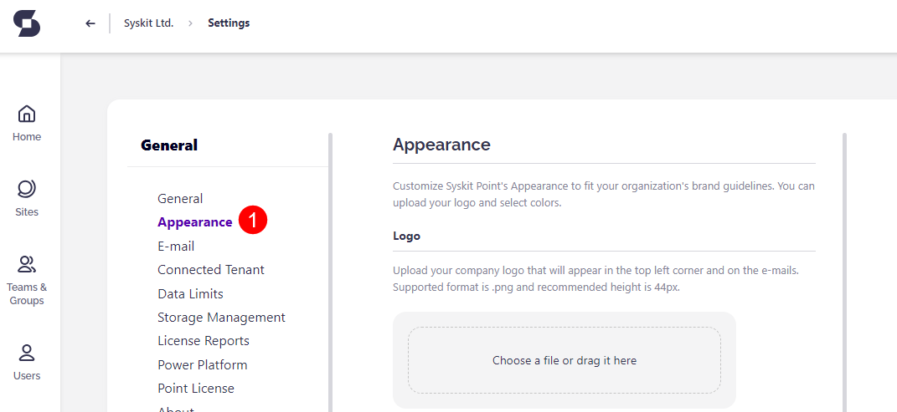
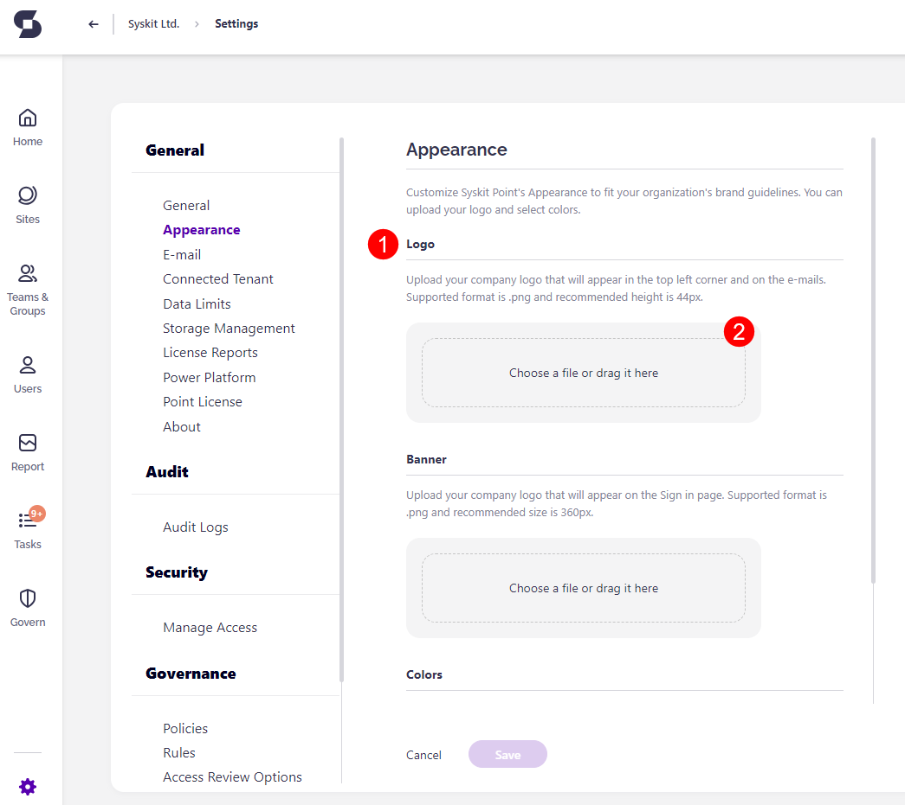
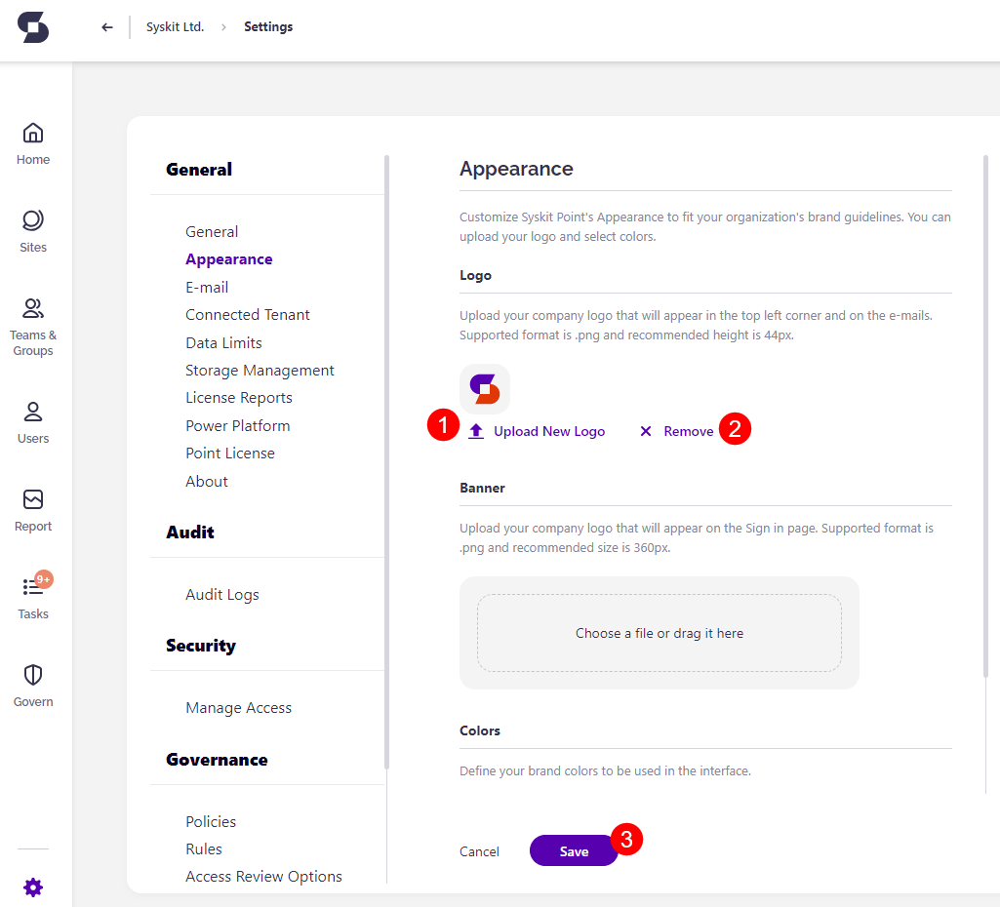
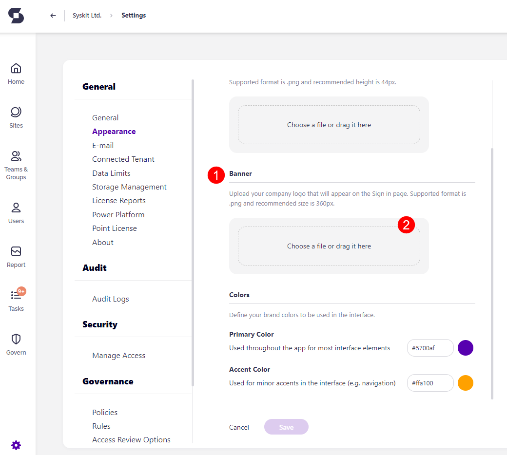
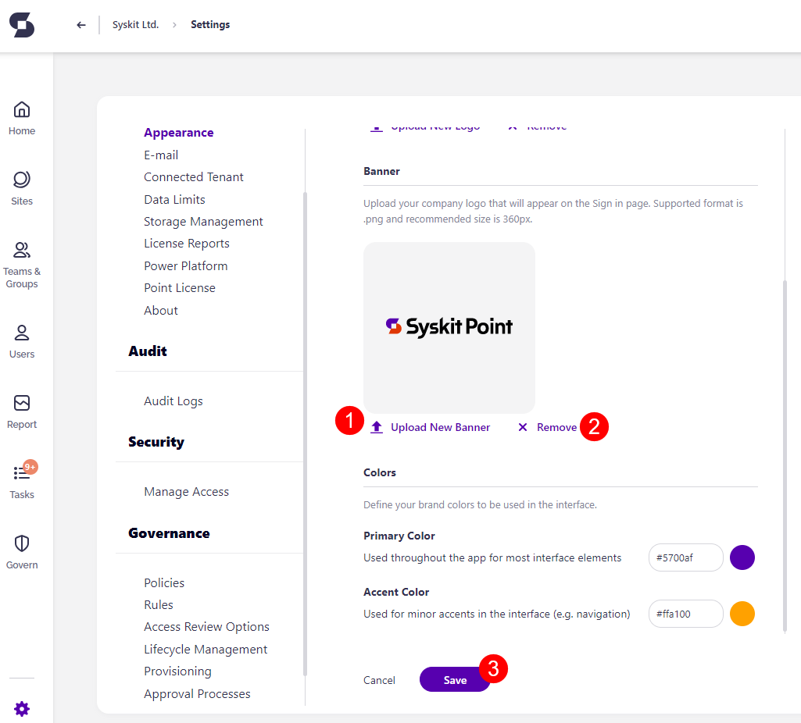
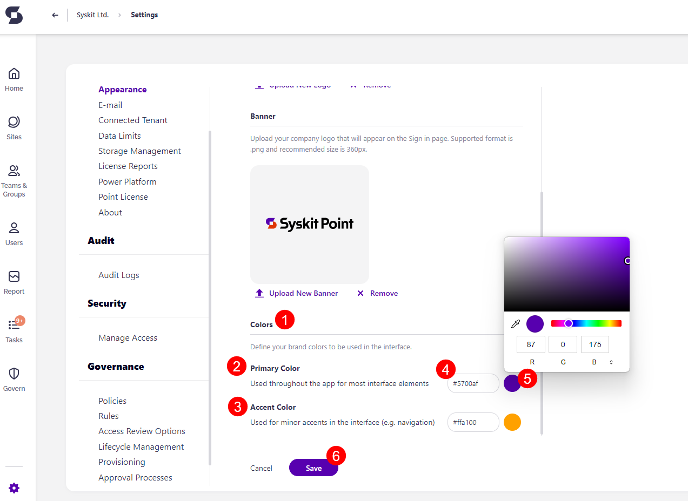
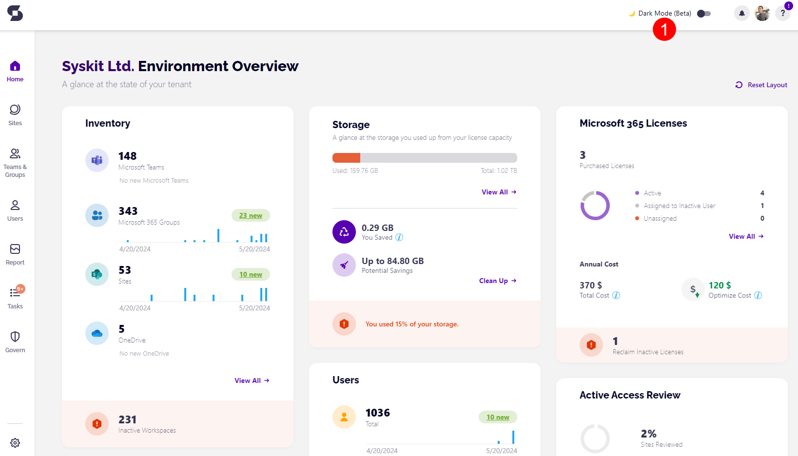
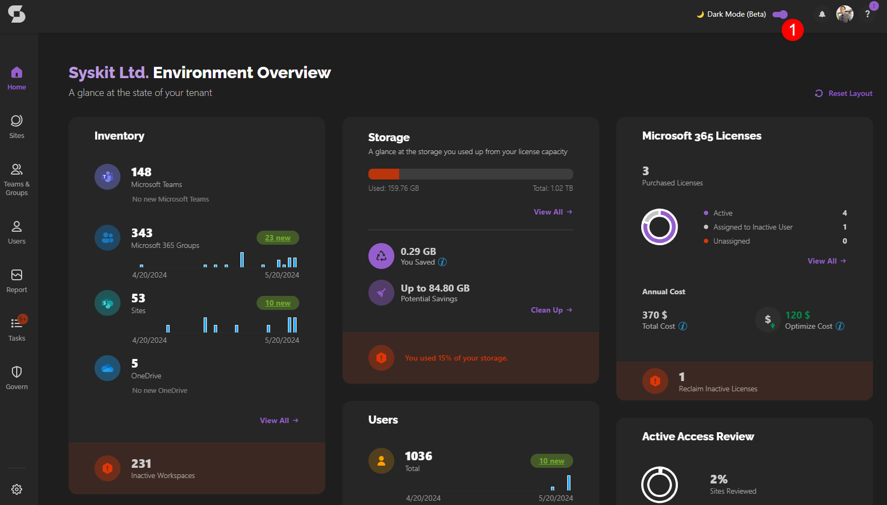

# Customize Syskit Point Appearance

Make your Syskit Point feel unique by using your company's **brand guidelines**. There are several things you can change to **customize how your Syskit Point looks**.

In this article, we will cover the following customizations.

* [Logo](customize-appearance.md#logo)
* [Banner](customize-appearance.md#banner)
* [Colors](customize-appearance.md#colors)
* [Dark Mode](customize-appearance.md#dark-mode)


**Please note:** the changes you make to the **logo, banner, and colors** are a company-wide setting. It is visible to all users within your company who utilize Syskit Point.

**Dark Mode (Beta) is a per-user setting**, meaning that its state is saved for each user separately and is not applied company-wide. &#x20;


To change the look of your Syskit Point, first go to Settings > General and **click the Appearance button (1)** on the left side of the screen.

## Logo

On the Appearance screen, the first thing you can customize is the **logo (1)**.

Uploading your company logo **changes the icon in the top left corner** from the default Syskit one to your new company logo. The supported format for the logo is **.png**, and the recommended height of the image is **44px**.

To add your company logo, **drag the file** into the designated space or **choose a file to upload (2)**.

Once your logo is selected, you can:

&#x20;\* Choose to **Upload New Logo (1)** if you want to try a different one.

&#x20;\* **Remove (2)** the uploaded logo completely.

&#x20;\* **Click Save (3)** to store the settings if you are satisfied with your changes.


Please note, this change to the logo is also applied to e-mails sent out. If you want to use a different logo for your e-mails, take a look at the [Customize E-mails article](customize-emails.md) for details on how to do so.


## Banner

Next, you can customize the **banner (1) that appears on the Sign in page** of Syskit Point.

The supported format for the banner is **.png**, and the recommended height of the image is **360px**.

To add your company banner, **drag the file** into the designated space or **choose a file to upload (2)**.

Once your banner is selected, you can:  \* Choose to **Upload New Banner (1)** if you want to try a different one.

&#x20;\* **Remove (2)** the uploaded banner completely.

&#x20;\* **Click Save (3)** to store the settings if you are satisfied with your changes.


Please note, this action only changes the banner on the Sign in page of Syskit Point. To add a custom banner for e-mails, please take a look at the [Customize E-mails article](customize-emails.md).


## Colors

Finally, you can also define and utilize your brand **colors (1)**. The colors you select are **used in the interface** of Syskit Point.

First, select your **Primary Color (2)**. This color is used throughout Syskit Point for most interface elements.

Second, you can choose your preferred **Accent Color (3)**. This color is used for minor accents in the interface, such as the navigation.

To select your colors:

* Enter the **HEX code for your selected color (4)**, or alternatively
* Select your color shade from the **color picker (5)**
* **Click Save (6)** to store the settings if you are satisfied with your changes.

## Dark Mode

Another thing you can change when it comes to the look and feel of your Syskit Point is the new **Dark Mode (Beta) (1)** feature.

To turn Dark Mode on, simply **click the toggle (1)**. The color scheme should change from a white background to a darker one. &#x20;

