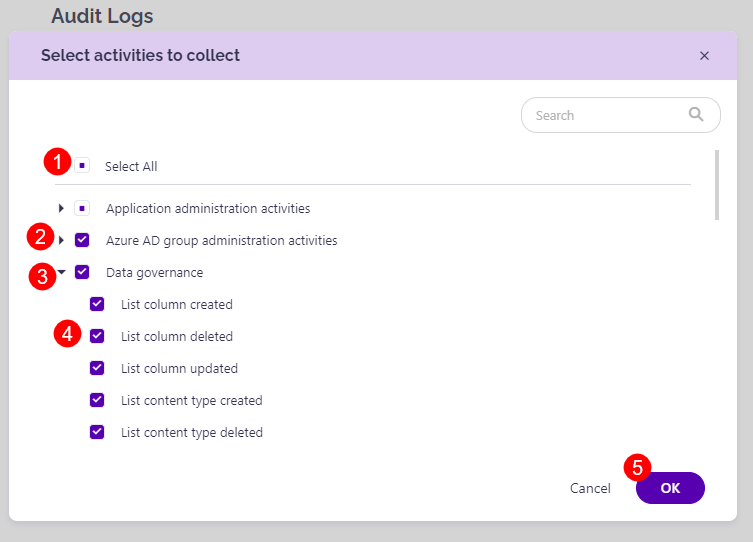

# Customize Audit Logs Collection

Audit logs can provide you with **insights into all activities** related to the user and administration activities in your Microsoft 365 environment.‌

Users that are assigned **SysKit Point Admin role** can configure activities that are going to be collected in these locations:

* **SysKit Point Registration > Tenant settings**
* **Audit Logs section in Settings**

## SysKit Point Registration > Tenant settings

After registering **SysKit Point**, on the **Connect tenant** step, you have the following audit options on disposal:

* **Store audit logs \(1\)**
* **Protect user privacy \(2\)**

### Store Audit Logs Option

By default, the **Store audit logs** option is enabled, meaning that SysKit Point will process and store the audit logs to your **Azure Cosmos DB account**.


**Please note!**  
Regardless of your selection to store them or not, audit logs are **regularly processed by SysKit Point** to track changes and activity in your Microsoft 365 environment. Storing audit logs gives you the possibility to access audit data for more extended periods than available in Microsoft 365.


### Protect User Privacy Option

Turning this option on results in the following:

* **User activity data**, such as file and permissions changes, **will be hidden and protected from Administrator supervision** 
  * **User Activity report will be hidden from SysKit Point user interface**
  * **Access to the File and Page Activities report will be hidden**
  * **Summary data in the Analytics & Usage tile will remain visible, but cannot be drilled to access data for a specific user**
* **User activity** data will, however, be collected and stored


**Please note!**  
User activity data continues to be collected and stored, to be readily available if needed, in case of a security incident.


The following rules apply regarding the User Privacy option:

* **By default, this option is turned off**
* **The option can be set for each tenant connected with SysKit Point independently**
* **Changing the option is possible through Manage Connection button in the SysKit Point Settings > General > Connected Tenant screen**


**Please note!**  
The **Protect user privacy** option is disabled automatically if the **Store audit logs option** is turned off.


## Audit Logs Settings

Audit log settings can also be configured after the initial configuration of **SysKit Point**. To do so:

* Open the **Settings** screen
* Navigate to the **Audit** > **Audit Logs \(1\)** page

Here, you can:

* **Turn the storage of Audit Logs on or off \(2\)**
* **Select activities to collect \(3\)**
* **View the number of events \(4\)** in the Audit Index
* **Enable and set up audit logs data retention \(5\)** - by default, this option is turned off; when enabled, SysKit Point will delete audit logs older than specified

Audit logs activities that are being collected can be found by clicking the **Select activities to collect \(3\)** link.

A new dialog opens, showing all audit log categories and activities available in SysKit Point. Here you can:

* Use the **Select All** option to enable the collection of all available activities **\(1\)**
* **Adjust which audit log categories will be collected by clicking the checkbox \(2\)** next to a category
* **Expand categories \(3\)**
* **Mark only specific activities within a category to be collected \(4\)**
* **Confirm your changes** by clicking the **OK button \(5\)** and **Save** button on the **Audit Logs** screen.

Available audit log categories:

* **Application administration activities**
* **Azure AD group administration activities**
* **Data governance**
* **Directory administration activities**
* **Exchange admin activities**
* **Exchange mailbox activities**
* **File and page activities**
* **Folder activities**
* **Microsoft Forms**
* **Microsoft Power Automate**
* **Microsoft Stream**
* **Microsoft Teams activities**
* **Power Apps activities**
* **Power BI activities**
* **Role administration activities**
* **SharePoint list events**
* **Sharing and access request activities**
* **Site administration activities**
* **Site permissions activities**
* **Synchronization activities**
* **User activities**
* **User administration activities**

### Exchange Logs


**Please note!**  
By default, Exchange logs are **not collected**; at least one Exchange activity must be selected for SysKit Point to start collecting and storing Exchange log data.


To select Exchange activities:

* **Open the Select activities to collect dialog in Audit settings**
* **Choose from two available categories:**
  * **Exchange admin activities \(1\)**
  * **Exchange mailbox activities \(2\)**
* **Click OK** to confirm


**Please note!** It can take up to 30 minutes for Syskit Point to collect Exchange log data.


To view collected Exchange logs, use the **Exchange Logs report** available in the Report Center.

