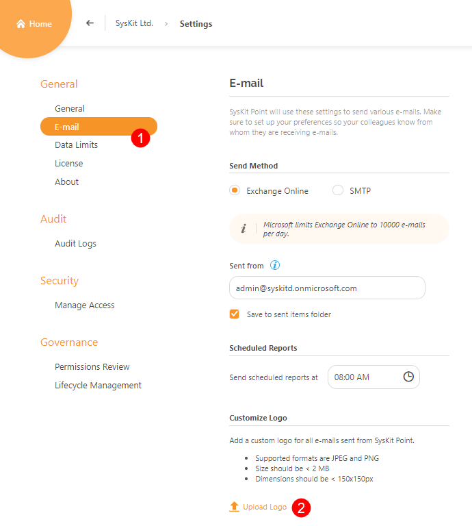
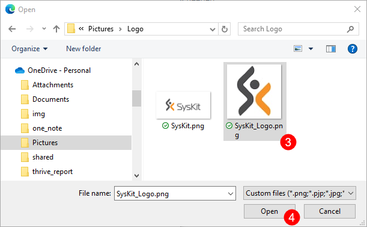
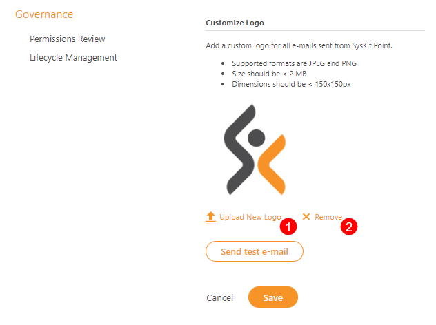
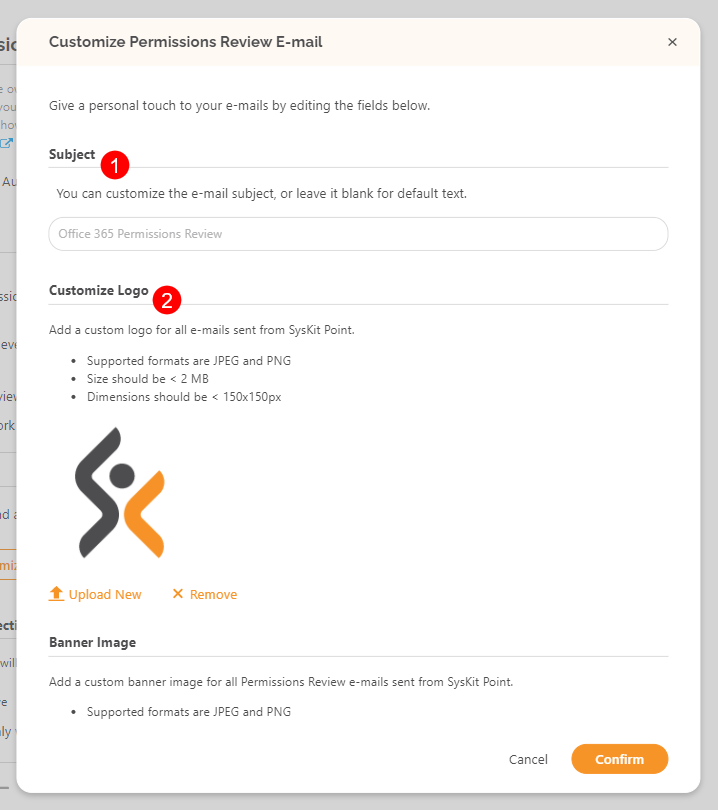
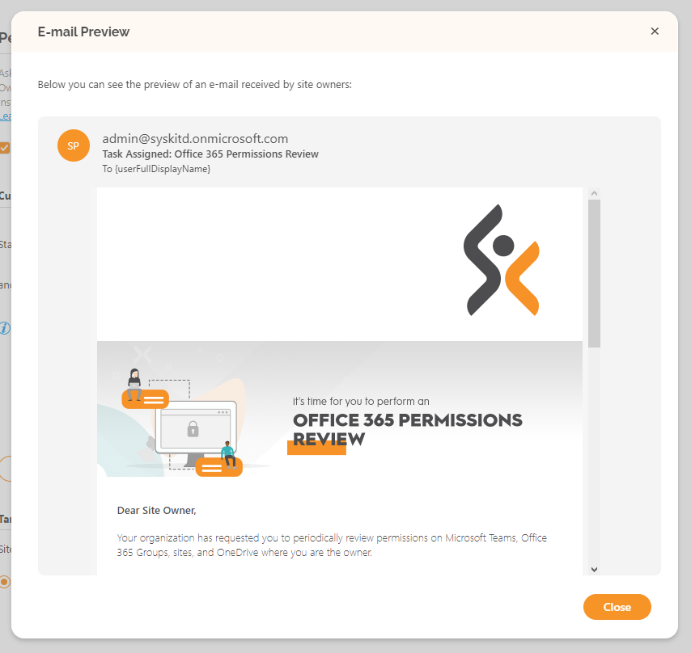

# Customize E-mails

SysKit Point **allows you to customize e-mails** that will be **sent to site owners** as a part of **Access Review and Lifecycle Management Automation**.

You can customize the following aspects of e-mails:

* **subject**
* **logo**
* **additional message in the body of the e-mail**

These changes can be performed in three locations within SysKit Point Settings:

* **General Settings &gt; E-mail section** 
* **Governance Settings &gt; Access Review** 
* **Governance Settings &gt; Lifecycle Management**


**Please note!**  
Only SysKit Point Admin users can customize e-mails.


## E-mail Settings

In E-mail settings, you can define a global logo that will be used in all e-mails sent by SysKit Point. To define the logo:

* **Navigate to the E-mail Settings screen \(1\)**
* **Click the Upload Logo link \(2\)** - File Explorer window opens
* **Select the file with your logo \(3\)** 
* **click Open \(4\)**


**Hint!**  
**Modifying the logo** in SysKit Point **is a global action**, which means that **editing from any location in the settings** \(E-mail section, Access Review, or Lifecycle Management\) **will affect all e-mails**.


In the picture below, the defined logo is shown. Here, you can also:

* **Upload New Logo \(1\)**, as already described
* **Remove Logo \(2\)**

## Access Review Settings


**Hint!**  
Customizing the Access Review e-mail is possible only if the Automated Access Review feature is enabled. For more information on that topic, visit the [following article](../governance-and-automation/permissions-review/enable-permissions-review.md).


To customize the Access Review e-mail:

* **Open the Access Review tab \(1\)** in the Governance section of settings 
* **Click the Customize e-mail button \(2\)** to open the editing screen

Here, you will see the following sections that can be edited:

* **Subject \(1\)** -  only applies to the Access Review email sent to the owners or administrators
* **Logo \(2\)** - global for all emails
* **Banner image \(3\)** - only applies to the Access email sent to the owners or administrators
* **Custom message \(4\)** - only applies to the Access email sent to the owners or administrators

The custom message can contain **plain text** or **HTML**. A **link has to be defined in the HTML form** `<a href="URL">LinkDisplayText</a>` where `URL` represents a web address to a web resource, and the `LinkDisplayText` is an arbitrary text that will be displayed in the e-mail and, when clicked, lead to the defined URL.

When done with editing, click the **Confirm button \(5\)** to save your changes.

You can immediately see the e-mail changes by clicking the **Preview e-mail button \(1\)**.

## Lifecycle Management Settings

Similar to the Access Review e-mail customization, there is an option to customize Lifecycle Management e-mails.

To customize the Access Review e-mail:

* **Open the Lifecycle Management tab \(1\)** in the Governance section of the settings 
* **Click the Customize e-mail button \(2\)** to open the editing screen

Similar to the Access Review e-mail, you can edit the following sections:

* **Subject**
* **Logo**
* **Custom Message**

All the rules apply as for the Access Review e-mail customization.

You can access the e-mail preview by clicking the **Preview e-mail button**.

