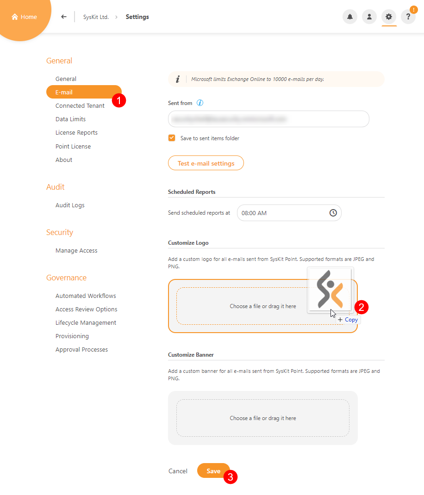
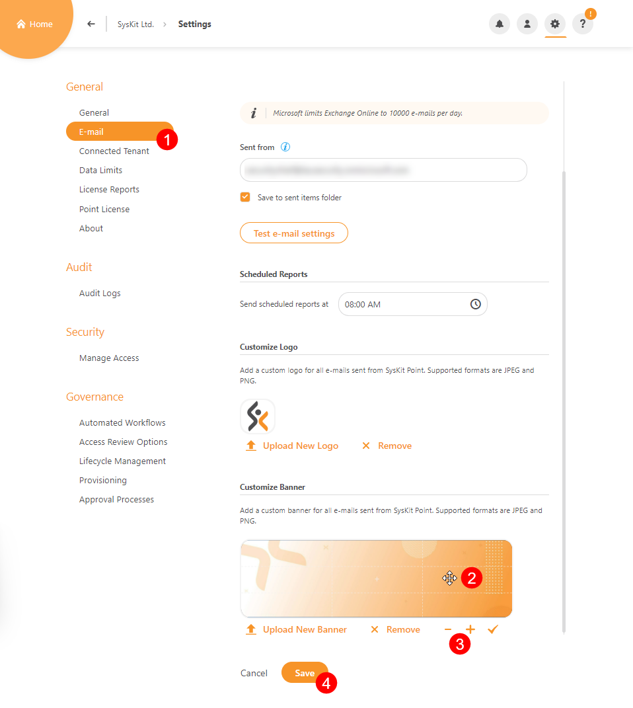
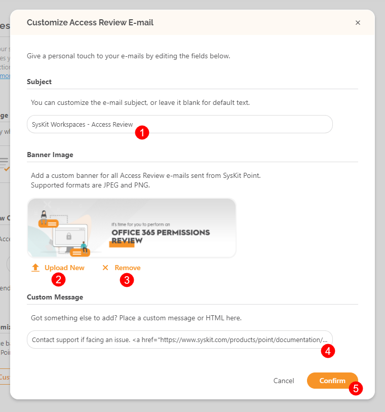
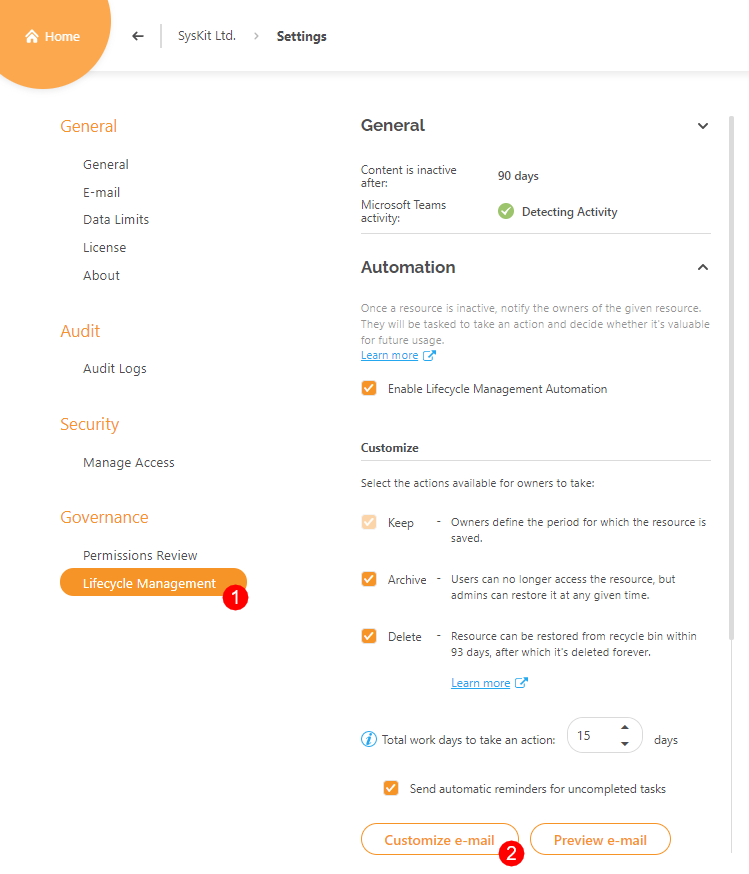
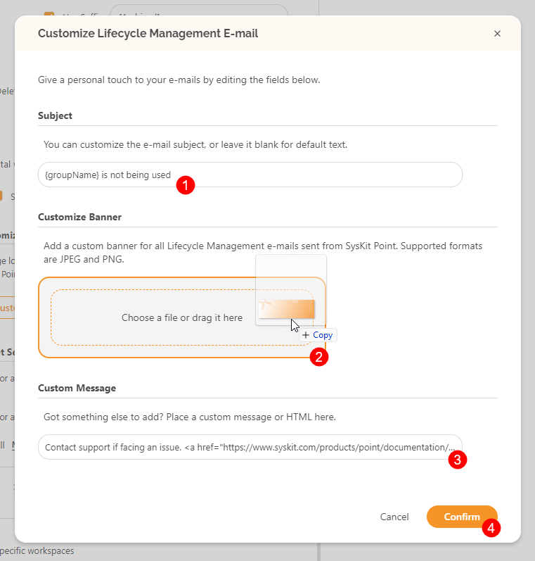
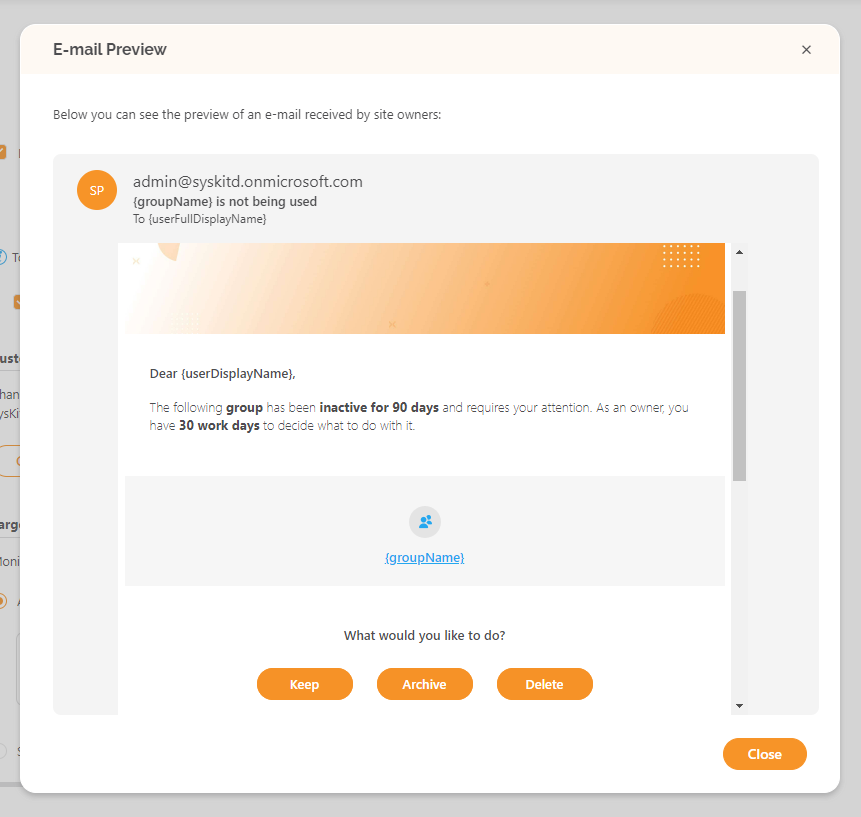

# Customize E-mails

SysKit Point **provides the option to customize e-mails** that are **sent to site owners** as a part of **Access Review and Lifecycle Management Automation**. 

These emails can be **scheduled** to send at a specific time period. Certain areas can be modified to suit your needs. 

Emails are used for **Access Review and Lifecycle Management** tasks and any policies created under **Automated Workflows**. They are also used for receiving reports that are available in the **Reports** section of SysKit Point. 

The following aspects of the e-mails can be customized:

* **Logo**
* **Banner**
* **Subject**
* **Additional message in the body of the e-mail**

These changes can be performed in three locations within SysKit Point Settings:

* **General Settings &gt; E-mail section** 
* **Governance Settings &gt; Access Review** 
* **Governance Settings &gt; Lifecycle Management**


**Please note!**  
Only SysKit Point Admin users can customize e-mails.


## E-mail Settings

In E-mail settings, you can define:
 * **A global logo** that will be used in all e-mails sent by SysKit Point
 * **A global e-mail banner** that will be used in all e-mails sent from SysKit Point

To define a logo used in all e-mails:
* **Navigate to the E-mail Settings screen \(1\)**. 
* **Scroll down to see the Customize Logo section**
* **Drag and drop your logo file \(2\)** to define your logo; keep in mind the supported file formats - JPEG and PNG
* **Click Save \(3\)** to save your changes

To define a banner used in e-mails:
* **Navigate to the E-mail Settings screen \(1\)**. 
* **Scroll down to see the Customize Banner section**
* **Drag and drop your banner file** to define your banner; keep in mind the supported file formats - JPEG and PNG
* **Drag the added image \(2\)** to adjust the position
* **Zoom in or zoom out \(3\)** to adjust the view
* **Click Save \(4\)** to save your changes


**Hint!**  
**Modifying the logo and banner** as described here **is a global action**, meaning that it **will affect all e-mails**.


## Access Review Settings


**Hint!**  
Customizing the Access Review e-mail is possible only if the Automated Access Review feature is enabled. For more information on that topic, visit the [following article](../governance-and-automation/permissions-review/enable-permissions-review.md).


To customize the Access Review e-mail, first, navigate to **Settings** > **Governance** > **Access Review Options \(1\)**. 

Here you can:
* **Customize the Access Review e-mail \(2\)** by clicking Customize e-mail button 
* **Preview the Access Review e-mail \(3\)**

After clicking the Customize e-mail button, you will see the following sections:

* **Subject \(1\)** -  only applies to the Access Review e-mail sent to the owners and administrators
* **Upload new banner image \(2\)** - only applies to the Access Review e-mail sent to the owners or administrators; initially, a default banner image is set up
* **Remove banner image \(3\)**
* **Define custom message \(4\)** - only applies to the Access Review e-mail sent to the owners or administrators

When finished, click the **Confirm button \(5\)** to save your changes.


**Please note!** 
The custom message can contain **plain text** or **HTML**. A **link has to be defined in the HTML form** `<a href="URL">LinkDisplayText</a>` where `URL` represents a web address to a web resource, and the `LinkDisplayText` is an arbitrary text that will be displayed in the e-mail, and, when clicked, lead to the defined URL.


You can immediately see the e-mail changes by clicking the before-mentioned **Preview e-mail button**.
The Preview dialog opens, as shown in the image below.

## Lifecycle Management Settings

Similar to the Access Review e-mail customization, there is an option to customize Lifecycle Management e-mails.

To customize the Lifecycle Management e-mail, **navigate to Settings** > **Governance** > **Lifecycle Management \(1\)**.

Here you can:
* **Customize the Lifecycle Management e-mail \(2\)** by clicking Customize e-mail button 
* **Preview the Lifecycle Management e-mail \(3\)**

Similar to the Access Review e-mail, you can edit the following sections after clicking the Customize e-mail button:

* **Subject \(1\)** -  only applies to the Lifecycle Management e-mail sent to the owners and administrators
* **Define the banner image \(2\)** - only applies to the Lifecycle Management e-mail sent to the owners or administrators; initially, no banner image is set up
* **Define custom message \(3\)** - only applies to the Lifecycle Management e-mail sent to the owners or administrators

When done with editing, click the **Confirm button \(4\)** to save your changes.

You can access the e-mail preview by clicking the **Preview e-mail button**.

