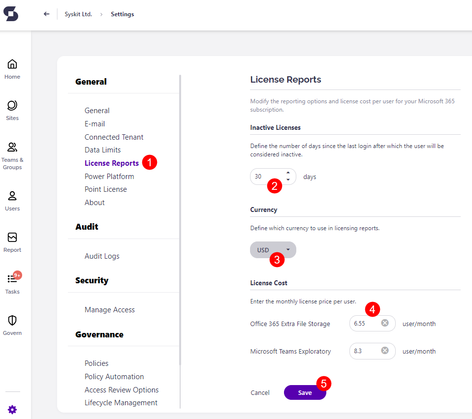

# Customize License Reports


Options described in this article are available only for users with the assigned SysKit Point Admin role. 


In this article, you can learn how to:
* **Define the number of days after which users will be considered inactive**
* **Change the currency** used in license reports
* **Specify monthly license price per user**
* **Show/hide license reports for users with the assigned SysKit Point Collaborators role**

## License Reports Settings

To modify license report settings, navigate to **Settings** &gt; **License Reports (1)**.
Here, you can:
* **Define the number of days after which users will be considered inactive (2)** – the value is used in the Inactive Licenses and Licenses Usage by Service reports; by default, this is set to 30 days
* **Define the currency used in license reports (3)** – the currency is displayed on the Licenses Overview and License Distribution reports, as well as the Dashboard; by default, this is set to USD
* **Define monthly license price per user (4)** – prices are used to calculate total costs on the Licenses Overview and License Distribution reports
Once you are finished with the modifications, **click Save (5)**.

## License Reports Visibility


By default, **license reports in SysKit Point are only visible for SysKit Point Admin users**. 


To make the License reports visible for SysKit Point Collaborators : 
* **navigate to Settings** > **Security** > **Manage Access (1)**
* **check** the **Give users access to license reports option (2)** under SysKit Point Collaborators role 
* **click Save (3)**


**Please note!**  
When the **Give users access to license reports option (2)** option is enabled, SysKit Point Collaborators can access the following reports: 
* **Licenses Usage by Service**
* **License Distribution**
* **Inactive Licenses**
The **signed-in SysKit Point Collaborator can only see license data related to users he is the manager of**.   
