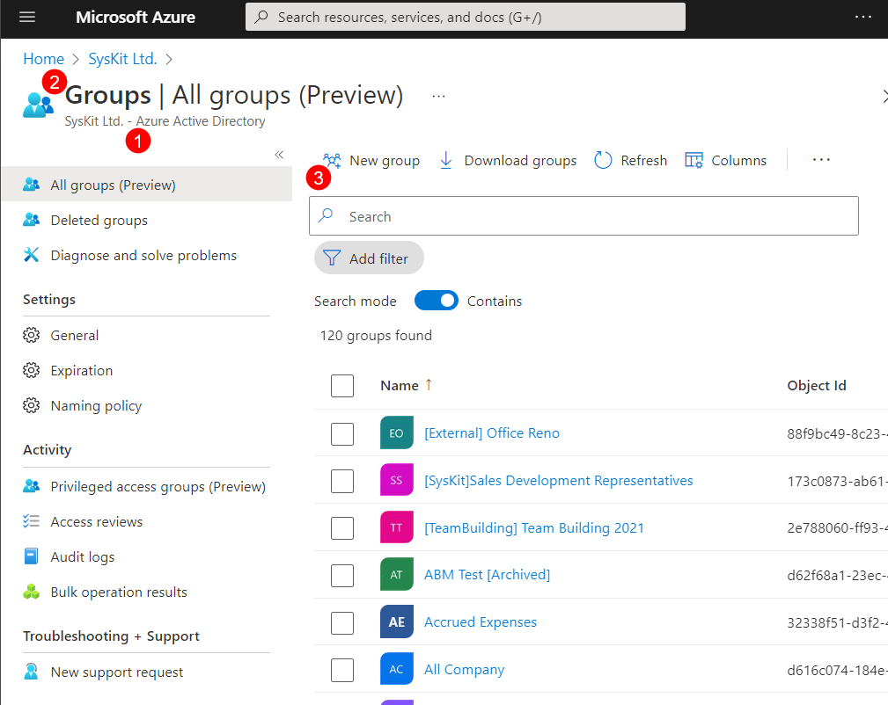
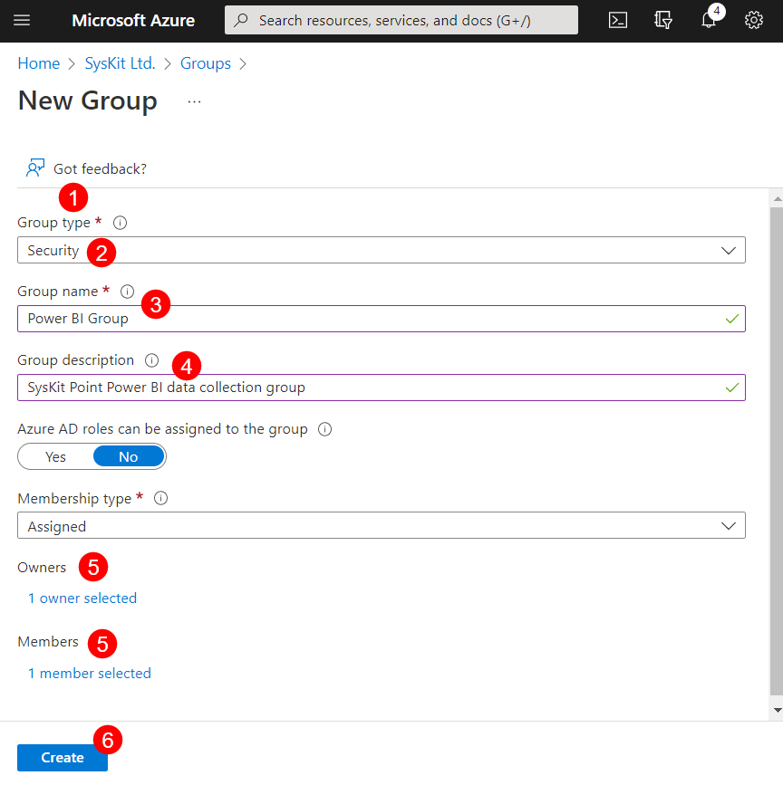
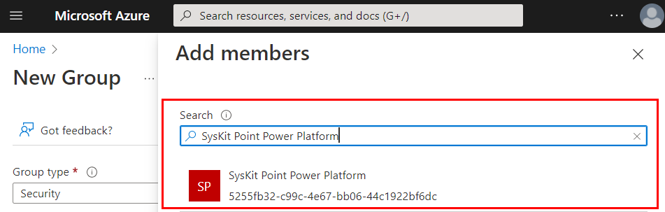
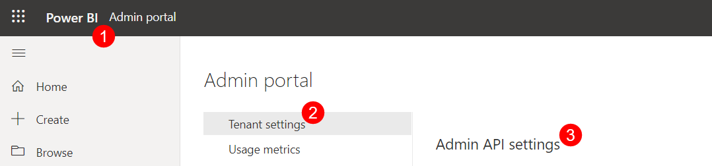
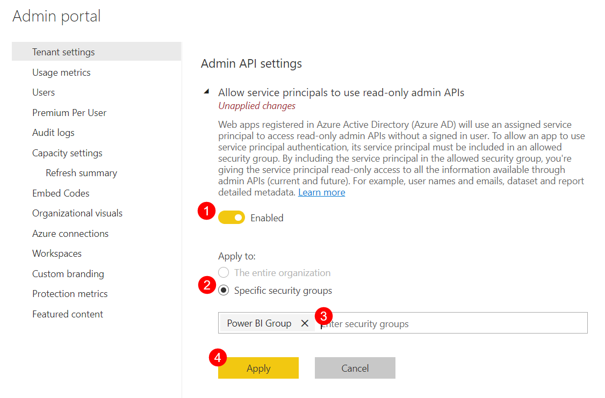
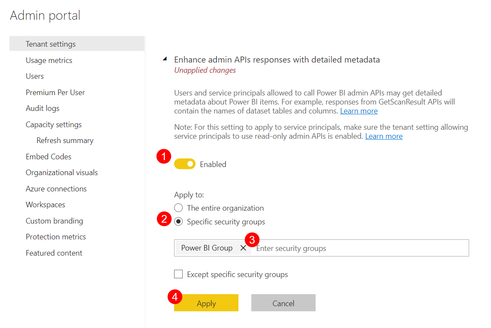
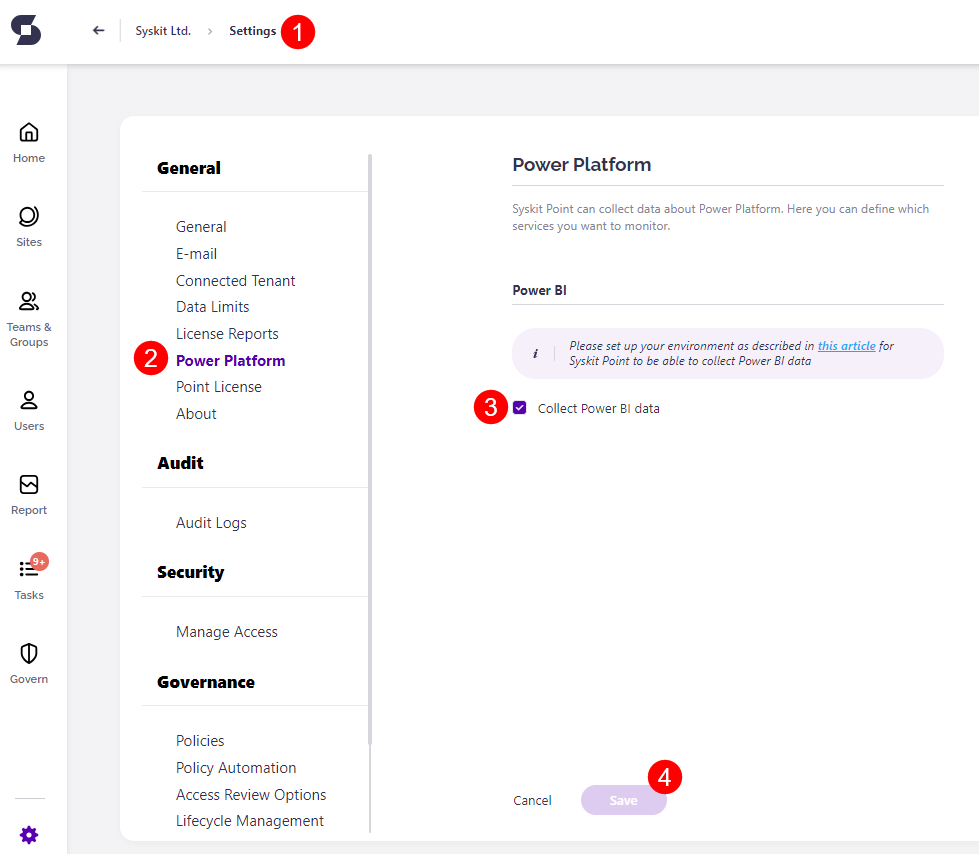

# Enable Power BI Data Collection


**Please note**: 

**Power BI reports** will soon become a part of the Power **Platform add-on**, and an additional license will be required to access them. For more details, please feel free to [contact us](https://www.syskit.com/contact-us/).


Enabling Power BI data collection for Syskit Point requires initial setup through your Azure Portal. 

## Create a Power BI Security Group 

 * **Click the [Azure Active Directory (1)](https://portal.azure.com/#view/Microsoft_AAD_IAM/ActiveDirectoryMenuBlade/~/Overview)**, on the Home page of your Azure portal. 
 * **Select Groups (2)**, located under the Manage section on the left side of the screen. Select Groups
 * **Click the New group button (3)** on the top bar. 
 

Fill out the following details when creating the new group:

 * Under **Group Type (1)**, select **Security (2)**
 * **Name (3)** the group **Power BI Group** or similar
 * For the **Group Description (4)** list the purpose of the new group, for example 'Syskit Point Power BI data collection group'
 * Select the **Owners and Members (5)** of the Group
   * Add the **Syskit Point Power Platform application** as a member of the security group
 * **Click Create (6)** when finished


**Please note!**  
Make sure the **Syskit Point Power Platform application** is selected as the member of this group, as shown in the picture below. 

Once created, the group can be found by going to **Azure Active Directory > Groups**.

Enter the name of the Power BI security group into **Search** to filter the list by title or scroll down. 

## Configure Power BI Tenant Settings

The next step is to configure Power BI tenant settings which can be done in the following way:

 * Open the **[Power BI admin portal (1)](https://app.powerbi.com/admin-portal/tenantSettings?language=en-US)** and sign in.
 * Under **Tenant settings (2)**, scroll down to the **Admin API settings (3)** section. 
 
 
 
 Once there, make the following changes:
   * Set the toggle as **Enabled** to **Allow service principals to use read-only Power BI admin APIs (1)**
     * Select **Apply to: Specific security groups (2)**
     * **Enter the name (3)** of the Power BI security group that was created
     * Click **Apply (4)**
 
 

   * Set the toggle as **Enabled** to **Enhance admin APIs responses with detailed metadata (1)**
     * Select **Apply to: Specific security groups (2)**
     * **Enter the name (3)** of the Power BI security group that was created
     * Click **Apply (4)**

 


**Please note!**  
It can take **up to 15 minutes** for these changes to apply. 

## Enable Power BI Data Collection in Syskit Point

Collecting Power BI data is disabled by default and must also be enabled within Syskit Point.  

  * **Go to General Settings (1)**; located in the top right corner of Syskit Point. 
  * **Click the Power Platform (2)**, which can be found under General.
  * **Click the checkbox (3)** to **Collect Power BI data**; the checkbox turns orange and shows a checkmark to indicate it was selected. 
  * **Click Save (4)** when finished. 

 