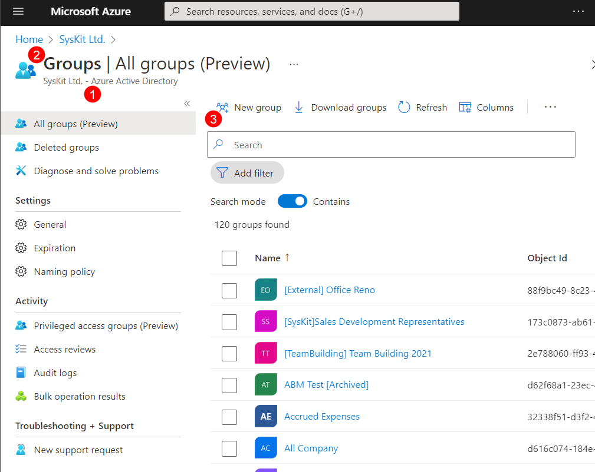
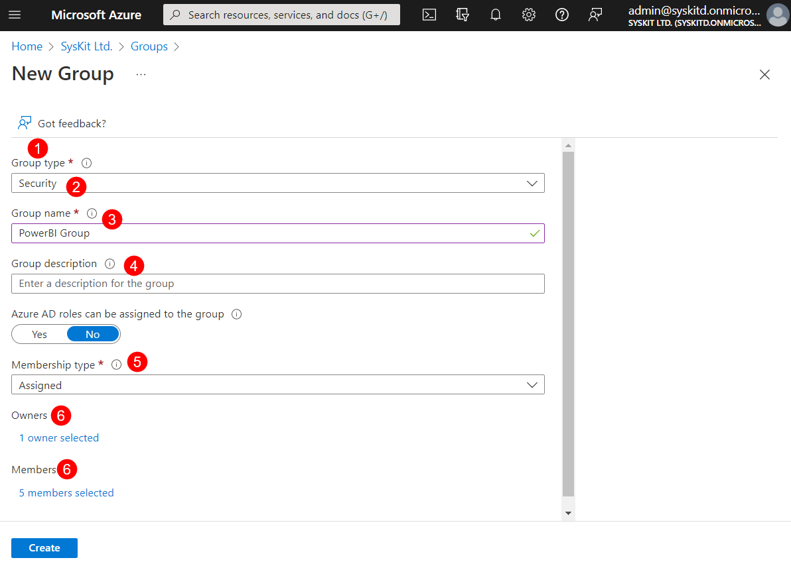
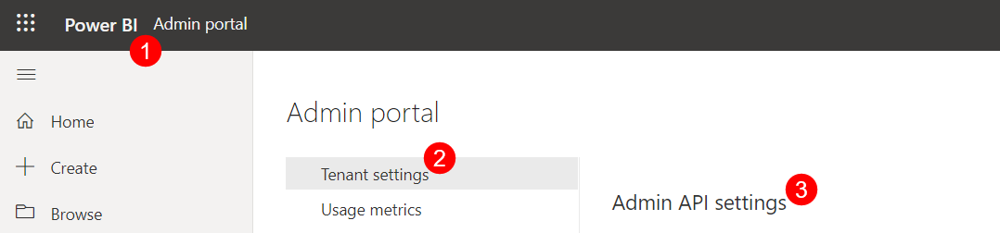
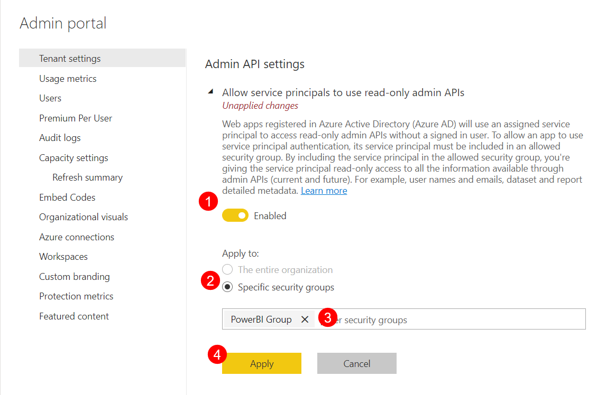
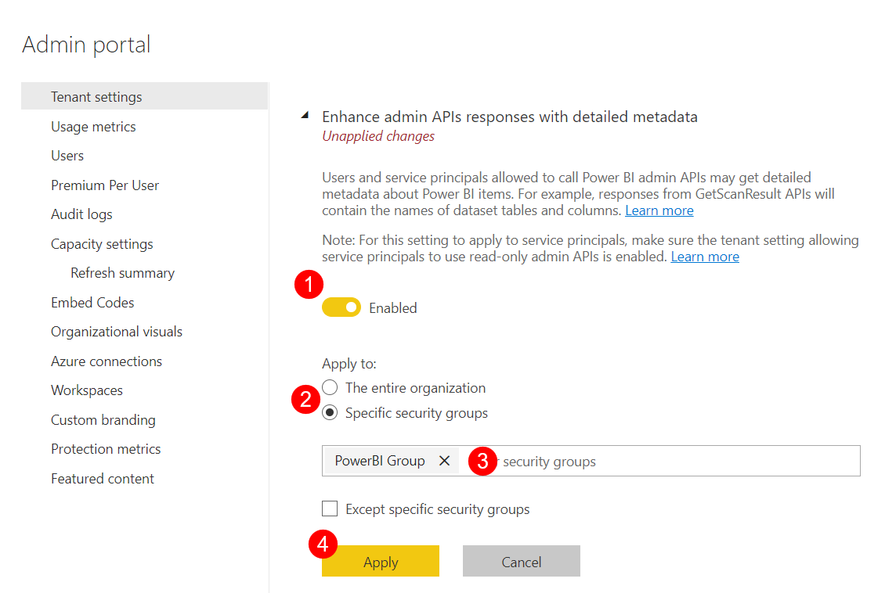

# Enable Power BI Data Collection

Enabling Power BI data collection for SysKit Point requires initial setup through your Microsoft 365 Azure Portal. 

## Create a Power BI Security Group 

 * **Click the Azure Active Directory (1)**; on the Home page of your Azure portal. 
 * **Select Groups (2)**; located under the Manage section on the left side of the screen. Select Groups
 * **Click the New Group button (3)** on the top bar. 
 

Fill out the following details when creating the new group:

 * Under **Group Type (1)**, select **Security (2)**
 * **Name(3)** the group **PowerBI Group** or similar
 * For the **Group Description (4)** list the purpose of the new group
 * Set the **toggle as NO** when asked whether Azure AD roles can be assigned to the group
 * Set the Membership Type as **Assigned (5)**
 * Select the **Owners and Members (6)** of the Group
   * Make sure the **SysKit Point Power Platform application** is selected as a member of this group

Once created, the group can be found by going to **Azure Active Directory > Groups**.

Enter the name of the Power BI security group into **Search** to filter the list by title or scroll down. 

## Configure Power BI Tenant Settings

The next step is to configure Power BI tenant settings which can be done in the following way:

 * Open the **Power BI admin portal (1)** and log in.
 * Under **Tenant settings (2)**, scroll down to the **Admin API settings (3)** section. 
 
 
 
 Once there, make the following changes:
   * Set the toggle as **Enabled** to **Allow service principals to use read-only Power BI admin APIs (1)**
     * Select **Apply to: Specific security groups (2)**
     * **Enter the name (3)** of the Power BI security group that was created
     * Click **Apply (4)**
 
 

   * Set the toggle as **Enabled** to **Enhance admin APIs responses with detailed metadata (1)**
     * Select **Apply to: Specific security groups (2)**
     * **Enter the name (3)** of the Power BI security group that was created
     * Click **Apply (4)**

 


**Please note!**  
It can take **up to 15 minutes** for these changes to apply. 