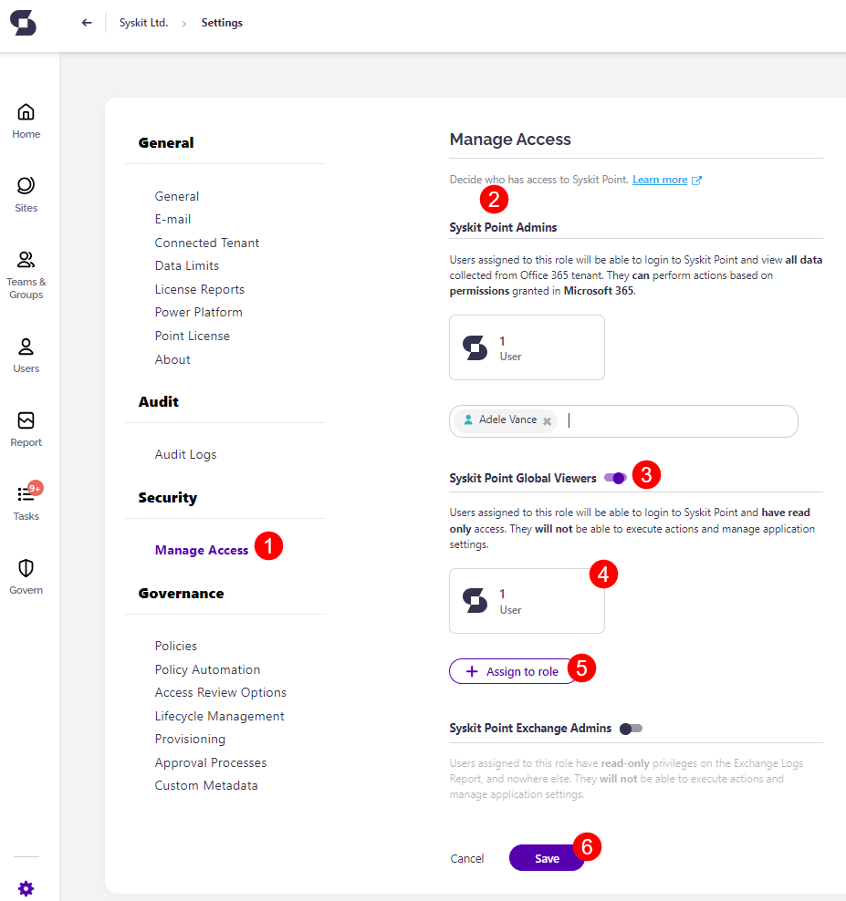
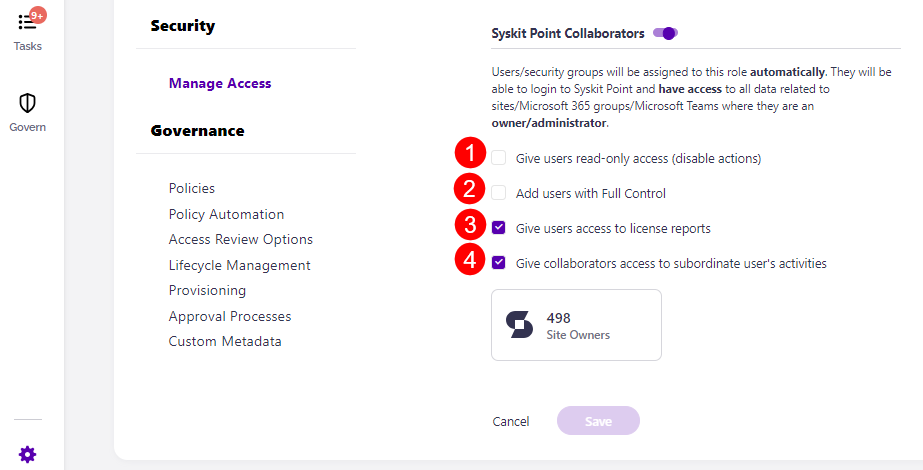

# Assign and Manage Access to Your SysKit Point

After deploying **SysKit Point**, your Microsoft 365 users can be given access to the **SysKit Point** web app.

By using the built in **role-based security** of SysKit Point you can easily manage who has access SysKit Point, and what features are available to them. Those assigned a role will be **able to view all data collected from Office 365 tenant and perform actions based on the permissions granted to them in Microsoft 365** or have access to all data related to sites, Microsoft 365 Groups, Microsoft teams.
 * Level of access **depends on the roles assigned**.

This allows **site owners to perform Access Reviews on their site and complete Lifecycle Management tasks** to determine which workspaces should be archived or kept. 

Read on to learn more about the specifics of each role and how to assign them to your users. 

## SysKit Point Roles

SysKit Point offers four predefined access roles:

* **SysKit Point Admins**
* **SysKit Point Global Viewers**
* **SysKit Point Exchange Admins**
* **SysKit Point Collaborators**

### SysKit Point Admins

Users with the SysKit Point Admins role assigned can:

* **see all data** collected from your Microsoft 365 tenant
* **manage all settings in SysKit Point** 
* **perform actions** based on the permissions granted in Microsoft 365

### SysKit Point Global Viewers

Users with the SysKit Point Global Viewers role assigned can:

* **see all data collected from your Microsoft 365 tenant**

They have **Read-Only** access and **cannot execute actions or manage application settings**.

### SysKit Point Exchange Admins

Users with the SysKit Point Exchange Admins role assigned can:

* **access the Exchange Logs report** exclusively

They have **Read-Only** access and **cannot execute actions or manage application settings**.

### SysKit Point Collaborators

The only role in SysKit Point that is **assigned automatically** to users or security groups, based on their **ownership permissions** in the **Microsoft 365 tenant**. When signed in to SysKit Point, they can:

* **access all data related to Microsoft 365 workspaces where they are owners/administrators**
* **perform actions** based on the permissions granted in Microsoft 365

Additional options enable you to control if actions and specific reports are available to Collaborators in SysKit Point. All options are described in the following section.

## Setting up Role-Based Access

To manage who has access to SysKit Point, navigate to **Settings** > **Security** > **Manage Access (1)**
Here, you will find:
* **All SysKit Point roles (2)** in a separate section
* **Toggle (3)** that enables a particular role; by default, all roles except the SysKit Point Admin role are initially disabled 
* **Tile with number of assigned users (4)** for each role; the total number of users with the assigned role is displayed in the tile
* **Assign to role (5)** button enabling you to add a user to a role easily
* **Save (6)** button to save changes

Clicking the tile showing the number of assigned users per role opens a **report for the corresponding role**
Here, you can:
* **See all users with the assigned role (1)**; by default, **Company Administrator and SharePoint Service Administrator Azure AD Roles are automatically assigned with the SysKit Point Admin role**
* **Assign (2)** new users to the role; you can add **users**, **Microsoft 365 Administration roles**, **security groups,** and **Microsoft 365 Groups**
* **Export or schedule (3)** the report

Additionally, you can **remove** a user from the role. To do so:
* **Select the user by clicking the checkbox next to the user name \(1\)**
* **Click the Remove Access from SysKit Point \(2\)** action

A **dialog** shows, asking you to **confirm** the removal action.

When the action is **completed**, the selected user **no longer has access** to **SysKit Point**.


**Please note!**  
Removing user access from **SysKit Point** will not remove a user from your **Microsoft 365** environment.


### SysKit Point Admins

During the initial user sync, SysKit Point will automatically add two **Microsoft 365** administration roles \(**Company Administrator** and **SharePoint Service Administrator**\) as **SysKit Point Admins**. Any user in your **Microsoft 365 environment** with that role will **automatically** have **full access** to **SysKit Point**.


**Please note!**  
You cannot assign or remove a user from a **Microsoft 365 administration role** in **SysKit Point**.


### SysKit Point Global Viewers

**Global Viewers role gives the assigned users the ability to**:
* **Sign in to SysKit Point**
* **Generate, view, and schedule reports**
* **See all data collected from Microsoft 365**
However, **Global Viewers will not be able to**:
* **Execute actions**
* **Manage SysKit Point settings**

### SysKit Point Exchange Admins

**SysKit Point Exchange Admins**:
* **Can view Exchange Log reports for your environment**
* **Have Read-Only access on the Exchange Logs report**
* **Cannot execute actions and manage application settings**

### SysKit Point Collaborators

The **SysKit Point Collaborators** role enables **site admins, Microsoft Teams, and Microsoft 365 Group owners** to:
* **Access SysKit Point**
* **See all information collected from Microsoft 365 for workspaces that they have access to**
* **Efficiently manage their workspaces by running actions**; **Collaborators can perform actions based on their assigned permissions in Microsoft 365 environment**
* **See user data collected from Microsoft 365 for users they are the manager of**


**Please note!**  
When the Collaborators role is enabled, **SysKit Point automatically** assigns **site admins, Microsoft Teams, and Microsoft 365 Group owners** to **SysKit Point Collaborators** role.


Additional options are available when the SysKit Point Collaborators role is enabled:
* **Give users read-only access (disable actions) (1)**; when enabled, Collaborators cannot run actions in SysKit Point
* **Add users with Full Control (2)**; when enabled, users with Full Control permissions on workspaces will be assigned with the Collaborators role in SysKit Point
* **Give users access to license reports (3)**; when enabled, Collaborators can access License reports
* **Give Collaborators access to subordinate user's activities (4)**; when enabled, Collaborators will be able to view the OneDrive tile, the Analytics & Usage tile, Audit log reports when accessing User details or workspaces they manage

### Why Should You Enable Role-Based Access

**Role-Based Access** brings the following benefits:
* **Empowers all admins and owners** \(and users with **Full Control** permissions\) to manage their workspaces
* **Gives admins and owners access to all reports and relevant information without disclosing the content they are not allowed to see**

**For example**, **SysKit Point Admin** generates the **User Access** report. Instead of sharing the URL of the generated report to another **SysKit Point Admin**, they sent it to the **SysKit Point Collaborator** that doesn't have access to all the users on the said environment. This is where the **Role-Based Access** kicks in.

When said **SysKit Point Collaborator** opens the URL, the report will be generated but only contain **users** the Collaborator manages. Also, the **report will only show workspaces that the Collaborator owns**.

When **SysKit Point Collaborator** tries to **drill** to the **user details** page of a user they are not a manager of, they will be redirected to an **Unauthorized Access** page.

**As demonstrated, the Role-Based Access provides a secure framework for collaboration in your Microsoft 365 environment**.