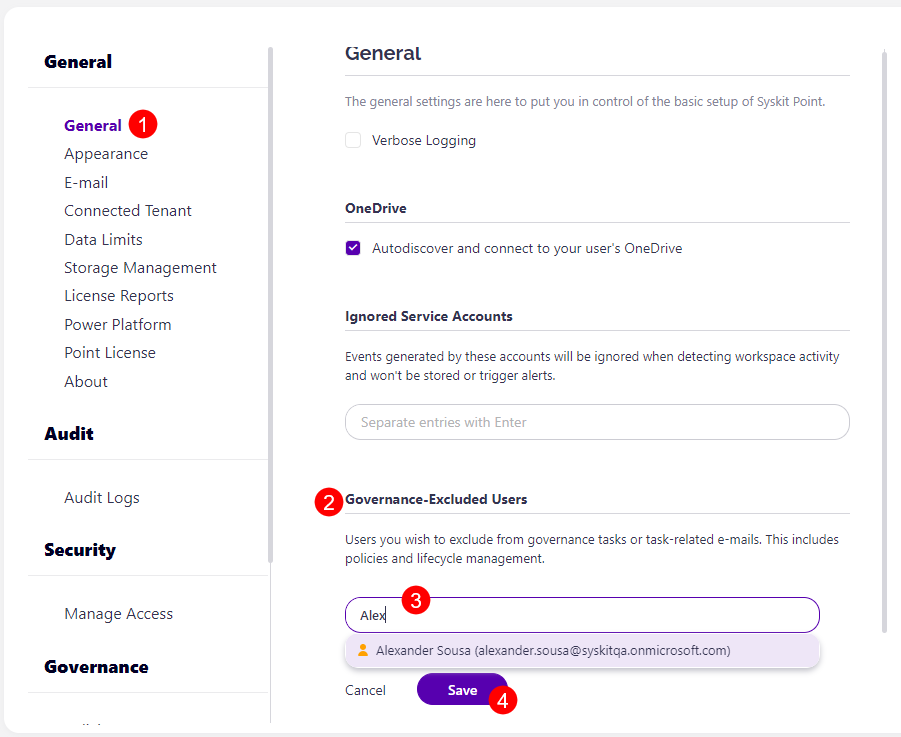

# Exclude Users from Receiving Tasks

The Governance-Excluded Users settings in Syskit Point allow you to exclude certain users receiving any of the following Governance tasks or task-related e-mails:

* Access Review tasks 
* Lifecycle Management tasks
* Security and Compliance Checks tasks
* Policy-related tasks (for policies where task delegation is enabled)

Take the following steps to set up your governance-excluded users:

* Open the Settings of Syskit Point and navigate to the **General section (1)**
* Scroll down to the **Governance-Excluded Users section (2)**
* Here, you can **enter the following (3)**:
 * **Name or e-mail-** of an individual user - this individual is added to the list of governance-excluded users and does not receive any governance tasks or task-related e-mails-
 * **Security Group** - all users included in the security group are added to the list of governance-excluded users, and they do not receive any governance tasks or task-related e-mails-
 * **Mail-Enabled Security Group** - all users included in the mail-enabled security group are added to the list of governance-excluded users, and they do not receive any governance tasks or task-related e-mails-
* Once you enter the user(s) or security group(s) that you want to exclude, **click Save (4)** to store your preference

