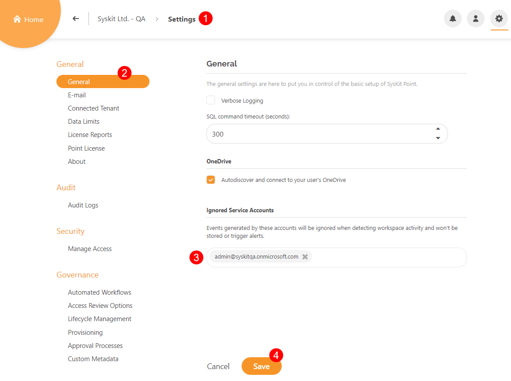

# Ignored Service Accounts

**Service accounts are user accounts created specifically to fulfill automated, expected changes to the server.**

For example, if you are using an **automated backup solution**, chances are there is a service account performing backups in defined intervals.

**Unified audit logs are created as a result of service account activity**, the same as for activities of regular users.

The **Ignored Service Accounts** addition to the **General Settings** of Syskit Point allows you to avoid tracking service accounts activities collected from Unified Audit Logs, meaning:

 * The Service Account page hits, and views **will be ignored when detecting any workspace activity**.
 * The Service Account audit logs **won’t be stored**.
 * The Service Account changes **will be ignored and won’t trigger alerts**.

## Setting up Ignored Service Accounts

Go to **General Setting (1)** in your Syskit Point to set up Ignore Service Accounts.

Under **General (2)**, at the bottom of the screen, is the **Ignored Service Accounts (3)** section, where accounts can be input in order to avoid triggering alerts when activity is detected. 

**Write the service account name and press enter to add it to the list.** Click **Save (4)** when finished.

