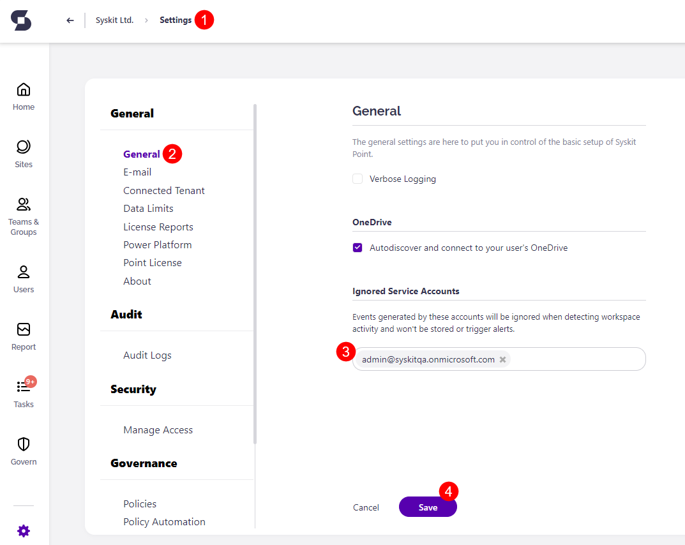

# Ignored Service Accounts
The **Ignored Service Accounts** addition to the **General Settings** of Syskit Point allows you to enter certain accounts in order to avoid triggering alerts for their actions.

**Service accounts are user accounts created specifically to fulfill automated, expected changes to the server.**

## Setting up Ignored Service Accounts

Go to **General Setting (1)** in your Syskit Point to set up Ignore Service Accounts.

Under **General (2)**, at the bottom of the screen, is the **Ignored Service Accounts (3)** section, where accounts can be input in order to avoid triggering alerts when activity is detected. 

**Write the service account name and press enter to add it to the list.** Click **Save (4)** when finished.

Adding an account to the Ignored Service Accounts list means:

* The account **will be ignored when detecting any workspace activity**.
* The account **won’t be stored in your audit logs**.
* The account **will be ignored and won’t trigger alerts**.
