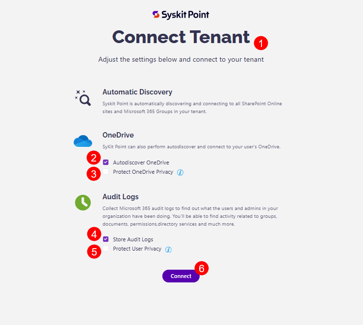

# Manage Tenant Connection


* Point Cloud customers can manage and edit their tenant connection after deploying Syskit Point.

* Point Data Center customers who set up their tenant connection when deploying Syskit Point can manage or edit their connection by following the steps in this article. 


Once Syskit Point is set up, you can manage or modify your tenant connection anytime through your Syskit Point Settings. This allows you to adjust Autodiscover and Audit Logs options and ensure accurate data collection. 

## Connect Tenant Settings

To modify your tenant connection, complete the following:

* **Go to the Settings (1)** of your Syskit Point
* **Click the Connected Tenant button (2)** located under the General category
* **The Connected Tenant screen opens** where you can;
  * Find information on the connected Microsoft 365 tenant (3)
  * Review the currently Enabled Tenant Options (4)
  * Click the **Manage Connection button (5)** to modify your connection
  * An information bubble on what to do in case you want to disconnect your tenant ([contact Syskit support](https://support.syskit.com/hc/en-us/requests/new?ticket_form_id=21891417027473)) (6)
  * Connect Service Account section where you can disable the connection or remove the service account (7)

To manage your connection, **click the Manage Connection button. (5)**
  * You are asked to reconsent to provide Syskit Point permission to your tenant by **clicking Accept**
  * After consenting, **the Connect Tenant screen opens (1)** where you can make any of your preferred changes by **selecting or deselecting the checkboxes**
    * The options provided are as follows:
      * **Automatic Discovery** – by default, Syskit Point continuously monitors your Microsoft 365 environment and shows you the latest data. You cannot modify this setting.
      * **Autodiscover OneDrive (2)** – by default, Syskit Point collects information and reports on the users' OneDrive activity, content, and sharing. To stop collecting OneDrive data, uncheck this option.
      * **Protect OneDrive privacy (3)** – When enabled, Syskit Point only shows general information about the user's OneDrive, such as used storage. Syskit Point Admins won't be able to access any OneDrive content and personal data. By default, this option is disabled.
      * **Store audit logs (4)** – Syskit Point also collects all audit logs to monitor internal and external user activities and changes and store them in an Azure Cosmos database. To stop storing audit logs, uncheck this option.
      * **Protect user privacy (5)** - When enabled, user activity data will be hidden from Syskit Point and protected from Administrator supervision. By default, this option is disabled.      
  * Once you are done, **click the Connect button (6)** to finalize
  * When Syskit Point is done updating your tenant, you are redirected back to the Syskit Point Dashboard

