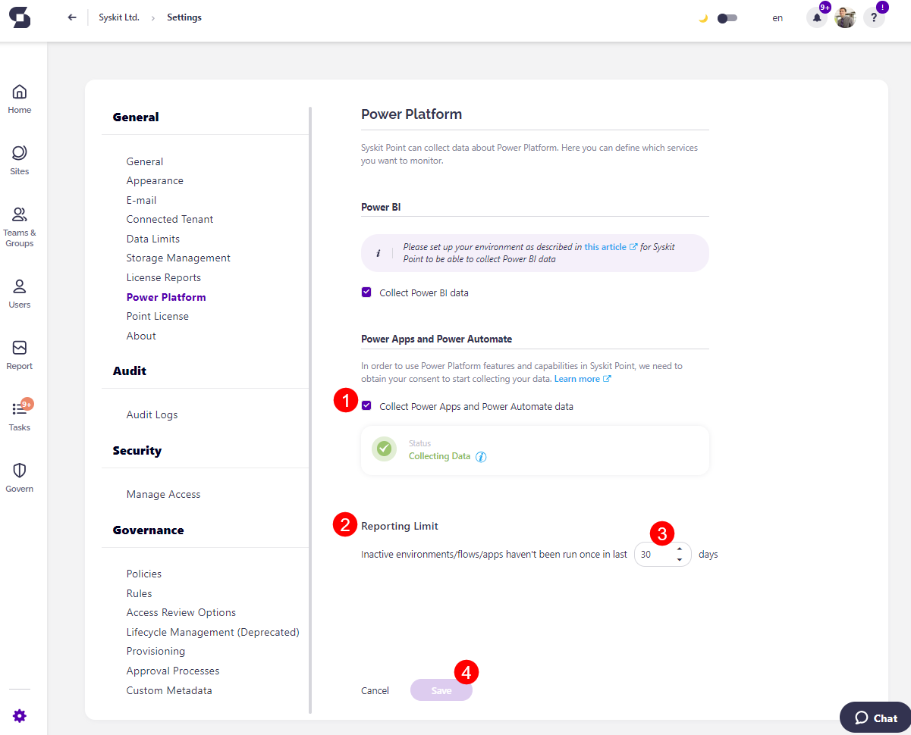

# Power Platform Data Collection

Enabling Power Platform data collection lets you generate Power Platform reports to keep track of your Power Platform usage. 

* [For details on how to enable Power BI data collection, take a look at this article.](../configuration/enable-powerBI-data-collection.md)

To use Power Platform features and capabilities, you need to provide consent for us to start collecting your data. This is done in the following way:
* Syskit Point requires permissions for its Client app to obtain a token with specific privileges. 
  * This token is then used to send API requests and synchronize data via the Power Platform app registration.
* These permissions are not visible on the Azure portal under App registrations, as access is granted directly to the API for the specified identity. 
  * The process is managed using PowerShell commands:
    * GET-PowerAppManagementApp -ApplicationId {appGuid}
    * NEW-PowerAppManagementApp -ApplicationId {appGuid}
    * REMOVE-PowerAppManagementApp -ApplicationId {appGuid}

* Permissions granted to the Syskit Point Client can be removed after data synchronization, as they are not required until the next Power Platform login
  * If the permission granted are not removed, you are never required to repeat the configuration steps again

## Enable Power Apps and Power Automate

To enable Power Apps and Power Automate, after granting permissions, please do the following:

* **Check the box (1)** next to Collect Power Apps and Power Automate Data
  * Once data is being collected, the Status shows as green and states Collecting Data
  * If the box is unchecked, the Status is yellow and states Please Enable Data Collection Above to Continue
* When collection is enabled, you can also set your **Reporting Limit (2)**
  * You can **enter the number of days (3)** in the designated space, after which the report does not include inactive environments/flows/apps that haven't been run once in the designated time
* **Click Save (4)** to store your preferences

 

Once this is enabled, you can find the Power Platform reports in the Report Center. For more details, [take a look at the Power Platform reports article](../reporting/power-platform-reports.md)