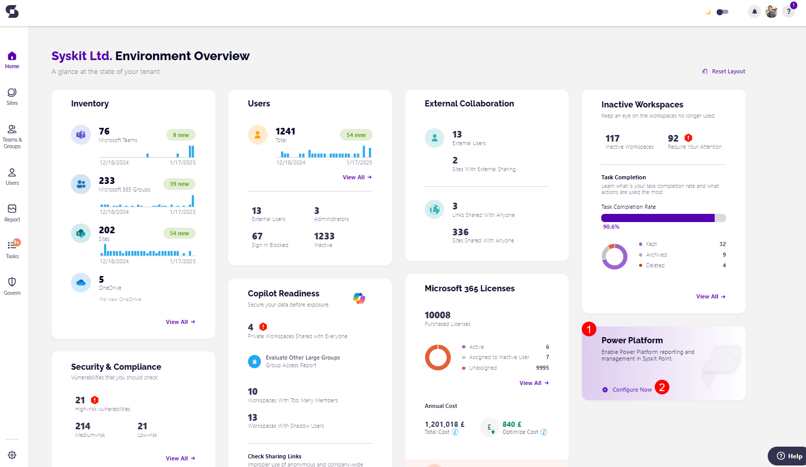
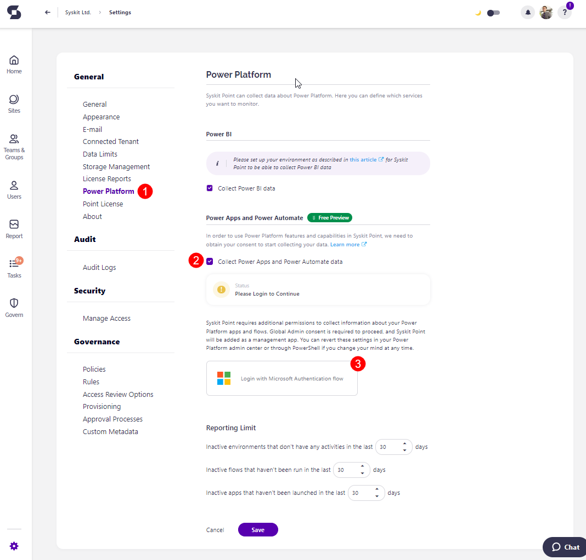
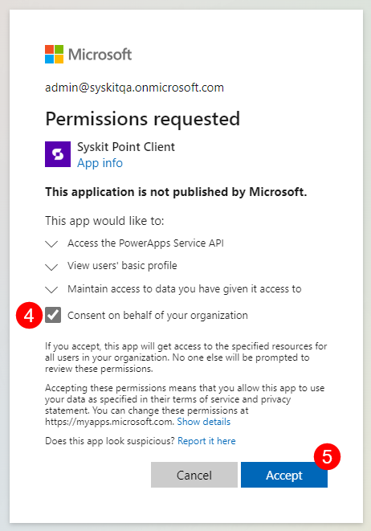
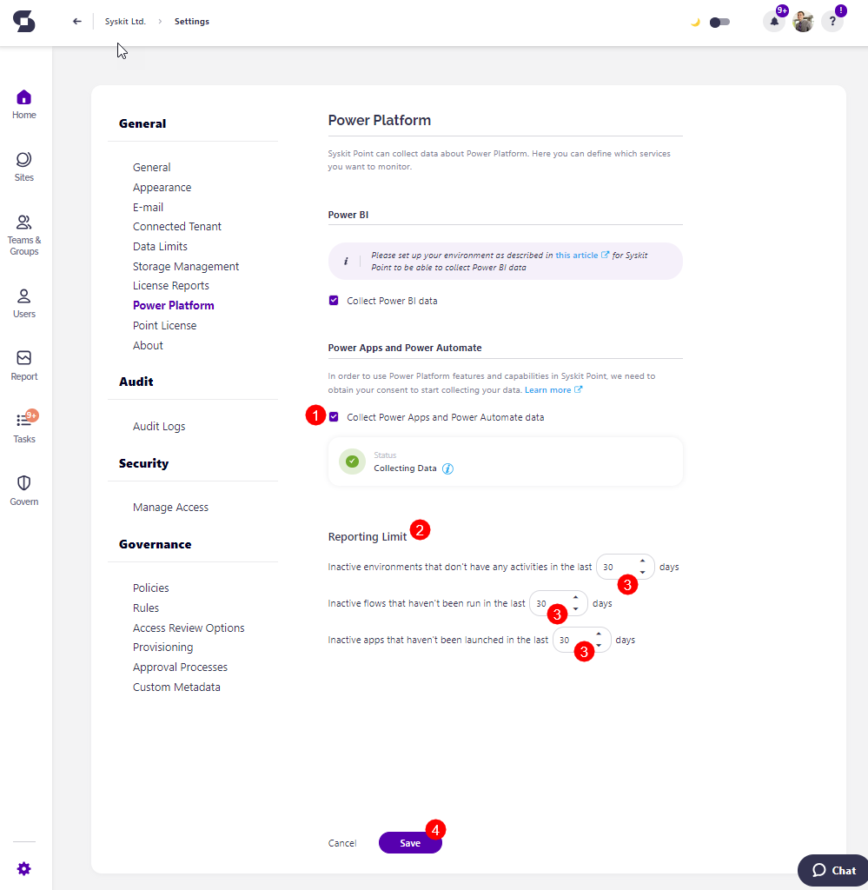

# Power Platform Data Collection

Configuring the Power Platform feature in Syskit Point starts the Power Platform data collection, which enables you to generate Power Platform reports for a detailed overview of your Power Platform resources.


**Power Platform functionality** is currently available as a free preview, allowing you to explore its benefits at no cost.


To enable the Power Platform data collection in Syskit Point, complete the following:

* Before the set up, the **Power Platform tile (1)** on the Dashboard shows the **Configure Now button (2)**

* Clicking the button redirects you to the **Power Platform section of Settings (1)** 
* Under Power Apps and Power Automate, **select the checkbox** next to **Collect Power Apps and Power Automate data (2)**

To collect Power Platform data, you need to **consent** for Syskit Point to start collecting it.

* **Click the Login with Microsoft Authentication flow (3)** button and **log in with the Global Administrator account**
  * The confirmation modal appears, listing the permissions required for the Power Platform data collection
  * **Select the 'Consent on behalf of your organization' checkbox (4)** to provide Syskit Point with access to the specified resources
  * Note that the Power Platform data will not be collected until consented
  * For more information about the permissions, check the [Permission Requirements Change Log article](../requirements/permission-requirements-change-log.md#syskit-point-cloud-2025177)
* **Click Accept (5)** to start collecting Power Platform data in Syskit Point

* [For details on how to enable Power BI data collection, take a look at this article.](../configuration/enable-powerBI-data-collection.md)

Once the permissions are granted, you can see the **Status** in the Settings change to **Collecting Data** with a **green** checkbox next to it. 

If the box is unchecked, the Status shows the 'Please Enable Data Collection Above to Continue' warning message.

Once this is enabled, the first Power Platform data sync starts. When completed, summary data will show on the Power Platform dashboard tile. From there, you can drill to open specific reports, which provide more details about selected Power Platform resources.
For more details, [take a look at the Power Platform reports article](../reporting/power-platform-reports.md)


To stop the Power Platform data collection, uncheck the Collect Power Apps and Power Automate Data checkbox and save the change.


## Configure Reporting Limits

After enabling the Power Platform data collection, additional settings are displayed, which affect the Power Platform reports and dashboard tile.

* You can set **Reporting Limits (1)** for how long environments, flows, or apps must be inactive before being flagged as such in the reports. The following can be set:
  * Inactive environments that don't have any activities in the last XX days
  * Inactive flows that haven't been run in the last XX days
  * Inactive apps that haven't been launched in the last XX days
* **Enter the number of days (2)** in the designated space
  * The number of days selected here is **reflected when showing data on the Power Platform reports** and the Power Platform **Dashboard tile**
  * The default/minimum number of days set as the inactivity period is 30 days
* **Click Save (3)** to store your preferences

 
## Power Platform Sync Limits

Syskit Point collects data for the following Power Platform resources:
* Power apps
  * Canvas (Standard & SharePoint Form)
* Cloud flows 
  * Automated
  * Instant
  * Scheduled


Solutions, Model-driven apps, and Desktop flows are not supported.


