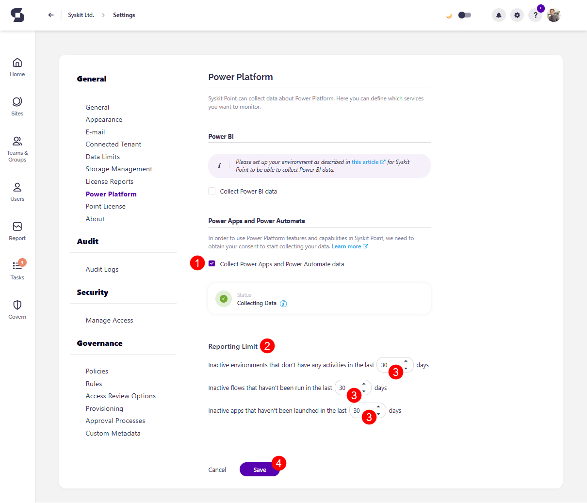

# Power Platform Data Collection

Enabling Power Platform data collection lets you generate Power Platform reports to keep track of your Power Platform usage. It also enables the Power Platform Dashboard tile. 

To configure Power Platform for Syskit Point, complete the following:

* Before the set up, the **Power Platform tile (1)** on the Dashboard shows the **Configure Now button (2)**

* Clicking the button redirects you to the **Power Platform section of Settings (1)** 
* Under Power Apps and Power Automate, **select the checkbox** next to **Collect Power Apps and Power Automate data (2)**

To collect Power Platform data, you need to **provide consent** for us to start collecting it.

* **Click the Login with Microsoft Authentication flow (3)** button and log in with your admin account
  * The confirmation modal appears up, listing the permissions that are required for the Power Platform feature
  * **Selecting the 'Consent on behalf of your organization' checkbox (4)** gives Syskit Point access to the specified resources for all users in your environment, and no one else will be prompted to review these permissions
  * If this is not selected, WHAT HAPPENS?
* **Click Accept (5)** to start collecting Power Platform data in Syskit Point



Permissions granted to Syskit Point can be removed after syncing data, as they are not required until the next Power Platform login.
  * If the permission granted is not removed, you are never required to repeat the configuration steps again.



* [For details on how to enable Power BI data collection, take a look at this article.](../configuration/enable-powerBI-data-collection.md)

## Enable Power Apps and Power Automate

Once the permissions are granted, you can see the **Status** in the Settings change to **Collecting Data** with a **green** checkbox next to it. 

If the box is unchecked, the Status is yellow and states, 'Please Enable Data Collection Above to Continue.'

To make sure Power Apps and Power Automate are enabled, after granting permissions, please do the following:

* Ensure that the **checkbox is selected (1)** next to Collect Power Apps and Power Automate Data
* You can then set your **Reporting Limit (2)** the following can be set:
  * Inactive environments that don't have any activities in the last XX days
  * Inactive flows that haven't been run in the last XX days
  * Inactive apps that haven't been launched in the last XX days
* **Enter the number of days (3)** in the designated space, after which the reports do not include inactive environments/flows/apps that haven't been used even once in the designated time
  * The number of days selected here is **reflected when showing data on the Power Platform reports** and the Power Platform **Dashboard tile**
* **Click Save (4)** to store your preferences

 

Once this is enabled, you can find the Power Platform reports in the Report Center. 

For more details, [take a look at the Power Platform reports article](../reporting/power-platform-reports.md)