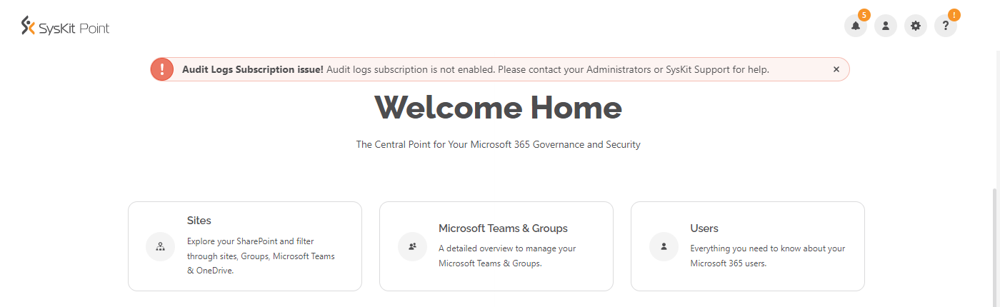
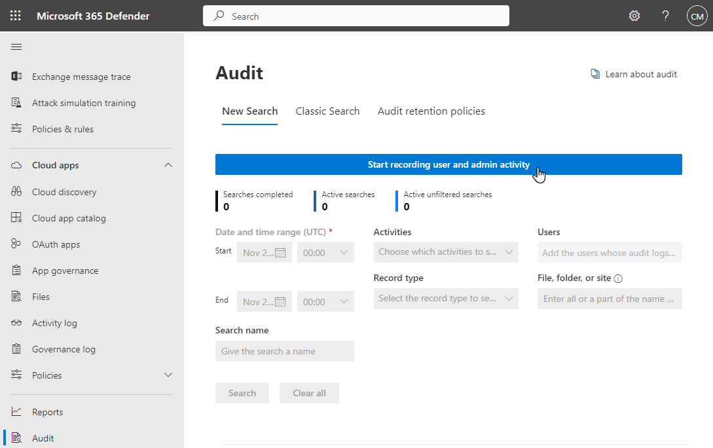
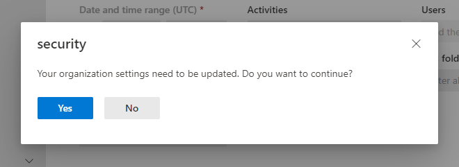

# Turn On Auditing


**Audit Reports** are available in the Security & Compliance plan and higher tiers. See the [pricing page](https://www.syskit.com/products/point/pricing/) for more details.


For Syskit Point to collect, process, and save audit logs, you must enable auditing in your tenant. The following warning message shows in Syskit Point if auditing is not enabled:

You can use the Syskit Point app, but audit data won't be collected.

First, open the following URL: [https://security.microsoft.com/auditlogsearch](https://security.microsoft.com/auditlogsearch)

The Microsoft 365 Security Center opens, showing the Audit log search page. At the top of the screen, a blue button is available to turn on auditing.

After you click the button, a security dialog appears. Click Yes to continue.

After you complete the steps described, wait for audit logs to show on the Audit Log Search page.


**Please note!**  
Syskit Point will not collect audit log data before it becomes available in the Microsoft 365 Security Center. **It can take up to 24 hours for audit log data to become available.**



**Hint!**  
You can also use **PowerShell** to turn on auditing. Find detailed instructions on how to do so in the [following article](https://docs.microsoft.com/en-us/microsoft-365/compliance/turn-audit-log-search-on-or-off).


