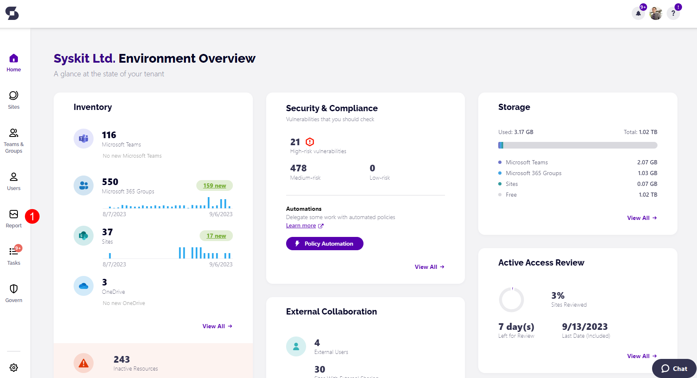
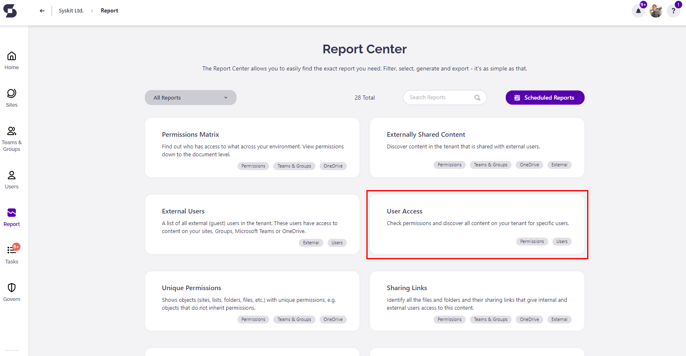
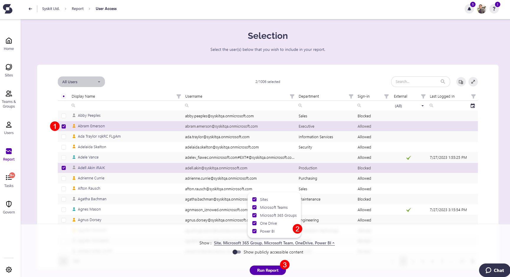
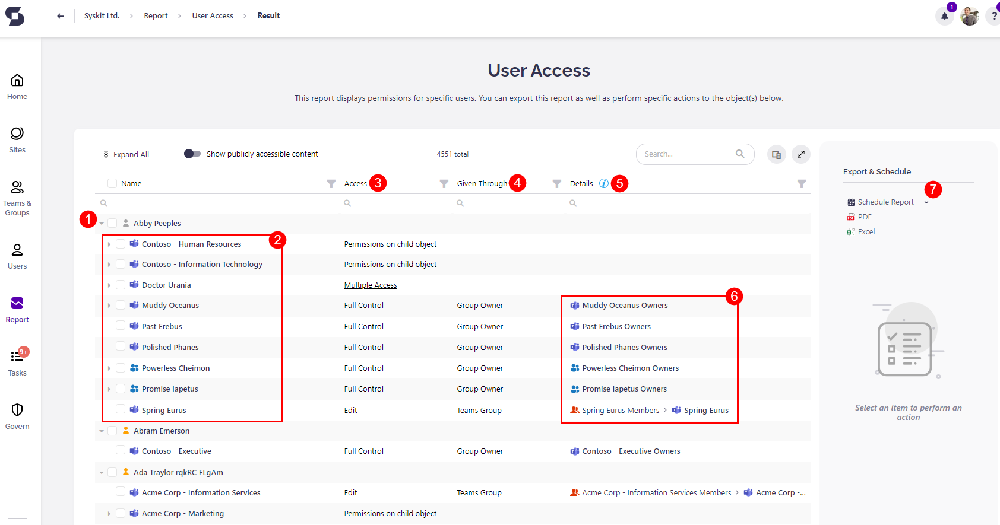
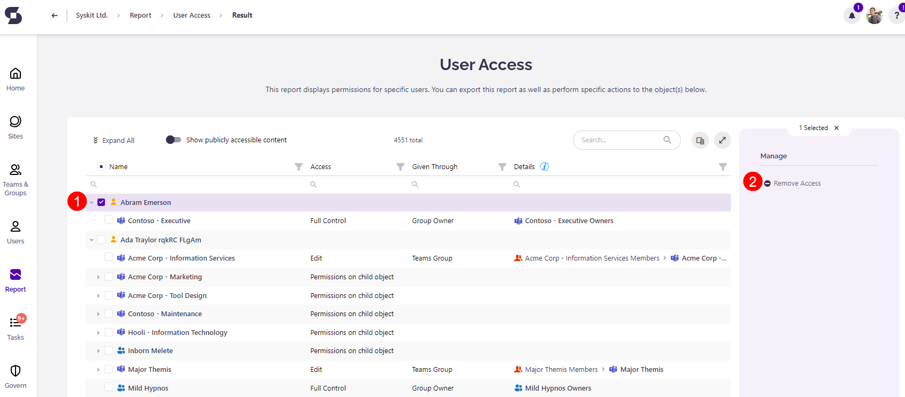
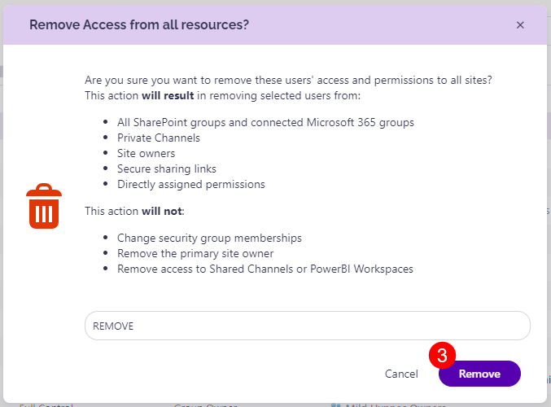
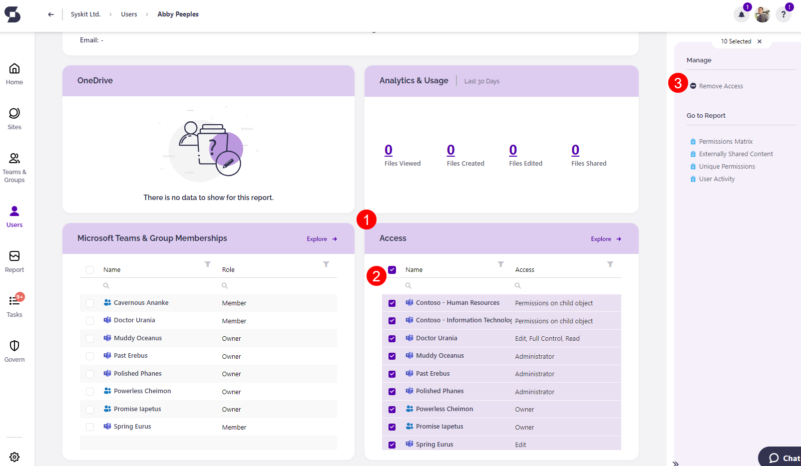

# Check Access for Specific Microsoft 365 User

## User Access in Microsoft 365 Environment

When using **Microsoft 365** for your daily **collaboration**, there are numerous occasions where you will **grant** or **remove access** to specific items in your environment. **Microsoft 365** gives multiple ways of doing that, be it via **direct access** to the file or maybe through **security groups**, **SharePoint groups**, and **sharing links**, among others. After a while, you may lose traction of which user has access to a specific item and how you gave the access. This is where the **Syskit Point User Access report** comes in to save the day.

## Syskit Point User Access Report

### Capabilities

**Syskit Point User Access report** is a powerful tool that allows you to **check** all **access** for **every specific user** in your **Microsoft 365 environment**. It enables you to:

* See what type of **access** does a user have \(**Full Control**, **Edit**, **Contribute**, or **any other level of access** you may have **granted** in your **environment**\).
* Understand **through which channel** is the **access given** to the user \(**Being a member in a SharePoint group**, **Group owner**, **Administrator**, through a **security group** or **directly** to said **user**\).
* Show the **details** from which exact **source** were those rights given to it.
* **Perform** multiple **actions directly** on the report \(**Remove Access**, **Change Owners**, **Change to Member**, **Edit Permissions**, **Remove from Group**, **Remove Sharing Link**\).

### Use Cases

There are multiple occasions where using the **User Access report** will help you successfully manage your **Microsoft 365 environment**.

Some of them are:

* When a **new user** in your **Microsoft 365 environment** is being **onboarded**, quickly check if they have all the correct permissions to succeed in their work.
* When a **user** is being **offboarded** to double-check if they still have access to some information they shouldn't have \(via **Anonymous sharing links**\).
* To check if some external collaborators have access to something they shouldn’t have.
* When reorganizing your environment \(**removing users** from certain **security groups** or **changing permissions** for specific users in your environment\).

## How to

### Generate User Access Report

Start by **signinig in** to your **Syskit Point**. 
From the home screen that opens, **click the Report button (1)** located in the left-side bar.

When located on the **home screen**, clic k the **Reports** tile.

It will redirect you to the **Syskit Point Report Center**, where you can click the **User Access** report tile.

:::info
**Hint! -** you can also access the **User Access report** through various other **Syskit Point** **reports**, **User overview screen**, and **User details screens**.
:::

Now that you are located on the **User Access selection** **screen**:
* Choose **one** or **multiple users \(1\)** you wish to generate the report for
* Select the **type of workspaces \(2\)** to show on the generated report 
  * You can choose among Sites, Microsoft Teams, Microsoft 365 Groups, One Drive and Power BI   
* Click the **Run Report button \(3\)** to generate the report

### Available Options and Actions

Now that you have **successfully** generated the **User Access report**, you'll see the following information:

* **User (1)** for which you have generated the report.
* All **types of workspaces (2)** \(**Sites**, **Microsoft Teams**, **Microsoft 365 Groups**, **Power BI**, and **OneDrive** accounts\) that user has some kind of **access** to.
* What kind of **access (3)** does the user have on a said **workspace**.
* **How** the access was **given (4)** to said user - **directly or through a group**, for example
* **Details (5)** containing **exact workspaces** through which the user got their **permissions**; **Microsoft 365 Groups** and **Microsoft Teams** shown here are **drillable (6)**, opening their respective **detail screens**.
* You can **schedule and export the report as PDF or Excel (7)**. 

### Remove Access

There are several ways to remove access for a user through the report: 
  * **To remove all access the User has**, **select the user's name (1)**. 
     * On the right side of the screen, the option to **Remove Access (2)** will show.
       * After clicking the Remove Access action, a **pop-up will appear**, providing more details on what the action will entail and prompting you to confirm by typing **REMOVE** in the space available.
       * Clicking the **Remove(3)** button will finalize the action.  
    * This can also be completed for a single workspace by clicking the option to expand, located next to the user's name, and selecting the specific workspace. 

After completing the action, you will receive a **notification** containing the **see the result** link, which reloads the report data when clicked. Once the action is completed, the user will no longer have access to any workspace. 

:::warning
**Please note!**  
Any user that had their access removed will successfully be removed from any private channels they had access to; however, at this time, it is **not possible to remove access from shared channels and Power BI workspaces**.
:::

You can also remove access for a specific user by clicking the user's name from the report. This will redirect you to the **user details screen**.
  * Scroll down to the **Access tile (1)**, and you'll have the option to either **select all workspaces (2)** or select them individually to perform the **Remove Access (3)** action.

**User Access report** helps all **Admins** and content **Owners** to keep their **Microsoft 365 environment** **clean**, **secure**, and **easy to manage** all at one place.

