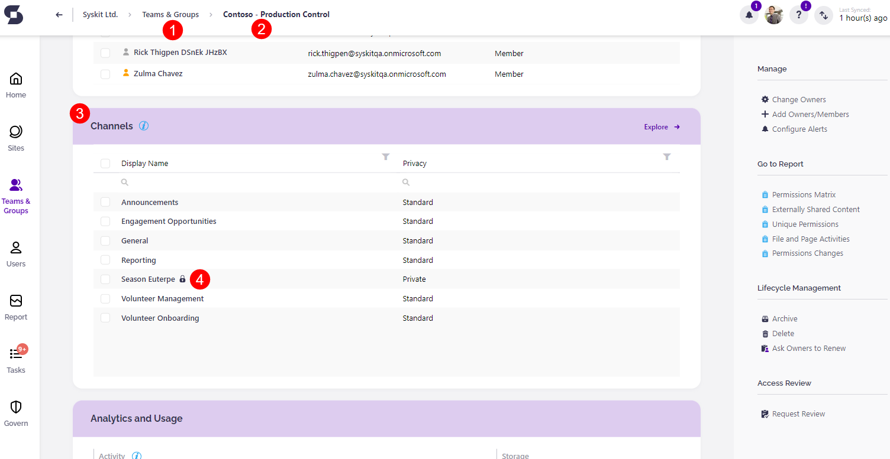
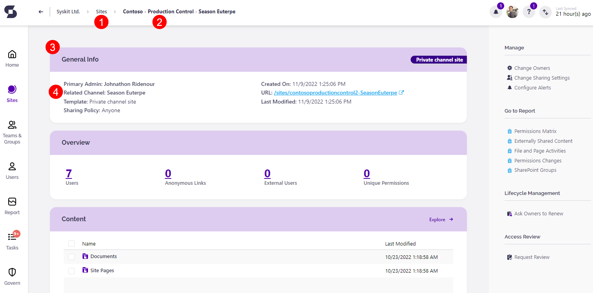
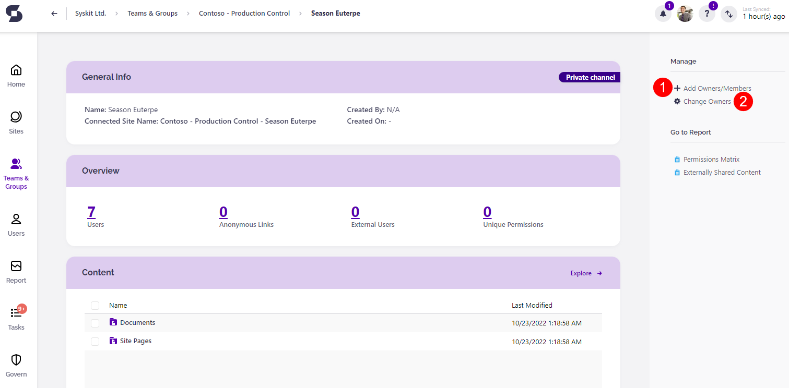
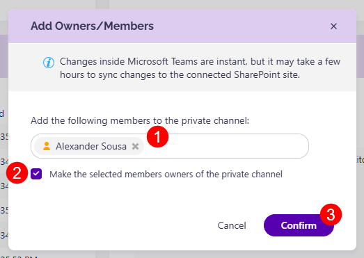
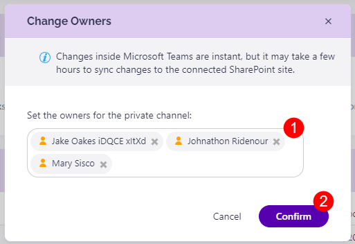
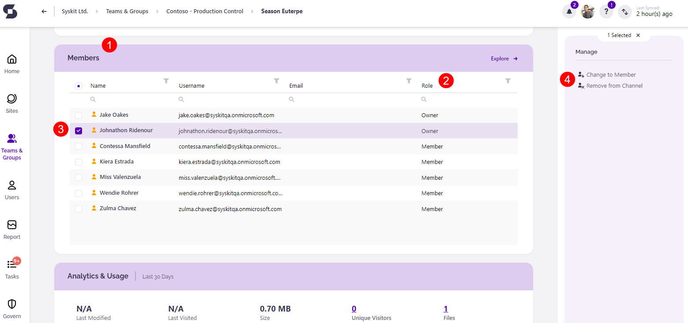
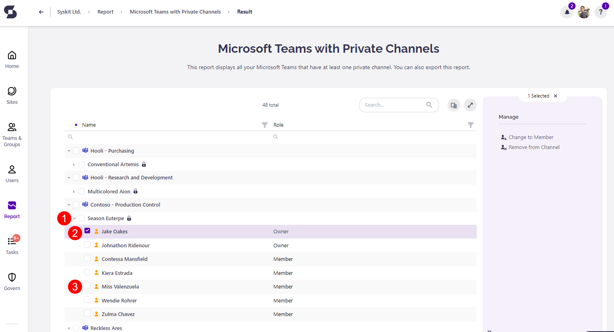

# Manage Private Channels Access

This article helps you set up and manage who the owners and members are for private channels in Microsoft Teams.


**Please note!**   The following users can manage private channels access:

* **Global administrator**
* **Private channel owner**


There are several ways to manage and change the access to private channels from within Syskit Point.

## Access Private Channels Details

To manage private channel access, complete the following:

* **Click the Microsoft Teams & Groups tile (1)**; this is located on the home screen of Syskit Point.
* **Select the team or group to manage (2)**; clicking the selected workspace opens the details screen.
* On the details screen, **scroll to the Channels section (3)**; the private channels will be marked by a lock symbol next to their name.
* **Click the private channel (4)**; this opens the details screen of the channel.

Another way to access private channels is through the **Sites screen** by taking the following steps:

* **Click the Sites tile (1)**; located on the home screen of Syskit Point.
* **Select the site to manage (2)**; the private channel site is marked with a lock symbol near its name.
  * Clicking the selected site opens the details screen.
* **Under General Information (3)** click the channel name shown under **Related Channel (4)**.
  * This opens the details screen of the private channel.

## Private Channels Access Options

When the **private channel details screen** opens, two options are listed on the right side of the screen under **Manage**.

* **Add Owners/Members (1)**; allows adding new members to the private channel as well as assigning owners.
  * The new members can be set as owners; however **you can also set a user as an owner but not add them as a member**.
  * If a user is **set as an owner or a workspace** that they are not a member of, **they are able to complete administrative actions** on the workspace but are **not able to access group content** and chats.
  * **Change Owners (2)**; provides the option to remove current owners or promote current members to owners.

Clicking the **Add Owners/Members** button opens a pop-up that provides the following options:

* **Add members to private channel (1)**; enter the names of the users that should be added as members to the private channel.
* **Make the selected members owners of the private channel (2)**; clicking this check box saves the user(s) entered above as owners of the private channel.
* **Confirm when finished (3)**; when all the new members/owners have been selected, click Confirm to save the changes.
  * After confirming, a **notification** is sent to **acknowledge** the new changes.
  * If the change is unsuccessful, the notification states that the action was **completed with errors** and has **failed**.
  * Clicking **check details** redirects to the **Action Details screen** with a detailed log of all changes.


**Please note!**   To add members to a private channel, the selected user must already be a member of the Microsoft Teams where the private channel is located.


Clicking the **Change Owners** button opens a pop-up that provides the following options:

* **Set the owners (1)**; there are two options available here:
  * Enter the names of the users that **should be set as owners** of the private channel.
  * **Remove the current owners** by clicking the x on the right side of their name.
* **Confirm when finished (2)**; when all the changes have been made, confirm to save them.
  * After confirming, a **notification** is sent to **acknowledge** the new changes.
  * If the change is unsuccessful, the notification states that the action was **completed with errors** and has **failed**.
  * Clicking **check details** will redirect to the **Action Details screen** with a detailed log of all changes.

&#x20;


**Please note!**   To set owners of a private channel, the selected user must already be a member of the Microsoft Teams where the private channel is located.


### Manage Member and Owner Status

Members and Owners can also be managed through the **Members tile (1)** located lower on the private channel screen.

The **Members tile (1)** shows a list of all members and owners available, and their status can be seen under the **Role column (2)**.

* **Selecting an Owner (3)** provides two options on the right side of the screen: **Remove from Channel or Change to Member (4)**.
* **Selecting a Member** provides two options on the right side of the screen: **Remove from Channel** or **Promote to Owner**.

&#x20;


**Please note!**   After making these changes to private channels in Syskit Point, it could take up to a few hours for the changes to show in the SharePoint admin center.


## Private Channels Report

All private channels are included in the Teams with Private Channels report. This is useful when there are multiple private channels to manage and keep up to date.

The Teams with Private Channels report can be generated through these steps:

* **Click the Reports tile**; located on the Syskit Point home screen.
* **Select Microsoft Teams & Groups in the filter**; located in the upper left corner.
* **Click the Microsoft Teams with Private Channels report** to generate the report.

The report has two columns, **Name** and **Role**. The column chooser, located on the top right side of the report, offers additional columns that can be added:

* **Email**
* **URL**
* **Is External User**

The following actions can be completed from this report:

* **Selecting the private channel (1)** provides information on who created the channel and when.
* **Selecting an owner (2)** provides the options to:
  * **Remove from Channel**
  * **Change to Member**
* **Selecting a member (3)** provides the options to:
  * **Remove from Channel**
  * **Promote to Owner**

The Microsoft Teams with Private Channels report can be **exported as PDF and XLSX files**. There is also the **option to schedule the report**.

## Related Articles

* [Supervise Microsoft Teams Private Channels](supervise-microsoft-teams-private-channels.md)
* [Enable Microsoft Teams Activity Tracking](../configuration/microsoft-teams-activity.md)
